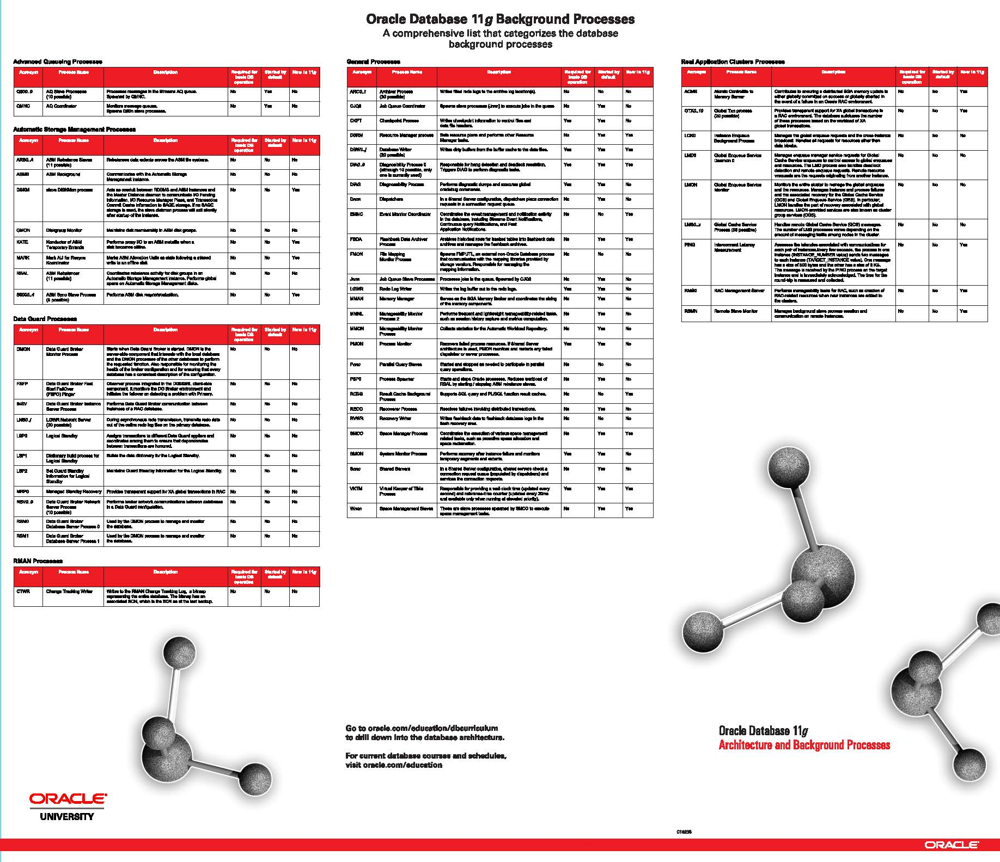
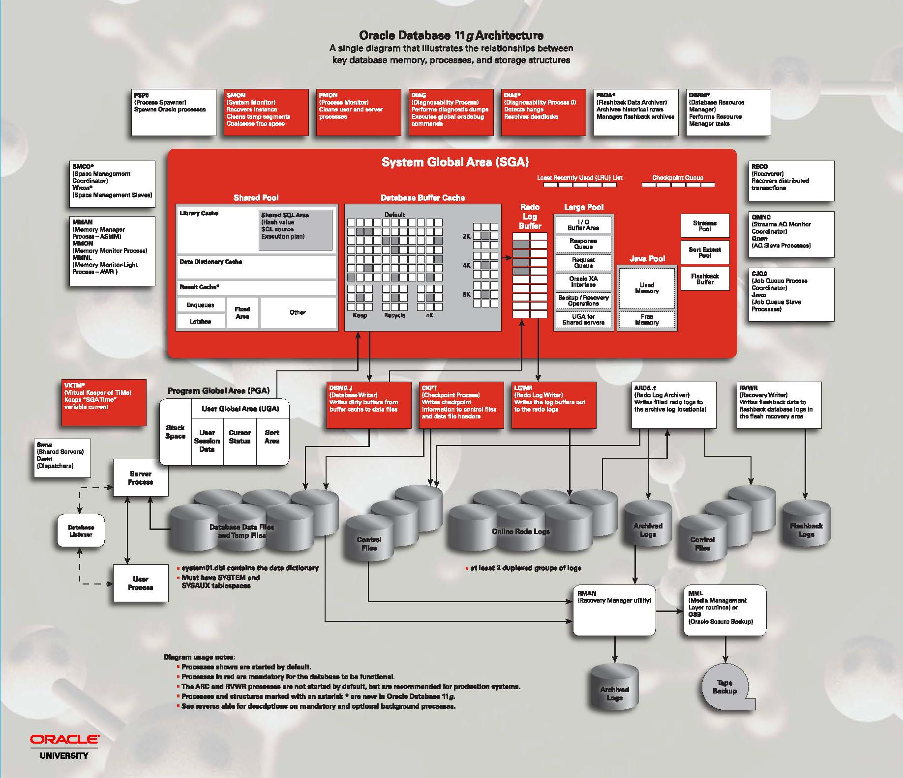

# 数据库实例_内存和进程

```
今天是祖国母亲的70岁生日，祖国万岁！
祖国如此富强，国人更应努力！做好自己的岗位也是为祖国出一份力，为建设社会主义社会出一份力！
```

<!-- TOC depthFrom:1 depthTo:6 withLinks:1 updateOnSave:1 orderedList:0 -->

- [数据库实例_内存和进程](#数据库实例内存和进程)
	- [内容概览](#内容概览)
		- [数据库实例](#数据库实例)
		- [物理结构](#物理结构)
		- [逻辑结构](#逻辑结构)
	- [Oracle 数据库简史](#oracle-数据库简史)
	- [Oracle 版本标识](#oracle-版本标识)
		- [Oracle 12c 及之前的版本标识](#oracle-12c-及之前的版本标识)
		- [Oracle 18c 之后的版本标识](#oracle-18c-之后的版本标识)
	- [Oracle数据库实例概述](#oracle数据库实例概述)
		- [后台进程](#后台进程)
			- [实践——查看后台进程](#实践查看后台进程)
		- [实例内存结构](#实例内存结构)
			- [实践——查看SGA](#实践查看sga)
- [sqlplus](#sqlplus)
			- [实践——查看PGA](#实践查看pga)

<!-- /TOC -->


[Oracle官方帮助](<https://docs.oracle.com/cd/B28359_01/server.111/b28318/intro.htm#CNCPT946>)

## 内容概览

### 数据库实例

Oracle数据库服务器由一个Oracle数据库和一个或多个Oracle数据库实例组成。 每次启动数据库时，都会分配一个称为系统全局区域（SGA）的共享内存区域，并启动Oracle数据库后台进程。`后台进程`和`SGA`的组合称为Oracle数据库[实例](https://docs.oracle.com/cd/B28359_01/server.111/b28318/glossary.htm#CBAFGFCJ)。

### 物理结构

Oracle数据库的物理数据库结构，包括数据文件，控制文件，重做日志文件，已归档的重做日志文件，参数文件，警报和跟踪日志文件以及备份文件。

the physical database structures of an Oracle database, including `datafiles`,`control files`, `online Redo Log Files`, `archived redo log files`, `parameter files`, `alert and trace log files`, and `backup files`.

补充`password files`

包括以下主题：

- [口令文件](<https://docs.oracle.com/cd/B28359_01/server.111/b28318/security.htm#CNCPT1568>)

- [参数文件](https://docs.oracle.com/cd/B28359_01/server.111/b28318/intro.htm#BABGABFB)

- [警报和跟踪日志文件](https://docs.oracle.com/cd/B28359_01/server.111/b28318/intro.htm#BABBBJGE)

- [控制文件](https://docs.oracle.com/cd/B28359_01/server.111/b28318/intro.htm#i66199)

- [联机重做日志文件](https://docs.oracle.com/cd/B28359_01/server.111/b28318/intro.htm#i60995)

- [数据文件](https://docs.oracle.com/cd/B28359_01/server.111/b28318/intro.htm#BABJHFAJ)

- [存档的重做日志文件](https://docs.oracle.com/cd/B28359_01/server.111/b28318/intro.htm#BABIDCDB)

- [备份文件](https://docs.oracle.com/cd/B28359_01/server.111/b28318/intro.htm#BABIGDCE)


### 逻辑结构

逻辑存储结构：数据块，扩展区，段和表空间。这些逻辑存储结构使Oracle数据库可以对磁盘空间使用进行细粒度的控制。

 logical storage structures: `data blocks`, `extents`, `segments`, and `tablespaces`. These logical storage structures enable Oracle Database to have fine-grained control of disk space use.

包括以下主题：

- [数据块](https://docs.oracle.com/cd/B28359_01/server.111/b28318/intro.htm#BABBEDEH)
- [扩展区](https://docs.oracle.com/cd/B28359_01/server.111/b28318/intro.htm#BABGGEJC)
- [段](https://docs.oracle.com/cd/B28359_01/server.111/b28318/intro.htm#BABFJBBC)
- [表空间](https://docs.oracle.com/cd/B28359_01/server.111/b28318/intro.htm#BABBGCEH)

## Oracle 数据库简史

* 1977年 甲骨文成立
* 1979年 第一个商业上可用的RDBMS
* 1983年 便携式版本的Oracle数据库
* 1992年 `Oracle 7` 引入了PL / SQL存储过程和触发器
* 1997年 `Oracle 8` 作为对象关系数据库发布，支持许多新的数据类型。此外，Oracle8支持大型表的分区`(815, 816, 8174)`
* 1999年 `Oracle 8i`  专为Internet计算而设计，使数据库可以部署在多层环境中
* 2001年 `Oracle 9i`  引入了Oracle RAC，使多个实例可以同时访问一个数据库`(9.0, 9.2)`
* 2003年 `Oracle 10g` 引入了[**网格计算**](https://docs.oracle.com/database/121/CNCPT/glossary.htm#GUID-EF507F26-F59A-415E-8C3E-3B95BFBA2F7C) `(10.1, 10.2)`
* 2007年 `Oracle 11g` 引入了许多新功能，使管理员和开发人员能够快速适应不断变化的业务需求`(11.1, 11.2)`
* 2013年 `Oracle 12c` 是专为云，采用了新的多租户架构，内存中的列存储，以及JSON文件的支持`(12.1, 12.2)`
* 2018年 `Oracle 18c`

```
Oracle的版本发布和补丁策略一直没有太大的调整，基本保持3-4年一个大版本，两代产品之间会出一个Release 2。
这种策略的好处是能够保证系统的稳定性，一个新的大部分更新到Release 2时，
基本被认为是比较稳定的版本，保守的用户一般会选择这个版本进行升级。
```

## Oracle 版本标识

### Oracle 12c 及之前的版本标识

* Major Database Release Number：第一个数字是最一般的标识符。它代表了包含重要新功能的软件的主要新版本

* Database Maintenance Release Number：第二个数字代表维护版本级别。一些新功能也可能包括在内。

* Fusion Middleware Release Number：第三个数字反映了Oracle融合中间件的发布级别

* Component-Specific Release Number：第四个数字标识特定于组件的发布级别。例如，取决于组件补丁集或临时版本，不同的组件在这个位置可以具有不同的编号。

* Platform-Specific Release Number：第五个数字标识特定于平台的版本。通常这是一个补丁集。当不同的平台需要相同的补丁集时，这个数字在受影响的平台上将是相同的。

### Oracle 18c 之后的版本标识

从2017年7月开始，Oracle改变了以往的数据库软件发布流程，采用年度Release和季度更新的策略。

* Yearly Release：将之前的N年一发布更改为每年一发布。每年发布的策略能够将更多的新功能更快的提供给用户，同时也大大减少了单次软件变更的数量，避免大的版本升级对系统产生的风险。

* Quarterly Release Update：Oracle会在每年1/4/7/10月提供季度发布更新。季度更新主要包含查询优化器相关BUG和安全漏洞的修复等。

* Release Update Revisions：除季度更新之外，发布更新修订也将按季度发布，基于上一个RU的缺陷进行修复，并包含最新的安全漏洞补丁。

每个季度更新发布之后的六个月内，最多有两个独立的更新修订（RUR）。例如，Release.Update.1和Release.Update.2，其中“1”和“2”代表版本迭代。

新的年度Release发布后的至少两年内，都会提供RU的支持，每个RU又会提供两个独立的RUR支持。因此每个年度Release至少会有3年的更新支持周期。


基于上述的策略，新的Oracle数据库版本号主要由三位数组成 – release.update.revision。

* Release 是发布年份的后两位数字，比如最新发布的18c，表示该版本发布于2018年

* Update 表示RU或者测试版本，发布于第一个季度为1，之后每个季度加1

* Revision 表示RUR版本，基于某个RU的修订，每个RU最多两个RUR

## Oracle数据库实例概述

Oracle数据库服务器由一个数据库和至少一个**数据库实例**（通常简称为*实例）组成*。由于实例和数据库之间的联系如此紧密，因此有时会使用术语**Oracle数据库**来指代实例和数据库。

从最严格的意义上讲，这些术语具有以下含义：

- 数据库

  数据库是位于磁盘上的一组文件，用于存储数据。这些文件可以独立于数据库实例而存在。

- 数据库实例

  实例是一组管理数据库文件的内存结构。该实例由一个共享内存区域（称为[**系统全局区域  system global area（SGA））**](https://docs.oracle.com/database/121/CNCPT/glossary.htm#GUID-78C0E867-233A-4857-B9FE-A3852A9B7BDF)和一组后台进程组成。实例可以独立于数据库文件而存在。

```
笔记：
1. 实例由内存和后台进程组成
2. 实例是访问数据库的方法
3. 初始化参数控制实例的行为
4. 一个实例只能连接一个数据库

启动实例不需要数据库；
产品安装好，有初始化参数文件，就可以启动实例；
与是否存在数据库无关。

实例内的内存叫做 SGA system global area

sga是全局共享的，大小有初始化参数文件控制；

后台进程是实例和数据库的联系纽带，分为：

- 核心进程
- 非核心进程

核心进程，必须存在，有一个终止，所有数据库进程全部终止
```

### 后台进程

[流程体系结构](https://docs.oracle.com/cd/B28359_01/server.111/b28318/process.htm#i16977)



#### 实践——查看后台进程

```sql
select name,description from v$bgprocess where paddr <> '00';
```

练习明细

```sql
SQL> select name,description from v$bgprocess where paddr <> '00';

NAME	   DESCRIPTION
---------- --------------------------------------------------------------------------------------------------------------------------------
PMON	   process cleanup
VKTM	   Virtual Keeper of TiMe process
GEN0	   generic0
DIAG	   diagnosibility process
DBRM	   DataBase Resource Manager
PSP0	   process spawner 0
DIA0	   diagnosibility process 0
MMAN	   Memory Manager
DBW0	   db writer process 0
ARC0	   Archival Process 0
ARC1	   Archival Process 1
ARC2	   Archival Process 2
ARC3	   Archival Process 3
LGWR	   Redo etc.
CKPT	   checkpoint
SMON	   System Monitor Process
RECO	   distributed recovery
CJQ0	   Job Queue Coordinator
QMNC	   AQ Coordinator
MMON	   Manageability Monitor Process
MMNL	   Manageability Monitor Process 2

21 rows selected.
```


### 实例内存结构

[内存体系结构](https://docs.oracle.com/cd/B28359_01/server.111/b28318/memory.htm#g30926)

Oracle数据库创建和使用内存结构有多种用途。例如，内存存储正在运行的程序代码，用户之间共享的数据以及每个已连接用户的私有数据区。Oracle数据库与两个基本的内存结构相关联：

- 系统全局区域（SGA）是一组共享内存结构，称为*SGA组件*，其中包含一个Oracle数据库实例的数据和控制信息。所有服务器和后台进程都共享SGA。SGA中存储的数据示例包括缓存的数据块和共享的SQL区域。
- 程序全局区域（PGA）是包含服务器或后台进程的数据和控制信息的内存区域。PGA是启动服务器或后台进程时由Oracle数据库创建的非共享内存。对PGA的访问权限是该过程的专有权限。每个服务器进程和后台进程都有自己的PGA。



#### 实践——查看SGA

```sql
# sqlplus
conn / as sysdba
select * from v$sga;
show sga;
```

练习明细

```sql
SQL> select * from v$sga;     

NAME					      VALUE
---------------------------------------- ----------
Fixed Size				    2254664
Variable Size				  150997176
Database Buffers			  356515840
Redo Buffers				    8048640
```

#### 实践——查看PGA

```sql
 show parameter pga
```

练习明细

```sql
SQL> show parameter pga

NAME				     TYPE		    VALUE
------------------------------------ ---------------------- ------------------------------
pga_aggregate_target		     big integer	    166M
```
