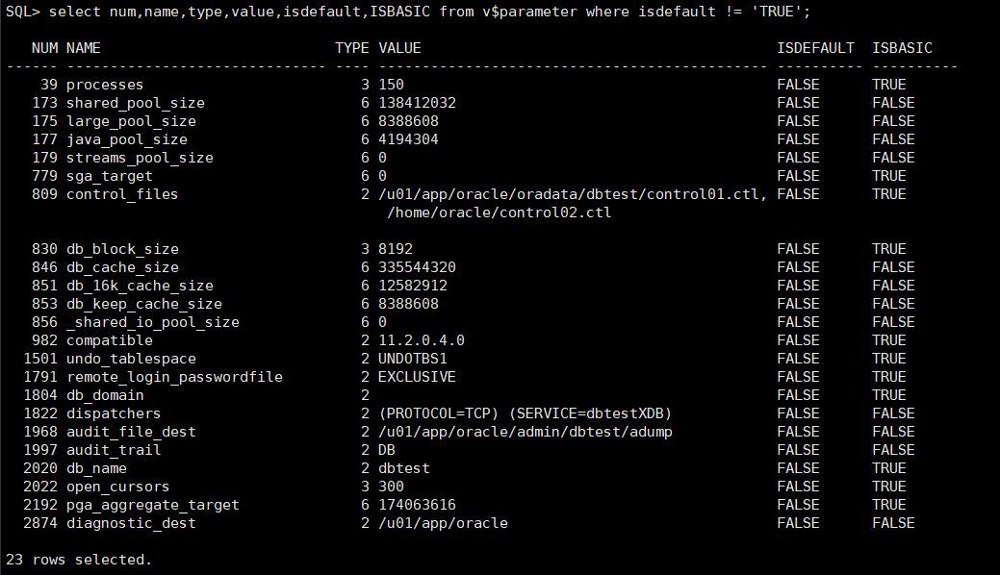
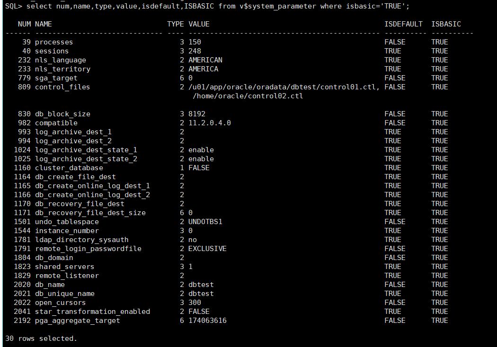

# 物理文件_参数文件

> 2019.10.02 BoobooWei

<!-- TOC depthFrom:1 depthTo:6 withLinks:1 updateOnSave:1 orderedList:0 -->

- [物理文件_参数文件](#物理文件参数文件)
	- [初始化参数的功能](#初始化参数的功能)
	- [初始化参数的类型](#初始化参数的类型)
		- [Derived Parameters](#derived-parameters)
		- [Operating System-Dependent Parameters](#operating-system-dependent-parameters)
		- [Variable Parameters](#variable-parameters)
	- [初始化参数的查看](#初始化参数的查看)
		- [实践——查看初始化参数视图的结构](#实践查看初始化参数视图的结构)
		- [实践——查看所有初始化参数](#实践查看所有初始化参数)
		- [实践——查看无默认值的初始化参数](#实践查看无默认值的初始化参数)
		- [实践——查看基础的初始化参数](#实践查看基础的初始化参数)
		- [实践——查看可以动态修改的初始化参数](#实践查看可以动态修改的初始化参数)
		- [实践——查看不可以动态修改的初始化参数](#实践查看不可以动态修改的初始化参数)
	- [初始化参数总结](#初始化参数总结)
		- [动态参数](#动态参数)
		- [静态参数](#静态参数)
	- [参数文件](#参数文件)
		- [服务器参数文件 spfile](#服务器参数文件-spfile)
		- [初始化参数文件 pfile](#初始化参数文件-pfile)
		- [实践——查看参数文件类型](#实践查看参数文件类型)
		- [实践——修改spfile启动的实例参数值](#实践修改spfile启动的实例参数值)
		- [实践——修改pfile启动的实例参数值](#实践修改pfile启动的实例参数值)
		- [实践——修改pfile和spfile的位置](#实践修改pfile和spfile的位置)
		- [实践——将spfile写入字符设备（裸设备）](#实践将spfile写入字符设备裸设备)

<!-- /TOC -->

## 初始化参数的功能

初始化参数分为各种功能组：

- 设置整个数据库的限制

- 设置用户或流程限制

- 设置数据库资源限制

- 影响性能（称为**可变参数**）

> `可变参数是数据库管理员特别感兴趣的，因为这些参数主要用于提高数据库性能。`

## 初始化参数的类型

Oracle数据库服务器具有以下类型的初始化参数：

- [衍生参数](https://docs.oracle.com/cd/B28359_01/server.111/b28320/initparams001.htm#i556848)
- [操作系统相关参数](https://docs.oracle.com/cd/B28359_01/server.111/b28320/initparams001.htm#i1124377)
- [可变参数](https://docs.oracle.com/cd/B28359_01/server.111/b28320/initparams001.htm#i1124386)

### Derived Parameters

> 衍生参数

* 衍生参数是通过其他参数计算而来
* 不建议修改衍生参数
* 例如，`SESSIONS`参数的默认值是从`PROCESSES`衍生而来。如果值`PROCESSES`更改，则默认值也将`SESSIONS`更改，除非使用指定值覆盖它。

### Operating System-Dependent Parameters

> 操作系统相关参数

* 参数的有效值或值范围取决于主机操作系统
* 例如，该参数`DB_BLOCK_BUFFERS`表示内存中数据缓冲区的数量，其最大值取决于操作系统，这些缓冲区的大小由设置`DB_BLOCK_SIZE`，具有与操作系统有关的默认值。

### Variable Parameters

> 可变参数

* 可变的初始化参数为改善系统性能提供了最大的潜力
* 一些可变参数设置容量限制，但不影响性能。例如，当的值为`OPEN_CURSORS`10时，尝试打开其第11个游标的用户进程将收到错误。
* 其他可变参数会影响性能，但不会施加绝对限制。例如，减小的值`DB_BLOCK_BUFFERS`不会阻止工作，即使它可能会降低性能。

增加可变参数的值可能会改善系统的性能，但是增加大多数参数也会增加系统全局区域（SGA）的大小。较大的SGA可以最大程度地提高数据库性能。在虚拟内存操作系统中，如果将SGA换入和换出内存，太大的SGA可能会降低性能。控制虚拟内存工作区的操作系统参数应牢记SGA大小。操作系统配置也可能会限制SGA的最大大小。

## 初始化参数的查看

`V$PARAMETER`显示有关该会话当前有效的初始化参数的信息。新会话将从`V$SYSTEM_PARAMETER`视图显示的实例范围的值继承参数值。

* [v$parameter](https://docs.oracle.com/cd/B28359_01/server.111/b28320/dynviews_2085.htm#REFRN30176)

* [v$system_parameter](https://docs.oracle.com/cd/B28359_01/server.111/b28320/dynviews_3090.htm#REFRN30275)

### 实践——查看初始化参数视图的结构

```sql
desc v$parameter;
```

`V$PARAMETER`显示有关该会话当前有效的初始化参数的信息。新会话将从`V$SYSTEM_PARAMETER`视图显示的实例范围的值继承参数值。

| 柱                      | 数据类型         | 描述                                                         |
| :---------------------- | :--------------- | :----------------------------------------------------------- |
| `NUM`                   | `NUMBER`         | 参数编号                                                     |
| `NAME`                  | `VARCHAR2(80)`   | 参数名称                                                     |
| `TYPE`                  | `NUMBER`         | 参数类型：`1` -布尔值`2` -字符串`3` - 整数`4` -参数文件`5` -保留`6` -大整数 |
| `VALUE`                 | `VARCHAR2(4000)` | 会话的参数值（如果在会话中修改）；否则，实例范围的参数值     |
| `DISPLAY_VALUE`         | `VARCHAR2(4000)` | 用户友好格式的参数值。例如，如果该`VALUE`列显示`262144`大整数参数的值，则该`DISPLAY_VALUE`列将显示value `256K`。 |
| `ISDEFAULT`             | `VARCHAR2(9)`    | 指示参数是设置为默认值（`TRUE`）还是在参数文件中指定了参数值（`FALSE`） |
| `ISSES_MODIFIABLE`      | `VARCHAR2(5)`    | 指示是否参数可以与被改变`ALTER SESSION`（`TRUE`）否（`FALSE`） |
| `ISSYS_MODIFIABLE`      | `VARCHAR2(9)`    | 指示参数是否可以更改`ALTER SYSTEM`以及更改何时生效：`IMMEDIATE`- `ALTER SYSTEM`不管用于启动实例的参数文件的类型如何，都可以更改参数。更改将立即生效。`DEFERRED`- `ALTER SYSTEM`不管用于启动实例的参数文件的类型如何，都可以更改参数。该更改在后续会话中生效。`FALSE`- `ALTER SYSTEM`除非使用服务器参数文件启动实例，否则无法使用参数进行更改。该更改在后续实例中生效。 |
| `ISINSTANCE_MODIFIABLE` | `VARCHAR2(5)`    | 对于可以使用更改的参数`ALTER SYSTEm`，指示参数值对于每个实例（`TRUE`）可以不同，还是对于所有Real Application Clusters实例（`FALSE`）参数必须具有相同的值。如果该`ISSYS_MODIFIABLE`列为`FALSE`，则此列始终为`FALSE`。 |
| `ISMODIFIED`            | `VARCHAR2(10)`   | 指示实例启动后是否已修改参数：`MODIFIED` -参数已被修改 `ALTER SESSION``SYSTEM_MOD`-参数已使用修改`ALTER SYSTEM`（这导致所有当前登录的会话的值都被修改）`FALSE` -实例启动后未修改参数 |
| `ISADJUSTED`            | `VARCHAR2(5)`    | 指示Oracle是否将输入值调整为更合适的值（例如，参数值应为质数，但用户输入了非质数，因此Oracle将值调整为下一个质数） |
| `ISDEPRECATED`          | `VARCHAR2(5)`    | 指示是否已弃用该参数`TRUE`（`FALSE`）                        |
| `ISBASIC`               | `VARCHAR2(5)`    | 指示参数是否是基本参数（`TRUE`），或者（`FALSE`）            |
| `DESCRIPTION`           | `VARCHAR2(255)`  | 参数说明                                                     |
| `UPDATE_COMMENT`        | `VARCHAR2(255)`  | 与最新更新相关的评论                                         |
| `HASH`                  | `NUMBER`         | 参数名称的哈希值                                             |

### 实践——查看所有初始化参数

```sql
select num,name,type,value,isdefault,ISBASIC from v$parameter;
```

353个参数

### 实践——查看无默认值的初始化参数

`select num,name,type,value,isdefault,ISBASIC from v$parameter where isdefault != 'TRUE';`



### 实践——查看基础的初始化参数

```sql
select num,name,type,value,isdefault,ISBASIC from v$system_parameter where isbasic='TRUE';
```



### 实践——查看可以动态修改的初始化参数

```sql
select NAME,ISSYS_MODIFIABLE from v$parameter where ISSYS_MODIFIABLE<>'FALSE' order by 2;
```

### 实践——查看不可以动态修改的初始化参数

```sql
select NAME,ISSYS_MODIFIABLE from v$parameter where ISSYS_MODIFIABLE='FALSE';
```

## 初始化参数总结

1. 按照`功能`分为四大类：设置整个数据库的限制；设置用户或流程限制；设置数据库资源限制；影响性能（即可变参数）
2. 按照`类型`分为三大类：衍生参数、与操作系统相关参数、可变参数
3. 按照`是否可以变更内存中的值`分为两类：动态参数、静态参数
4. 按照`是否设置参数默认值`分类两类：有默认值、无默认值

### 动态参数

参数在内存中的当前值是可以改变的，修改参数的代价比较小，不需要停止数据库。

* DEFERRED : 参数修改后的新值对已持续连接无效
* IMMEDIATE: 参数修改后的新值对所有会话立即生效

### 静态参数

参数在内存中的当前值不可以被修改。

* 无默认值的初始化参数被写入到`参数文件`，启动实例时读取

* 例如，`db_name`无默认值

## 参数文件

**参数文件**是包含的初始化参数列表和每个参数的值的文件，Oracle支持以下两种类型的参数文件：

| 参数文件                                                     | 文件类型 | 存放位置         | 文件系统           | 优先级 | 修改方式   |
| ------------------------------------------------------------ | -------- | ---------------- | ------------------ | ------ | ---------- |
| [服务器参数文件 spfile](https://docs.oracle.com/cd/B28359_01/server.111/b28320/initparams003.htm#i1124404) | 二进制   | 只能放在服务器端 | 脱离文进系统的束缚 | 高     | SQL命令    |
| [初始化参数文件 pfile](https://docs.oracle.com/cd/B28359_01/server.111/b28320/initparams003.htm#i1124407) | ASCII    | 服务器端或客户端 | 只能放在文件系统下 | 低     | 文本编辑器 |

* 存放的位置：`$ORACLE_HOME/dbs`

* 参数文件命名规则：

  ```
  spfile<$ORACLE_SID>.ora
  spfile.ora
  init<$ORACLE_SID>.ora
  ```

### 服务器参数文件 spfile

**服务器参数文件**是充当初始化参数库的二进制文件。服务器参数文件可以驻留在执行Oracle数据库服务器的计算机上。存储在服务器参数文件中的初始化参数是持久性的，因为在实例运行时对参数所做的任何更改都可以在实例关闭和启动之间持久化。

### 初始化参数文件 pfile

**初始化参数文件**是一个包含初始化参数列表的文本文件。该文件应使用客户端的默认字符集编写。

以下是初始化参数文件中的示例条目：

```
PROCESSES = 100
OPEN_LINKS = 12
GLOBAL_NAMES = true
```

有关操作系统上初始化参数文件的默认位置和文件名，请参阅特定于操作系统的Oracle文档。初始化参数文件由用于启动服务器的客户端工具（例如SQL * Plus）读取。

在Oracle分发介质上为每个操作系统提供了示例初始化参数文件。样本文件足以用于初始使用，但是您可能需要修改该文件以调整数据库以实现最佳性能。完全关闭并重新启动实例后，所有更改才会生效。


### 实践——查看参数文件类型

```bash
[oracle@oratest ~]$ cd $ORACLE_HOME/dbs
[oracle@oratest dbs]$ ll
total 36168
-rw-r-----  1 oracle oinstall 16720384 Aug 18 06:23 arch1_26_1010245731.dbf
-rw-r-----  1 oracle oinstall  3963904 Oct  1 03:28 arch1_27_1010245731.dbf
-rw-r-----  1 oracle oinstall 16325120 Oct  1 23:04 arch1_28_1010245731.dbf
-rw-rw----. 1 oracle oinstall     1544 Oct  1 23:04 hc_dbtest.dat
-rw-r--r--. 1 oracle oinstall     2851 May 15  2009 init.ora
-rw-r-----. 1 oracle oinstall       24 Jun  6 15:48 lkDBTEST
-rw-r-----  1 oracle oinstall     1536 Oct  1 23:11 orapwdbtest
-rw-r-----. 1 oracle oinstall     3584 Aug 10 04:28 spfiledbtest.ora
[oracle@oratest dbs]$ file init.ora
init.ora: ASCII English text
[oracle@oratest dbs]$ file spfiledbtest.ora
spfiledbtest.ora: data

```

### 实践——修改spfile启动的实例参数值

| 参数修改   | `内存`中的值           | `参数文件`中的值       | `内存`中的值和`参数文件`中的值 |
| ---------- | ---------------------- | ---------------------- | ------------------------------ |
| `动态`参数 | `alter..scope=memory;` | `alter..scope=spfile;` | `alter..scope=both;`           |
| `静态`参数 |                        | `alter..scope=spfile;` |                                |

spfile启动的实例，如何修改动态参数内存中的值：

* ```sql
  alter system set open_cursors=400 scope=memory;
  ```

spfile启动的实例，如何修改动态参数在参数文件中的值：

* ```sql
  alter system set open_cursors=500 scope=spfile;
  ```

spfile启动的实例，如何修改动态参数内存中的值和参数文件中的值：

* ```sql
  alter system set open_cursors=600 scope=both;
  ```

spfile启动的实例，如何修改静态参数在参数文件中的值：

* ```sql
  alter system set memory_max_target=1g scope=spfile;
  ```

* 静态参数的修改之后需要重新启动实例才能生效。

### 实践——修改pfile启动的实例参数值

| 参数修改   | `内存`中的值 | `参数文件`中的值 | `内存`中的值和`参数文件`中的值             |
| ---------- | ------------ | ---------------- | ------------------------------------------ |
| `动态`参数 | `alter..;`   | `文本编辑器`     | 先`alter..;`再使用`文本编辑器`修改参数文件 |
| `静态`参数 |              | `文本编辑器`     |                                            |


创建pfile：使用sys创建会话之后就可以使用的命令，不需要启动数据库。

* ```sql
  create pfile from spfile;
  ```


pfile启动的实例，如何修改动态参数内存中的值：

* ```sql
  alter system set open_cursors=400;
  ```

pfile启动的实例，如何修改动态参数在参数文件中的值：

* 使用文本编辑器直接修改参数文件！

pfile启动的实例，如何修改动态参数内存中的值和参数文件中的值：

* ```sql
  alter system set open_cursors=500;
  ```

* 再使用文本编辑器修改参数文件

pfile启动的实例，如何修改静态参数在参数文件中的值：

* 使用文本编辑器直接修改参数文件

### 实践——修改pfile和spfile的位置

修改pfile的位置：

* ```sql
  startup pfile='/home/oracle/orcl.ora'
  ```


修改spfile的位置：

* ```bash
  vi $ORACLE_HOME/dbs/initorcl.ora
  -------------------------------------
  spfile='/home/oracle/2.ora'
  -------------------------------------
  ```

### 实践——将spfile写入字符设备（裸设备）

制作二进制文件

* ```bash
  dd if=/dev/zero of=/disk1 bs=1M count=10
  ```

将二进制文件初始化为块设备

* ```bash
  losetup /dev/loop1 /disk1
  ```

将块设备初始化为字符设备（裸设备）

* ```bash
  raw /dev/raw/raw1 /dev/loop1
  chown oracle.oinstall /dev/raw/raw1

  shut immediate
  create spfile='/dev/raw/raw1' from pfile='/home/oracle/orcl.ora';

  vi $ORACLE_HOME/dbs/initorcl.ora
  -------------------------------------
  spfile='/dev/raw/raw1'
  -------------------------------------
  startup

  show parameter spfile
  ```
