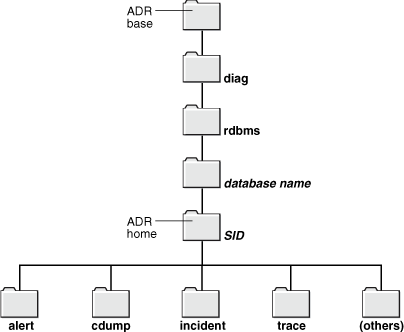

# 物理结构_跟踪文件

> 2019.10.03 BoobooWei

[TOC]

## 关于Oracle代码的可测量性

> * [关于Oracle数据库故障诊断基础架构](https://docs.oracle.com/cd/B28359_01/server.111/b28310/diag001.htm#ADMIN11257)
> * [管理诊断数据](https://docs.oracle.com/cd/B28359_01/server.111/b28310/diag.htm#adminChapterDiagnosability)

在应用设计和开发中，可测量性至关重要。每一版Oracle数据库的可测量性都越来越好。

* Oracle 10g 将内核中的代码测量发展到一个全新的层次，引入了自动负载存储库`Automatic Workload Repository,AWR` 和活动会话历史`Active Session History,ASH`特性；
* Oracle 11g 则更进一步，引入了自动诊断存储库`Automatic Diagnostic Repository,ADR`和SQL性能分析器`SQL Performance Analyzer,SPA`;
* Oracle 12c 在原来的基础上又增加了 DDL 日志以记录数据库中所有的DDL操作，此外还增加了调试日志，用于记录数据库中产生的一些异常情况。

​                                                                    ——摘自《**Oracle编程艺术：深入理解数据库体系结构(第3版)**》

> 从指标采集，到自动诊断和SQL分析，个人觉得Oracle的监控告警做得太棒了！相信不久的将来，Oracle 可以做到故障自愈 ^.^

---

从 Oracle 11 *g*开始，Oracle数据库有一个**高级故障诊断系统**用于收集和管理诊断数据。**诊断数据**包括以前版本中也存在的`跟踪文件`，`转储`和`核心文件`，以及使客户和Oracle支持人员能够快速有效地识别，调查，跟踪和解决问题的`新型诊断数据`。

在这一章当中：

- [关于Oracle数据库故障诊断基础架构](https://docs.oracle.com/cd/B28359_01/server.111/b28310/diag001.htm#CHDIAADE)
- [调查，报告和解决问题](https://docs.oracle.com/cd/B28359_01/server.111/b28310/diag002.htm#CHDJDBCH)
- [使用企业管理器支持工作台查看问题](https://docs.oracle.com/cd/B28359_01/server.111/b28310/diag003.htm#CHDBCHID)
- [创建用户报告的问题](https://docs.oracle.com/cd/B28359_01/server.111/b28310/diag004.htm#CHDFECDJ)
- [查看警报日志](https://docs.oracle.com/cd/B28359_01/server.111/b28310/diag005.htm#CHDGCEIH)
- [查找跟踪文件](https://docs.oracle.com/cd/B28359_01/server.111/b28310/diag006.htm#CHDIHIBA)
- [使用运行状况监控器运行运行状况检查](https://docs.oracle.com/cd/B28359_01/server.111/b28310/diag007.htm#CHDFCCAE)
- [使用SQL Repair Advisor修复SQL故障](https://docs.oracle.com/cd/B28359_01/server.111/b28310/diag008.htm#CHDBIGAA)
- [使用Data Recovery Advisor修复数据损坏](https://docs.oracle.com/cd/B28359_01/server.111/b28310/diag009.htm#CHDBHCFF)
- [创建，编辑和上传定制事件包](https://docs.oracle.com/cd/B28359_01/server.111/b28310/diag010.htm#CHDCACEJ)

今天要学习的跟踪文件只是 Oracle 11g 高级故障诊断系统收集的数据之一，本节我们将集中学习各种跟踪文件中的信息，如某类跟踪文件到底是什么，在哪里，对这些跟踪文件能够做什么。

## 自动诊断存储库ADR

自动诊断存储库`Automatic Diagnostic Repository,ADR`中的文件目录结构




- 该图显示了单个数据库实例的ADR的目录结构，其中每个目录都由一个文件夹表示。顶部是一个标有“ ADR base”的文件夹。
- 在ADR基础之下是一个名为diag的目录，在其下是一个名为rdbms的目录。在rdbms目录下面是一个目录，其名称为数据库名称。
- 在该目录下是目录全名的是数据库SID。此目录由标签标记为数据库实例的ADR主目录。例如我的环境中是`/u01/app/oracle/diag/rdbms/dbtest/dbtest`
- ADR主目录（名称为数据库SID的目录）下面是以下子目录：alert，cdump，event，trace和其他。

| 目录       | 英文             | 说明                                                         |
| ---------- | ---------------- | ------------------------------------------------------------ |
| `trace`    | `Diag Trace`     | 用户进程和后台进程产生的诊断跟踪文件                         |
| `alert`    | `Diag Alert`     | XML格式的告警日志                                            |
| `incident` | `Diag Incident`  | 记录事件信息，包含多个子目录，其中每个子目录都为特定事件命名，每个子目录包含仅与该事件有关的转储 |
| `cdump`    | `Diag Cdump`     | 内核跟踪目标，当发生严重问题时（如进程崩溃）会自动生成相应的跟踪文件 |
| `hm`       | `Health Monitor` | 运行状况监控器报告                                           |


```bash
[oracle@oratest dbtest]$ pwd
/u01/app/oracle/diag/rdbms/dbtest/dbtest
[oracle@oratest dbtest]$ ll
total 68
drwxr-x---. 2 oracle oinstall  4096 Jun  6 15:47 alert
drwxr-x---. 2 oracle oinstall  4096 Jun  6 15:47 cdump
drwxr-x---. 2 oracle oinstall  4096 Jun  6 15:47 hm
drwxr-x---. 2 oracle oinstall  4096 Jun  6 15:47 incident
drwxr-x---. 2 oracle oinstall  4096 Jun  6 15:47 incpkg
drwxr-x---. 2 oracle oinstall  4096 Jun  6 15:47 ir
drwxr-x---. 2 oracle oinstall  4096 Jun  6 15:48 lck
drwxr-x---. 2 oracle oinstall  4096 Jun  6 15:48 metadata
drwxr-x---. 2 oracle oinstall  4096 Jun  6 15:47 metadata_dgif
drwxr-x---. 2 oracle oinstall  4096 Jun  6 15:47 metadata_pv
drwxr-x---. 2 oracle oinstall  4096 Jun  6 15:47 stage
drwxr-x---. 2 oracle oinstall  4096 Jun  6 15:47 sweep
drwxr-x---. 2 oracle oinstall 20480 Oct  5 22:20 trace
```

## 跟踪文件的分类

我们将跟踪文件分成两大类：

* **计划内的，由用户请求所产生的跟踪文件**：如启用`DBMS_MONITOR.SESSION_TRACE_ENABLE`产生的跟踪文件。这类文件包含会话相关的诊断信息，它有助于你调整及优化应用的性能，并诊断出瓶颈到底在哪里。
* **计划外的，数据库服务器自动产生的跟踪文件**：当数据库服务器发生某些严重错误时，它会自动生成这些跟踪文件。这些错误包括（但不限于）`ORA-00600 "Internal Error"`（内部错误）、`ORA-03113 "End of file on communication channel"`（通信通道上文件结束）以及`ORA-07445 "Exception Encountered"`（遇到异常）。这些跟踪文件包含一些诊断信息，它主要对 Oracle Support 的分析人员有用，但对我们来说，除了能看出应用中哪里出现了内部错误之外，用处不大。

### 计划内的，由用户请求所产生的跟踪文件

这些跟踪文件包含与诊断和性能相关的信息。他们对于了解数据应用的内部工作有着非凡的意义。在一个正常运行的数据库中，这类跟踪文件最为常见。

#### 产生方式

* `DBMS_MONITOR`
* `Oracle 9iR2`及更早的版本中可用`alter session set sql_trace=TRUE`
* `10046`事件等`Oracle拓展跟踪工具`

#### 跟踪文件的位置

不论使用以上三种产生方式中的哪一种，Oracle都会在以下两个位置之一产生跟踪文件：

1. 如果使用**专用服务器连接**，会在`user_dump_dest`参数指定的目录中生成跟踪文件；
2. 如果使用**共享服务器连接**，会在`backgroup_dump_dest`参数指定的目录中生成跟踪文件。

如何查看跟踪文件的位置？

* sqlplus 执行`show parameter dump_dest`
* 查看视图`v$parameter`
* 查看视图`v$diag_info`

#### 命名约定

> Oracle 跟踪文件的命名约定随着版本不同而变化。

Linux系统的命名规范如下：

| 数据库版本    | 跟踪文件名            |
| ------------- | --------------------- |
| 9i Release 1  | ora_10583.trc         |
| 9i Release 2  | ora9ir2_ora_1905.trc  |
| 10g Release 2 | ora10gr2_ora_6793.trc |
| 11g Release 2 | ora11gr2_ora_1990.trc |
| 12c Release 1 | ora12cr1_ora_2344.trc |

除了`9i Release 1`，其他版本的跟踪文件名包含以下部分：`$ORACLE_SID_ora_<进程ID>.trc`

* 第一部分：`$ORACLE_SID`
* 第二部分：`ora`
* 第三部分：专用服务器在操作系统中的`进程ID`

#### 对跟踪文件加标记

当我们无权访问`v$process` 和`v$session`的时候，想得到跟踪文件的名字就比较困难了。这时，我们可以对跟踪文件“加标记”来找到它。

* 有权限访问`user_dump_dest`目录
* 使用会话参数`tracefile_identifier`来标记跟踪文件

```sql
alter session set tracefile_identifier = 'Look_For_Me';
!ls $ORACLE_BASE/diag/rdbms/dbtest/dbtest/trace/*Look_For_Me*
exec dbms_monitor.session_trace_enable
!ls $ORACLE_BASE/diag/rdbms/dbtest/dbtest/trace/*Look_For_Me*
```

执行以上命令可以获取到添加标记的两个文件：

* `/u01/app/oracle/diag/rdbms/dbtest/dbtest/trace/dbtest_ora_22489_Look_For_Me.trc`
* `/u01/app/oracle/diag/rdbms/dbtest/dbtest/trace/dbtest_ora_22489_Look_For_Me.trm`

`.trc`结尾的文件为标记后的跟踪文件；`.trm`结尾的文件为跟踪文件的图文件`trace map file`,包含了跟踪文件的结构信息。

### 计划外的，数据库服务器自动产生的跟踪文件

#### 产生方式

* 这类跟踪文件的产生不在我们的计划内
* 由`ORA-00600`或另外某个内部错误而自动产生

#### 处理方式

针对这类跟踪文件我们能做什么？

* 向Oracle提交一个服务请求
* 将产生的跟踪文件打包上传到Oracle Support

从Oracle 11g开始，利用命令行工具`ADRCI(Automatic Diagnostic Repository Command Interpreter)`并结合`Enterprice Manager`的用户界面，就能轻松查看自动诊断存储库`ADR`中的跟踪信息，并把它们打包传输到Oracle Support。

```bash
[oracle@oratest ~]$ adrci

ADRCI: Release 11.2.0.4.0 - Production on Sat Oct 5 22:20:20 2019

Copyright (c) 1982, 2011, Oracle and/or its affiliates.  All rights reserved.

ADR base = "/u01/app/oracle"
adrci> show problem

ADR Home = /u01/app/oracle/diag/rdbms/dbtest/dbtest:
*************************************************************************
0 rows fetched
```
### 实践

#### 实践——查看是否开启跟踪文件

```sql
show parameter trace
```

#### 实践——查看跟踪文件位置

```sql
show parameter dump_dest	
select name,value from v$parameter where name like '%dump_dest%';
select name,value from v$diag_info;
```

这里显示了三个跟踪目标：

- `background_dump_dest`：后台跟踪目标，用于所有服务器后台进程
- `core_dump_dest`：内核跟踪目标，当发生严重问题时（如进程崩溃）会自动生成相应的跟踪文件
- `user_dump_dest`：用户跟踪目标，用于专用/共享服务器的跟踪文件

#### 实践——启用用户跟踪文件

```sql
exec dbms_monitor.session_trace_enable
```

> 疑问？
>
> ```bash
> [oracle@oratest trace]$ ps -ef|
> > grep sqlplus
> oracle     3230   2951  0 05:06 pts/0    00:00:00 rlwrap sqlplus / as sysdba
> oracle     3231   3230  0 05:06 pts/1    00:00:00 sqlplus   as sysdba
> oracle     3309   3250  0 05:12 pts/2    00:00:00 grep sqlplus
> ```
>
> sqlplus 的系统进程id为3231，但是产生的跟踪文件却是3232！
>
> [root@oratest ~]# ps -ef|grep 3231
> oracle     3231   3230  0 05:06 pts/1    00:00:00 sqlplus   as sysdba
> oracle     3232   3231  0 05:06 pts/1    00:00:00 oracledbtest (DESCRIPTION=(LOCAL=YES)(ADDRESS=(PROTOCOL=beq)))
>
> 可以看到3231有一个子进程 3232 zhege jiushi Oracle的用户会话进程，因此跟踪文件使用的是 3232 ，而不是3231的sqlplus客户端进程。

## 笔记

### 1. 查看常用的跟踪文件路径

```
show parameter diagnostic_dest
show parameter user_dump_dest
show parameter background_dump_dest
show parameter core_dump_dest

/u01/app/oracle
/u01/app/oracle/diag/rdbms/orcl/orcl/trace
/u01/app/oracle/diag/rdbms/orcl/orcl/trace
/u01/app/oracle/diag/rdbms/orcl/orcl/cdump
```

### 2. 掌握常用跟踪文件命名规则

* 警报日志：`alert_<$ORACLE_SID>.log`,数据库报错信息的概要文件
* 后台进程的跟踪文件:`<$ORACLE_SID>_进程名字_pid.trc`，后台进程工作时的消息或者报错信息
* 用户进程的跟踪文件:`<$ORACLE_SID>_ora_pid.trc`,记录user process发出的消息，但是需要手工打开跟踪

### 3. 掌握打开/关闭当前会话跟踪的方法

```sql
exec dbms_monitor.session_trace_enable
exec dbms_monitor.session_trace_disable
```

### 4. 掌握打开/关闭指定的会话跟踪方法

* 获得需要跟踪的会话的信息：`select sid,serial#,username,machine from v$session where username='SYS';`

* 打开跟踪：`EXEC DBMS_SYSTEM.SET_SQL_TRACE_IN_SESSION(sid,serial#,boolean);`

* 做业务
* 关闭跟踪：`EXEC DBMS_SYSTEM.SET_SQL_TRACE_IN_SESSION(sid,serial#,boolean);`
* 查找跟踪文件：`select spid from v$process p,v$session s where p.addr=s.paddr and s.sid=20;`
* 格式化用户跟踪文件: `tkprof orcl_ora_5874.trc 1.txt`

举例：

```bash
SQL> select sid,serial#,username,machine from v$session where username='SYS';

       SID    SERIAL# USERNAME	 MACHINE
---------- ---------- ---------- --------------------
	21	   33 SYS	 oratest

SQL> EXEC DBMS_SYSTEM.SET_SQL_TRACE_IN_SESSION(21,33,true);

PL/SQL procedure successfully completed.

SQL> select * from v$process where rownum < 10;

ADDR			PID SPID					     PNAME	USERNAME      SERIAL# TERMINAL
---------------- ---------- ------------------------------------------------ ---------- ---------- ---------- ------------------------------------------------------------
PROGRAM
------------------------------------------------------------------------------------------------
TRACEID
--------------------------------------------------------------------------------------------------------------------------------------------------------------------------------------------------------
TRACEFILE
--------------------------------------------------------------------------------------------------------------------------------------------------------------------------------------------------------
BA LATCHWAIT			    LATCHSPIN			     PGA_USED_MEM PGA_ALLOC_MEM PGA_FREEABLE_MEM PGA_MAX_MEM
-- -------------------------------- -------------------------------- ------------ ------------- ---------------- -----------
000000007E8D2748	  1										    0
PSEUDO

/u01/app/oracle/diag/rdbms/dbtest/dbtest/trace/dbtest_ora_0.trc
										0	      0 	       0	   0

000000007E8D3800	  2 2985					     PMON	oracle		    1 UNKNOWN
oracle@oratest (PMON)
此处省略。。。

SQL> EXEC DBMS_SYSTEM.SET_SQL_TRACE_IN_SESSION(21,33,false);

PL/SQL procedure successfully completed.

SQL> select spid from v$process p,v$session s where p.addr=s.paddr and s.sid=21;

SPID
------------------------------------------------
3302

SQL> show parameter user_dump_dest

NAME				     TYPE		    VALUE
------------------------------------ ---------------------- ------------------------------
user_dump_dest			     string		    /u01/app/oracle/diag/rdbms/dbt
							    est/dbtest/trace
SQL> !ls /u01/app/oracle/diag/rdbms/dbtest/dbtest/trace/dbtest_ora_3302*
/u01/app/oracle/diag/rdbms/dbtest/dbtest/trace/dbtest_ora_3302.trc  /u01/app/oracle/diag/rdbms/dbtest/dbtest/trace/dbtest_ora_3302.trm

[oracle@oratest trace]$ which tkprof
/u01/app/oracle/product/11.2.0.4/bin/tkprof
[oracle@oratest trace]$ tkprof /u01/app/oracle/diag/rdbms/dbtest/dbtest/trace/dbtest_ora_3302.trc booboo.txt

TKPROF: Release 11.2.0.4.0 - Development on Sat Oct 5 23:37:25 2019

Copyright (c) 1982, 2011, Oracle and/or its affiliates.  All rights reserved.
```


