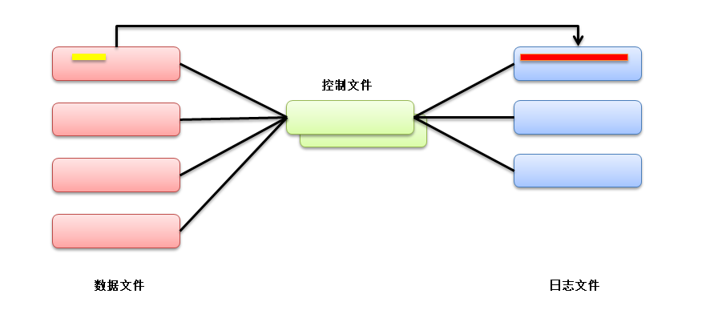
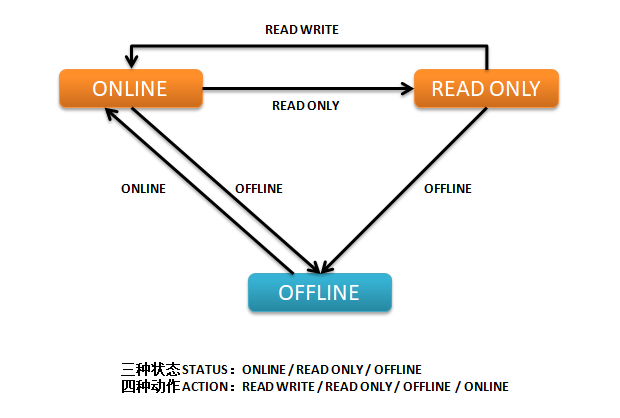

# 数据文件

> 2019-12-21 - BoobooWei

<!-- MDTOC maxdepth:6 firsth1:1 numbering:0 flatten:0 bullets:1 updateOnSave:1 -->

- [数据文件](#数据文件)   
   - [关于数据文件](#关于数据文件)   
   - [实践1-建立新的表空间](#实践1-建立新的表空间)   
      - [查看表空间和数据文件的信息](#查看表空间和数据文件的信息)   
      - [查看每个表空间有多少个数据文件](#查看每个表空间有多少个数据文件)   
      - [建立新的表空间](#建立新的表空间)   
      - [加入新的数据文件](#加入新的数据文件)   
      - [删除数据文件](#删除数据文件)   
      - [改变数据文件的大小](#改变数据文件的大小)   
      - [数据文件的自动扩展](#数据文件的自动扩展)   
      - [修改表空间状态](#修改表空间状态)   
   - [实践2-更改表空间的名称，更改数据文件的名称](#实践2-更改表空间的名称，更改数据文件的名称)   
      - [修改表空间名](#修改表空间名)   
      - [数据文件改名称](#数据文件改名称)   
         - [只将待修改的数据文件offline](#只将待修改的数据文件offline)   
         - [将表空间offline](#将表空间offline)   
   - [拓展知识点-数据文件的文件头](#拓展知识点-数据文件的文件头)   
      - [如何得到文件头的转储文件](#如何得到文件头的转储文件)   
      - [获取跟踪文件名](#获取跟踪文件名)   
      - [查看跟踪文件](#查看跟踪文件)   
      - [获取数据块的转储文件](#获取数据块的转储文件)   
   - [数据字典总结](#数据字典总结)   

<!-- /MDTOC -->


## 关于数据文件

[关于数据文件](https://docs.oracle.com/en/database/oracle/oracle-database/12.2/admin/managing-data-files-and-temp-files.html#GUID-B1805034-94ED-4887-94B4-369FB8AAE416)

数据文件是操作系统的物理文件，用于存储数据库中所有逻辑结构的数据。必须为每个表空间显式创建它们。

Oracle数据库为每个数据文件分配两个关联的文件号，一个绝对文件号和一个相对文件号，用于唯一地标识它。下表描述了这些数字：

| 文件编号类型 | 描述                                                         |
| ------------ | ------------------------------------------------------------ |
| 绝对         | 唯一标识数据库中的数据文件。该文件号可以在许多引用数据文件的SQL语句中使用，而不是使用文件名。绝对文件号可以在找到`FILE# `所述的柱`V$DATAFILE`或`V$TEMPFILE`视图，或者在`FILE_ID`所述的柱`DBA_DATA_FILES`或`DBA_TEMP_FILES`视图。 |
| 相对的       | 唯一标识表空间内的数据文件。对于中小型数据库，相对文件号通常具有与绝对文件号相同的值。但是，当数据库中的数据文件数超过阈值（通常为1023）时，相对文件数与绝对文件数不同。在bigfile表空间中，相对文件号始终为1024（在OS / 390平台上为4096）。 |

**父主题：** [管理数据文件的准则](https://docs.oracle.com/en/database/oracle/oracle-database/12.2/admin/managing-data-files-and-temp-files.html#GUID-BB7D8910-FCAE-4DAD-BDE5-B5EE35C69C6B)


* 数据文件是数据的存放载体
* 数据文件存在于操作系统上,可以不是文件。设备也可以。
* 数据文件不能独立存在,得有组织 数据文件的逻辑组织形式为表空间`tablespace`
* 一个表空间内可以含有多个数据文件 数据库内可以有多个表空间



* 红色是存放数据的数据文件
* 红色的变化存放在蓝色的日志文件
* 绿色为控制文件，存放红色和蓝色的结构和行为。


## 实践1-建立新的表空间

该实验的目的是初步认识数据文件和表空间。

### 查看表空间和数据文件的信息

```SQL
SELECT
    tablespace_name, file_name, CEIL(bytes / 1024 / 1024) mb
FROM
    dba_data_files
ORDER BY 1;
```

### 查看每个表空间有多少个数据文件

```sql
SELECT
    tablespace_name, count(*) file_num
FROM
    dba_data_files
GROUP BY tablespace_name    
ORDER BY 1;
```

### 建立新的表空间

```sql
CREATE TABLESPACE <tablespace_name> DATAFILE '<datafile_path>' SIZE 2M;
CREATE TABLESPACE <tablespace_name> DATAFILE '<datafile_path>' SIZE 2M, '<datafile_path>' SIZE 2M;
```

### 加入新的数据文件

```sql
ALTER TABLESPACE <tablespace_name> ADD DATAFILE '<datafile_path>' SIZE 2M;
```

### 删除数据文件

Oracle版本 小于 10g 时，数据文件只能加入，不能删除，除非将表空间删除。

Oracle版本 从10g数据库版本开始可以删除。

```SQL
ALTER TABLESPACE <tablespace_name> DROP DATAFILE '<datafile_path>';
```

### 改变数据文件的大小

改变数据文件的大小 可以加大，也可以缩小

```sql
ALTER DATABASE DATAFILE '<datafile_path>' RESIZE 3M;
```

3M为最后的大小，不是加大3M。

* 一个数据文件的最小值为文件头加最小的表；
* 一个数据文件的最大值为该表空间的块大小乘4M。

### 数据文件的自动扩展

查看表空间数据文件自动拓展属性

```sql
SELECT
    file_name, autoextensible, maxblocks, increment_by
FROM
    dba_data_files;
```

修改数据库文件为自动拓展

```sql
alter database datafile '/home/oracle/ts1.dbf' autoextend on next 1m maxsize 100m;
```

关闭数据文件自动扩展功能

```sql
alter database datafile '/home/oracle/ts1.dbf' autoextend off;
```

### 修改表空间状态

查看表空间状态`status`属性

```sql
select tablespace_name,status from dba_tablespaces;
```

修改表空间的状态为只读

```sql
alter tablespace ts1 read only;
```

修改表空间状态为读写

```sql
alter tablespace ts1 read write;
```

* 只读表空间内的表不能DML，但可以DROP 。
* 因为DROP操作的是SYSTEM表空间，SYSTEM表空间不能设为只读。

修改表空间状态为离线

```sql
alter tablespace ts1 offline;
```

修改表空间状态为在线

```sql
alter tablespace ts1 online;
```




## 实践2-更改表空间的名称，更改数据文件的名称

该实验的目的是管理表空间,了解什么是数据文件的一致性。


### 修改表空间名

表空间改名称（10g新特性），前提条件为：
* `system`和`sysaux`表空间不能改名称
* 要改的表空间必须`online`,`read write`
* 数据库版本10g以上

```SQL
ALTER TABLESPACE ts1 RENAME TO ts2;
```


### 数据文件改名称

#### 只将待修改的数据文件offline

1. 查看数据文件位置
2. 修改数据文件状态为`Offline`
3. 操作系统层文件名变更
4. 数据库层文件名变更
5. 修改数据文件状态为`online`
6. 查看`dba_data_files`验证

```SQL
select tablespace_name,file_name,online_status from dba_data_files where tablespace_name='<tbs_name>';
alter database datafile '<old_file_path>' offline;
!mv '<old_file_path>' to '<new_file_path>'
ALTER DATABASE RENAME FILE '<old_file_path>' TO '<new_file_path>';
recover datafile '<new_file_path>';
alter database datafile '<new_file_path>' online;
select name,status from v$datafile;
```

#### 将表空间offline

1. 查看数据文件位置
2. 修改表空间状态为`offline`
3. 操作系统层文件名变更跟
4. 数据库层文件名变更
5. 修改表空间状态为`online`
6. 查看`dba_data_files`验证

```SQL
select tablespace_name,file_name,online_status from dba_data_files where tablespace_name='<tbs_name>';
alter tablespace <tbs_name> offline;
!mv '<old_file_path>' to '<new_file_path>'
alter database rename file '<old_file_path>' TO '<new_file_path>';
alter tablespace <tbs_name> online;
select name,status from v$datafile;
```

##实践3-删除表空间

* 删除数据文件：只能删除表空间，才能删除数据文件
* 临时表空间的临时文件除外，你可以删除临时表空间内的临时文件。

```sql
drop tablespace ts1 including contents and datafiles;
```

## 拓展知识点-数据文件的文件头

Oracle提供了一类命令，可以将Oracle各类内部结构中所包含的信息转储(dump)到跟踪文件中，以便用户能根据文件内容来解决各种故障，或查看物理文件的内容。


### 如何得到文件头的转储文件

```SQL
ALTER SESSION SET EVENTS 'immediate trace name file_hdrs level 3';
```
这句话将所有数据文件的头都转储到dump文件中。

* file_hdrs事件：dump所有数据文件的头部信息
|level | 含义|
|:--|:--|
|1| 控制文件中的文件头信息 |
|2| level 1 + 文件头信息|
|3| level 2 + 数据文件头信息 |

### 获取跟踪文件名

```SQL
SELECT    a.VALUE
       || b.symbol
       || c.instance_name
       || '_ora_'
       || d.spid
       || '.trc' trace_file
  FROM (SELECT VALUE
          FROM v$parameter
         WHERE NAME = 'user_dump_dest') a,
       (SELECT SUBSTR (VALUE, -6, 1) symbol
          FROM v$parameter
         WHERE NAME = 'user_dump_dest') b,
       (SELECT instance_name
          FROM v$instance) c,
       (SELECT spid
          FROM v$session s, v$process p, v$mystat m
         WHERE s.paddr = p.addr AND s.SID = m.SID AND m.statistic# = 0) d;
```

### 查看跟踪文件

```bash
[oracle@oratest ~]$ less /u01/app/oracle/diag/rdbms/booboo/BOOBOO/trace/BOOBOO_ora_4763.trc
Trace file /u01/app/oracle/diag/rdbms/booboo/BOOBOO/trace/BOOBOO_ora_4763.trc
Oracle Database 11g Enterprise Edition Release 11.2.0.4.0 - 64bit Production
With the Partitioning, OLAP, Data Mining and Real Application Testing options
ORACLE_HOME = /u01/app/oracle/product/11.2.0.4
System name:    Linux
Node name:      oratest
Release:        2.6.32-573.el6.x86_64
Version:        #1 SMP Wed Jul 1 18:23:37 EDT 2015
Machine:        x86_64
VM name:        VMWare Version: 6
Instance name: BOOBOO
Redo thread mounted by this instance: 1
Oracle process number: 17
Unix process pid: 4763, image: oracle@oratest (TNS V1-V3)


*** 2019-12-22 15:06:13.116
*** SESSION ID:(162.35) 2019-12-22 15:06:13.116
*** CLIENT ID:() 2019-12-22 15:06:13.116
*** SERVICE NAME:(SYS$USERS) 2019-12-22 15:06:13.116
*** MODULE NAME:(sqlplus@oratest (TNS V1-V3)) 2019-12-22 15:06:13.116
*** ACTION NAME:() 2019-12-22 15:06:13.116

DUMP OF DATA FILES: 8 files in database

DATA FILE #1:
  name #7: /u01/app/oracle/oradata/BOOBOO/system01.dbf
creation size=41600 block size=8192 status=0xe head=7 tail=7 dup=1
 tablespace 0, index=1 krfil=1 prev_file=0
 unrecoverable scn: 0x0000.00000000 01/01/1988 00:00:00
 Checkpoint cnt:76 scn: 0x0000.000779cc 12/21/2019 22:50:59
 Stop scn: 0xffff.ffffffff 12/21/2019 19:55:30
 Creation Checkpointed at scn:  0x0000.00000007 11/09/2019 21:31:08
 thread:1 rba:(0x1.3.10)
 enabled  threads:  01000000 00000000 00000000 00000000 00000000 00000000
  00000000 00000000 00000000 00000000 00000000 00000000 00000000 00000000
  00000000 00000000 00000000 00000000 00000000 00000000 00000000 00000000
  00000000 00000000 00000000 00000000 00000000 00000000 00000000 00000000
  00000000 00000000 00000000 00000000 00000000 00000000 00000000 00000000
  00000000 00000000 00000000 00000000 00000000 00000000 00000000 00000000
  00000000 00000000 00000000 00000000 00000000 00000000 00000000 00000000
  00000000 00000000 00000000 00000000 00000000 00000000 00000000 00000000
  00000000 00000000 00000000 00000000 00000000 00000000 00000000 00000000
  00000000 00000000 00000000 00000000 00000000 00000000 00000000 00000000
  00000000 00000000 00000000 00000000 00000000 00000000 00000000 00000000
  00000000 00000000 00000000 00000000 00000000 00000000 00000000 00000000
  00000000 00000000 00000000 00000000 00000000 00000000 00000000 00000000
  00000000 00000000 00000000 00000000 00000000 00000000 00000000 00000000
  00000000 00000000 00000000 00000000 00000000 00000000 00000000 00000000
  00000000 00000000 00000000 00000000 00000000 00000000 00000000 00000000
  00000000 00000000 00000000 00000000 00000000 00000000
 Offline scn: 0x0000.0006e823 prev_range: 0
 Online Checkpointed at scn:  0x0000.0006e824 12/15/2019 11:25:12
 thread:1 rba:(0x1.2.0)
 enabled  threads:  01000000 00000000 00000000 00000000 00000000 00000000
   00000000 00000000 00000000 00000000 00000000 00000000 00000000 00000000
   00000000 00000000 00000000 00000000 00000000 00000000 00000000 00000000
   00000000 00000000 00000000 00000000 00000000 00000000 00000000 00000000
   00000000 00000000 00000000 00000000 00000000 00000000 00000000 00000000
   00000000 00000000 00000000 00000000 00000000 00000000 00000000 00000000
   00000000 00000000 00000000 00000000 00000000 00000000 00000000 00000000
   00000000 00000000 00000000 00000000 00000000 00000000 00000000 00000000
   00000000 00000000 00000000 00000000 00000000 00000000 00000000 00000000
   00000000 00000000 00000000 00000000 00000000 00000000 00000000 00000000
   00000000 00000000 00000000 00000000 00000000 00000000 00000000 00000000
   00000000 00000000 00000000 00000000 00000000 00000000 00000000 00000000
   00000000 00000000 00000000 00000000 00000000 00000000 00000000 00000000
   00000000 00000000 00000000 00000000 00000000 00000000 00000000 00000000
   00000000 00000000 00000000 00000000 00000000 00000000 00000000 00000000
   00000000 00000000 00000000 00000000 00000000 00000000 00000000 00000000
   00000000 00000000 00000000 00000000 00000000 00000000
  Hot Backup end marker scn: 0x0000.00000000
  aux_file is NOT DEFINED
  Plugged readony: NO
  Plugin scnscn: 0x0000.00000000
  Plugin resetlogs scn/timescn: 0x0000.00000000 01/01/1988 00:00:00
  Foreign creation scn/timescn: 0x0000.00000000 01/01/1988 00:00:00
  Foreign checkpoint scn/timescn: 0x0000.00000000 01/01/1988 00:00:00
  Online move state: 0
  V10 STYLE FILE HEADER:
          Compatibility Vsn = 186647552=0xb200400
          Db ID=3420951115=0xcbe7924b, Db Name='BOOBOO'
          Activation ID=0=0x0
          Control Seq=1383=0x567, File size=41600=0xa280
          File Number=1, Blksiz=8192, File Type=3 DATA

```         

文件头最特殊,使用上面的语法dump,

### 获取数据块的转储文件

转储文件1的2到4数据块：

```SQL
SQL> alter system dump datafile 1 block min 2 block max 4;
System altered.
```

转储文件1的2号数据块：

```SQL
SQL> alter system dump datafile 1 block 2;
System altered.
```


## 数据字典总结

[DBA_DATA_FILES](https://docs.oracle.com/cd/E11882_01/server.112/e40402/statviews_3143.htm#REFRN23049)

Online status of the file:

- `SYSOFF`
- `SYSTEM`
- `OFFLINE`
- `ONLINE`
- `RECOVER`

[DBA_TABLESPACES](<https://docs.oracle.com/cd/E11882_01/server.112/e40402/statviews_5060.htm#REFRN23287> )

 Tablespace status:

* `ONLINE`
* `OFFLINE`
* `READ ONLY`
