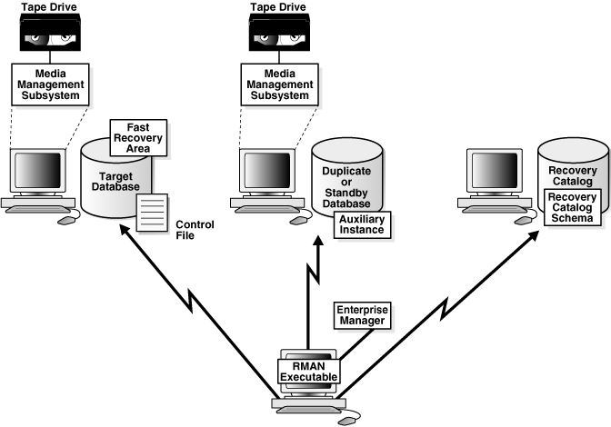

# 恢复管理器Recover Manager

> 2019.12.07 BoobooWei

[toc]


## 恢复管理器简介

### 功能

* 能够备份、还原、恢复
* 能够记录备份信息
* 全备、增备

[Database Backup and Recovery User's Guide ](https://docs.oracle.com/cd/E11882_01/backup.112/e10642/toc.htm)

### 原理



Recovery Manager环境由在备份和恢复策略中起作用的各种应用程序和数据库组成。

[表3-1](https://docs.oracle.com/cd/E11882_01/backup.112/e10642/rcmarchi.htm#CHDBEBIE)列出了典型RMAN环境中的某些组件。

表3-1 RMAN环境的组件

| 零件                                                         | 描述                                                         |
| :----------------------------------------------------------- | :----------------------------------------------------------- |
| [**RMAN客户端 RMAN client**](https://docs.oracle.com/cd/E11882_01/backup.112/e10642/glossary.htm#CHDDDAEB) | 客户端应用程序，用于管理目标数据库的备份和恢复操作。RMAN客户端可以使用Oracle Net连接到目标数据库，因此它可以位于通过Oracle Net连接到目标主机的任何主机上。 |
| [**目标数据库 target database**](https://docs.oracle.com/cd/E11882_01/backup.112/e10642/glossary.htm#i433583) | 一个数据库，其中包含RMAN备份或还原的控制文件，数据文件和可选的归档重做日志。RMAN使用目标数据库控制文件来收集有关目标数据库的元数据，并存储有关其自身操作的信息。备份和恢复工作由目标数据库上运行的服务器会话执行。 |
| [**恢复目录数据库 recovery catalog database**](https://docs.oracle.com/cd/E11882_01/backup.112/e10642/glossary.htm#i433287) | 包含[**recovery catalog schema**](https://docs.oracle.com/cd/E11882_01/backup.112/e10642/glossary.htm#i433280)数据库，该[**目录**](https://docs.oracle.com/cd/E11882_01/backup.112/e10642/glossary.htm#i433280)包含RMAN用于执行备份和恢复的元数据。您可以创建一个包含多个目标数据库的RMAN元数据的恢复目录。除非您将RMAN与[**物理备用数据库**](https://docs.oracle.com/cd/E11882_01/backup.112/e10642/glossary.htm#CHDEJBIJ)一起使用，否则在使用RMAN时，恢复目录是可选的，因为RMAN将其元数据存储在每个目标数据库的控制文件中。 |
| [**恢复目录架构**](https://docs.oracle.com/cd/E11882_01/backup.112/e10642/glossary.htm#CHDCCBAG) | 恢复目录数据库中的用户，该用户拥有RMAN维护的元数据表。RMAN定期将元数据从目标数据库控制文件传播到恢复目录中。 |
| [**物理备用数据库 physical standby database**](https://docs.oracle.com/cd/E11882_01/backup.112/e10642/glossary.htm#CHDEJBIJ) | 主数据库的副本，该副本已使用由主数据库生成的归档重做日志进行更新。物理备用数据库具有相同的`DBID`和`DB_NAME`值与主数据库，但不同的[`DB_UNIQUE_NAME`](https://docs.oracle.com/cd/E11882_01/server.112/e40402/initparams070.htm#REFRN10242)。如果无法访问主数据库，则可以故障转移到备用数据库。RMAN可以创建，备份或恢复 备用数据库。您在备用数据库上进行的备份可在主数据库或同一生产数据库的另一个备用数据库上使用。在Data Guard环境中使用RMAN时，需要恢复目录。**注意：**逻辑备用数据库被RMAN视为单独的数据库，因为它具有与其主数据库不同的DBID。[**另请参见：** *Oracle Data Guard概念和管理*](https://docs.oracle.com/cd/E11882_01/server.112/e41134/rman.htm#SBYDB04700)以了解如何在Data Guard环境中使用RMAN |
| [**重复数据库 duplicate database**](https://docs.oracle.com/cd/E11882_01/backup.112/e10642/glossary.htm#CHDBEFHG) | 可以用于测试目的的主数据库的副本。DBID与创建数据库的数据库不同。 |
| [**快速恢复区fast recovery area**](https://docs.oracle.com/cd/E11882_01/backup.112/e10642/glossary.htm#i999320) | 您可以用来存储与恢复相关的文件（例如控制文件和联机重做日志副本，已归档的重做日志，[**闪回日志**](https://docs.oracle.com/cd/E11882_01/backup.112/e10642/glossary.htm#CHDFHAAE)和RMAN备份）的磁盘位置。Oracle数据库和RMAN自动管理快速恢复区域中的文件。 |
| [**媒体经理 media manager**](https://docs.oracle.com/cd/E11882_01/backup.112/e10642/glossary.htm#i432922) | 供应商特定的应用程序，使RMAN可以备份到存储系统（例如磁带）   |
| [**媒体管理目录 media management catalog**](https://docs.oracle.com/cd/E11882_01/backup.112/e10642/glossary.htm#CHDIEBEA) | 有关媒体管理应用程序的特定于供应商的元数据存储库             |
| Oracle企业管理器 Oracle Enterprise Manager                   | 基于浏览器的数据库接口，包括通过RMAN的备份和恢复             |


RMAN环境中唯一需要的组件是目标数据库和RMAN客户端，但是大多数实际配置更加复杂。例如，您使用RMAN客户端连接到多个媒体管理器以及多个目标数据库和辅助数据库，这些都可以通过企业管理器访问。

[图3-1](https://docs.oracle.com/cd/E11882_01/backup.112/e10642/rcmarchi.htm#CHDHICBA)说明了可能的RMAN环境中的组件。该图显示主数据库，备用数据库和恢复目录数据库都位于不同的计算机上。主数据库和备用数据库主机使用本地连接的磁带驱动器。RMAN客户端和企业管理器控制台在单独的计算机上运行。

更详细的工具原理，参见官方文档[**调整RMAN性能**](https://docs.oracle.com/cd/E11882_01/backup.112/e10642/rcmtunin.htm#BRADV011)

### 命令

[ RMAN命令参考 ](https://docs.oracle.com/cd/E11882_01/backup.112/e10643/toc.htm)

## 操作实践

### 实践1-启动rman连接目标库


```sql
启动rman连接目标库(要进行备份的数据库)
rman target /

查看当前数据库的物理信息
RMAN> report schema;
```

### 实践2-使用rman对控制文件做镜像备份

```sql
使用rman对控制文件做镜像备份
RMAN> copy current controlfile to '/home/oracle/rmanbk/control01.ctl';

查看控制文件的镜像备份
RMAN> list copy of controlfile;

使用rman还原控制文件
RMAN> restore controlfile from '/home/oracle/rmanbk/control01.ctl';

使用rman装载数据库
RMAN> alter database mount;

使用rman恢复数据库
RMAN> recover database;

使用rman打开数据库
RMAN> alter database open resetlogs;
```

### 实践3-使用rman对数据文件做镜像备份

```sql
RMAN> copy datafile 5 to '/home/oracle/rmanbk/tbs01.dbf';

查看数据文件的镜像备份
RMAN> list copy of datafile 5;

切换日志：
alter system switch logfile;
alter system switch logfile;
alter system switch logfile;
alter system switch logfile;

模拟数据变化
select owner,table_name from dba_tables where tablespace_name='TBS1';

切换日志：
alter system switch logfile;
alter system switch logfile;
alter system switch logfile;
alter system switch logfile;

模拟5号文件丢失
rm -f /u01/app/oracle/oradata/db01/tbs01.dbf

重新启动数据库
startup force

ORA-01157: cannot identify/lock data file 5 - see DBWR trace file
ORA-01110: data file 5: '/u01/app/oracle/oradata/db01/tbs01.dbf'


启动rman还原和恢复5号文件
run{
restore datafile 5;
recover datafile 5;
alter database open;
}
```

### 实践4-使用rman的特有备份格式：备份集-->备份片

```sql
使用备份集备份spfile:
RMAN> backup spfile format '/home/oracle/rmanbk/spfile.bkp';

查看包含spfile的备份集
RMAN> list backup of spfile;

模拟spfile丢失
SQL> show parameter spfile

NAME				     TYPE	 VALUE
------------------------------------ ----------- ------------------------------
spfile				     string	 /u01/app/oracle/product/11.2.0
						 /db_1/dbs/spfiledb01.ora
SQL> !rm -f /u01/app/oracle/product/11.2.0/db_1/dbs/spfiledb01.ora

重新启动数据库
startup force

使用rman启动伪实例
RMAN> startup nomount

还原参数文件
RMAN> restore spfile from '/home/oracle/rmanbk/spfile.bkp';

停止伪实例启动真实例
startup force
```

### 实践5-修改rman备份片的保存位置

```sql
修改rman备份片的保存位置：
RMAN> configure channel device type disk format '/home/oracle/rmanbk/%d_%I_%s_%p_%T.bkp';

%d --> 数据库名字
%I --> 数据库的ID号
%s --> 备份集的编号
%p --> 备份片的编号
%T --> 格里高利格式的时间
```

### 实践6-使用备份集备份数据文件

```sql
使用备份集备份数据文件：
RMAN> backup datafile 5;
查看包含数据文件的备份集：
RMAN> list backup of datafile 5;
切换日志：
alter system switch logfile;
alter system switch logfile;
alter system switch logfile;
alter system switch logfile;
还原和恢复数据文件：
run{
restore datafile 5;
recover datafile 5;
alter database open;
}

创建2个备份目录
mkdir rmanbk1
mkdir rmanbk2

RMAN中设置两个channal，运行两个备份
run{
allocate channel c1 type disk format '/home/oracle/rmanbk1/%d_%I_%s_%p_%c_%T.bkp';
allocate channel c2 type disk format '/home/oracle/rmanbk2/%d_%I_%s_%p_%c_%T.bkp';
backup
(datafile 4 channel c1)
(datafile 4 channel c2);
}
```

