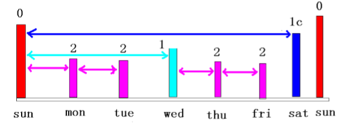
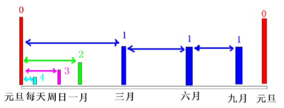

# 恢复管理器Recover Manager 03

> 2019.12.15 - BoobooWei

<!-- TOC depthFrom:1 depthTo:6 withLinks:1 updateOnSave:1 orderedList:0 -->

- [恢复管理器Recover Manager 03](#恢复管理器recover-manager-03)
	- [数据库备份（冷备）与RMAN备份的概念](#数据库备份冷备与rman备份的概念)
		- [数据库完全备份](#数据库完全备份)
		- [RMAN备份](#rman备份)
		- [RMAN备份的类型](#rman备份的类型)
			- [完整备份](#完整备份)
			- [增量备份](#增量备份)
			- [一致性备份](#一致性备份)
			- [非一致性备份](#非一致性备份)
		- [备份集与镜像副本](#备份集与镜像副本)
			- [备份集`backup`](#备份集backup)
			- [镜像副本`copy`](#镜像副本copy)
		- [备份路径](#备份路径)
		- [备份限制](#备份限制)
	- [使用RMAN进行备份](#使用rman进行备份)
		- [备份数据库](#备份数据库)
		- [备份数据文件](#备份数据文件)
		- [备份表空间](#备份表空间)
		- [备份控制文件](#备份控制文件)
		- [备份参数文件](#备份参数文件)
		- [备份归档日志文件](#备份归档日志文件)
		- [备份闪回区](#备份闪回区)
		- [总结：](#总结)
	- [备份的其它特性](#备份的其它特性)
		- [备份片大小的限制](#备份片大小的限制)
		- [并发](#并发)
		- [复用备份](#复用备份)
		- [备份备份集](#备份备份集)
		- [镜像备份](#镜像备份)
		- [压缩备份集](#压缩备份集)
		- [使用tag标记](#使用tag标记)
		- [增量备份](#增量备份)
			- [案例1](#案例1)
			- [案例2](#案例2)
		- [启用块变化跟踪](#启用块变化跟踪)
		- [备份保留策略](#备份保留策略)
			- [备份冗余](#备份冗余)
			- [恢复窗口](#恢复窗口)
			- [清除备份保留策略](#清除备份保留策略)
			- [永不将备份置为obsolete](#永不将备份置为obsolete)
			- [注意`obsolete` 与 `expired`](#注意obsolete-与-expired)
		- [验证数据文件逻辑坏块](#验证数据文件逻辑坏块)
	- [备份相关的动态性能视图及监控](#备份相关的动态性能视图及监控)
		- [相关视图](#相关视图)
		- [查看channel对应的server sessions](#查看channel对应的server-sessions)
		- [Linux下的rman自动备份](#linux下的rman自动备份)

<!-- /TOC -->

## 数据库备份（冷备）与RMAN备份的概念

### 数据库完全备份

> 此处只讨论冷备之物理备份-全备

按归档模式分为归档和非归档

| 归档模式 | 冷备分类      | 恢复状态   | 服务可用性         | 数据一致性 |
| :------- | :------------ | :--------- | :----------------- | :--------- |
| 非归档   | 离线冷备-copy | 完全恢复   | `shutdown`不能读写 | 一致       |
| 归档     | 在线热备-SQL  | 不完全恢复 | `open` 可读写      | 不一致     |
| 归档     | 在线热备-RMAN | 不完全恢复 | `open` 可读写      | 不一致     |
| 归档     | 离线冷备-RMAN | 完全恢复   | `mount` 不能读写   | 一致       |


### RMAN备份     

* RMAN使用服务器会话来完成备份操作，从RMAN客户端连接到服务器将产生一个服务器会话

* RMAN备份内容包括：整个数据库,表空间,数据文件,指定的数据文件,控制文件,归档日志文件,参数文件等

  ​     

### RMAN备份的类型

完整备份(full) 或增量备份(incremental)

一致性备份(consistent)或不一致性备份(inconsistent)

热备(open)或冷备(closed)，冷备时数据库必须处于mount状态

​               

#### 完整备份

一个或多个数据文件的一个完整副本,包含从备份开始处所有的数据块.完整备份不能作为增量的基础


#### 增量备份

> 注意：增量备份（通用）=差异增量（Oracle） 差异备份（通用）=累计增量（Oracle）
> 增量备份（通用）:相对于上一次的备份
> 差异备份（通用）:相对于上一次的全备


* 包含从最近一次备份以来被修改或添加的数据块.可以分为差异增量备份和累计增量备份

* 差异增量备份仅仅包含n级或n级以下被修改过的数据块。备份数据量小，恢复时间长。

* 累计增量备份仅仅包含n-1级或n-1级以下被修改过的数据块。备份数据量大，恢复时间短。

* 0级增量备份相当于一个完整备份,该备份包含所有已用的数据块文件,与完整备份的差异是完整备份不能用作级增量备份的基础

  ​		   

#### 一致性备份

* 备份所包含的各个文件中的所有修改都具备相同的系统变化编号(system change number，SCN)。

* 也就是说，备份所包含的各个文件中的所有数据均来自同一时间点。

* 一致性数据库完全备份(consis-tent whole database backup)进行还原(restore)后，不需要执行恢复操作(recovery)


#### 非一致性备份

* 在数据库处于打开(open)状态时，或数据库异常关闭(shut down abnormally)后，对一个或多个数据库文件进行的备份。非一致性备份需要在还原之后进行恢复操作


### 备份集与镜像副本

#### 备份集`backup`

是包含一个或多个数据文件,归档日志文件的二进制文件的集合.备份集由备份片组成,一个备份集中可以包含一个或多个备份片

可以通过filesperset参数来设置备份集中可包含的备份片数，

也可以设定参数maxpiecesize来制定每个备份片的大小。

备份集中空闲的数据块将不会被备份，因此备份集可以支持压缩。备份集支持增量备份，可以备份到磁盘或磁带。


#### 镜像副本`copy`

是数据文件或归档日志文件等的完整拷贝,未经过任何压缩等处理,不能备份到磁带,也不支持增量备份

恢复时可以立即使用实现快速恢复

等同于操作系统的复制命令

可以作为级增量备份


### 备份路径

可以备份到磁盘目录

可以备份到磁带

闪回区


### 备份限制

数据库必须处于mount或open状态

不能备份联机日志

在非归档模式下仅仅能作干净备份，即在干净关闭且启动到mount状态下备份

在归档模式下，current状态下数据文件可以备份


​       

## 使用RMAN进行备份

### 备份数据库

```sql
backup database;
backup database plus archivelog;
backup as compressed backupset database plus archivelog;
backup as compressed backupset database plus archivelog delete all input;
```

### 备份数据文件

````sql
backup datafile 5;
backup as compressed backupset datafile 5;
````

### 备份表空间

```sql
backup tablespace users;
```

### 备份控制文件

```sql
backup current controlfile;
```

### 备份参数文件

```sql
backup spfile format '/home/oracle/rmanbk/spfile.bkp';
```

### 备份归档日志文件

* 备份归档日志时仅仅备份归档过的数据文件(不备份联机重做日志文件)
* 备份归档日志时总是对归档日志做完整备份
* RMAN对归档日志备份前会自动做一次日志切换，且从一组归档日志中备份未损坏的归档日志
* RMAN会自动判断哪些归档日志需要进行备份
* 归档日志的备份集不能包含其它类型的文件

```sql
list archivelog all; list copy of archivelog all;
list backup of archivelog all;
list copy of archivelog sequence between 264 and 265 thread=1 ;

backup archivelog all;
BACKUP ARCHIVELOG ALL DELETE INPUT  format 'd:\bk\arc%s.bk';
backup archivelog sequence between 264 and 265 thread=1 format 'd:\bk\arc%s.bk'; backup archivelog sequence between 50 and 52 thread=1 like '%0586360856%' format 'c:\bk\arc%s.bk';
backup database plus archivelog;
backup database plus archivelog delete all input;

BACKUP ARCHIVELOG ALL DELETE INPUT  format 'd:\bk\arc%s.bk';
--如果上面的语句有问题，请运行下面语句来标定控制文件中归档日志的状态。
change archivelog all crosscheck;
delete archivelog all;

select SEQUENCE#,APPLIED,DELETED,STATUS,BACKUP_COUNT from v$archived_log
```

备份归档日志方式有两种：

1. 单独备份归档日志
2. 在执行备库时一起备份归档日志

> 这两种方式有什么区别呢？

 运行`backup archivelog all`  命令时执行的步骤：

1. `alter system archive log current;`  归档当前日志
2. `backup  archivelog all ; `备份所有归档日志

而运行`backup database plus archivelog`，的运行步骤是；

1. `alter system archive log current; ` 归档当前日志文件
2. `backup archivelog all；`        备份所有已归档日志文件
3. `backup database; `         备份数据库
4. `alter system archive log current; ` 归档当前日志文件
5. `backup archivelog recently generated ; `  备份刚生成的归档日志文件

由于归档日志会占用较多的空间，所以应对定期删除掉没用的归档日志。

 比如，在备份数据库及归档日志文件后，删除掉已经备份的归档日志文件。

命令：`backup database plus archivelog delete all input; `

其中，`delete all input`即为删除归档日志文件参数。

### 备份闪回区

```sql
backup recovery area;
backup recovery files;
```

使用`backup recovery area`时，将备份位于闪回区且未进行过备份的所有文件，这些文件包括完整、增量备份集、自动备份的 控制文件(假定使用闪回区作为备份路径时)、归档日志、数据文件的镜像副本等。闪回日志，当前的控制文件。 联机重做日志不会被备份 。

使用`backup recovery files`时，将备份磁盘上未进行过备份的所有恢复文件，而不论是否位于闪回区   

> 注：使用上述两条命令时，备份目的地必须是磁带

### 总结：

数据文件的备份集对于未使用的块可以执行增量备份，可以跳过未使用过的数据块来进行压缩备份
对于控制文件、归档日志文件、spfile文件则是简单的拷贝，并对其进行打包压缩而已

## 备份的其它特性

### 备份片大小的限制

使用 rman 进行 backup 的操作.限制每个备份片的大小.


限制通道的大小,什么是通道呢?

进程!告诉数据库使用一个进程 d1 做备份,我们通过限制进程的写信息来 限制每个备份片的大小.备份集是逻辑的,有多个备份片组成.备份片是物理的.没有明确说明默认情况下为 一个备份集对应一个物理的备份片,一个备份集中可以包含多个备份的数据文件.

你可以理解为备份集是压 缩包的名称,一个压缩包里含有多个被压缩的文件,我们又将压缩包分解为多个小压缩文件,当我们解压缩 的时候需要所有的小压缩包才能解压缩文件.我们一般限制备份片大小的目的是使得备份片可以存放在一 个磁带上.

下面的命令是限制每个备份片大小为 10m,我们上面的实验看到正常备份有 25 m,所以会被切割为 三个备份片,前两个每个为 10m,最后一个为 5m.

```sql
RUN {
ALLOCATE CHANNEL d1 TYPE disk;
set limit channel d1 kbytes=10000;
backup datafile 4 FORMAT 'c:\bk\%s_%p' ;
}
```


### 并发

> 并发：主要用于提高备份的速度，可以分为手动并发或自动并发

手动并发：通过分配多个通道并将文件指定到特定的通道


```sql
RMAN> run {
allocate channel ch1 device type disk;
allocate channel ch2 device type disk;
allocate channel ch3 device type disk;
backup incremental level=0
format '/u01/app/oracle/rmanbak/df_%d_%U'
(datafile 1 channel ch1 tag='sys')
(datafile 3 channel ch2 tag='aux')
(datafile 2,4,5,6 channel ch3 tag='other');
sql 'alter system archive log current';
release channel ch1;
release channel ch2;
release channel ch3;
}  
```


自动并发：使用configure配置并发度即可

```sql
RMAN> configure device type disk parallelism 3 backup type to backupset;
--下面的备份将自动启用个通道执行并发
RMAN>  backup database format '/u01/app/oralce/rmanbak/p3_%U';
```


### 复用备份

即将一个备份集复制多份，同一备份集，Oracle最多可复用个

手工指定：

```sql
RMAN> backup copies 2 datafile 4
2> format '/u01/app/oracle/rmanbak/d1/df_%U',
3> '/u01/app/oracle/rmanbak/d2/df_%U';  
```


自动指定：配置下列参数
```sql
RMAN> configure datafile backup copies for device type disk to 2;  --指定备份数据文件副本数
RMAN> configure archivelog backup copies for device type disk to 2;--指定备份日志文件副本数
```


### 备份备份集

```sql
bacup backupset
```


### 镜像备份

镜像备份时会检查数据文件中是否存在坏块，可以使用nochecksum来跳过坏块的检测

也可以指定maxcorrupt判断有多少个坏块时，Oracle将停止该镜像备份

| 镜像备份 | 命令                                                         |
| -------- | ------------------------------------------------------------ |
| 控制文件 | `copy current controlfile to '/home/oracle/rmanbk/control01.ctl';` |
| 数据文件 | `copy datafile 5 to '/home/oracle/rmanbk/tbs01.dbf';`        |
| 日志文件 | `copy archivelog`                                            |


```sql
RMAN> backup as copy
2> datafile 4 format '/u01/app/oracle/rmanbak/users.dbf' tag='users'
--以下命令等同于上一条
RMAN> copy datafile 4 to '/u01/app/oracle/rmanbak/user01.dbf';
RMAN> backup as copy
2> archivelog like 'o1_mf_1_118_6chl1byd_.arc'
3> format '/u01/app/oracle/rmanbak/arch_1015.bak';

--使用下面的configure命令将backup type设置为copy之后，则缺省的备份为镜像副本
RMAN> configure device type disk parallelism 1 backup type to copy;
RMAN> backup datafile 4  --由于上面的设置，则此命令备份的将是镜像副本
2> format '/u01/app/oracle/rmanbak/users.dbf.bak' tag=users;   
--使用并行度来执行镜像拷贝
RMAN> configure device type disk parallelism 4;
RMAN> backup as copy #3 files copied in parallel
2> (datafile 1 format '/u01/app/oracle/rmanbak/df1.bak')
3> (datafile 2 format '/u01/app/oracle/rmanbak/df2.bak')
4> (datafile 3  format '/u01/app/oracle/rmanbak/df3.bak');

```

镜像备份时指定子句DB_FILE_NAME_CONVERT来实现镜像路径转移，该子句也是一个初始化参数，用于primary db 到standby db
的数据文件的转换

```sql
DB_FILE_NAME_CONVERT = ('string1' , 'string2' , 'string3' , 'string4' ...)
用string2替换string1,string4替换string3
RMAN> backup as copy device type disk
2> db_file_name_convert('oradata/orcl','bk/rmbk')
3> tablespace users;       
```


### 压缩备份集   

```sql
RMAN> configure channel device type disk format '/u01/app/oracle/rmanbak/%d_%U.bak';
--下面的命令使用了参数as compressed来实现手动压缩
RMAN> backup as compressed backupset database;
RMAN> backup as compressed backupset datafile 4,5,6;
--下面使用configure命令配置自动压缩备份集功能，则后续的备份会自动使用压缩功能
RMAN> configure device type disk parallelism 4 backup type to compressed backupset;
--由于设置了自动压缩，则下面的命令将压缩备份的system表空间及控制文件、参数文件
RMAN> backup tablespace system tag=system;
```


### 使用tag标记

tag标记可以为备份集或映像副本指定一个有意义的名字，以备后续使用，其优点如下

* 为备份集或映像副本提供描述信息
* 能够在list 命令中使用更好的定位备份文件
* 能够在restore和switch命令中使用
* 同一个tag在多个备份集或多个映像副本中使用
* 当未指定tag标记时，则系统产生缺省的tag标记，其格式为：`TAGYYYYMMDDTHHMMSS`


```sql
RMAN> backup as compressed backupset datafile 1,2,3 tag='Monthly_full_bak';
RMAN> backup as compressed backupset tablespace users tag='Weekly_full_bak';
RMAN> list backupset tag=monthly_full_bak;
```


### 增量备份

Backup 有增量,copy 没有增量。

* `0`所有的使用的数据块，是基石
* `1-4` 增量级别,备份`<=n` 以来的变化
* `1c-4c` 累积增量,备份`<=n-1` 以来的变化

通过增量的级别来指定完备的备份策略。

#### 案例1



请看这个案例,每周日晚做 0 级备份,就是备份所有使用过的数据块.

* 周一做 2 级增量,备份小于等于 2 以来备份后发生变化的块,前面有个 0 级备份.所以备份当天的变化.
* 周二做 2 级增量,备份小于等于 2 以来备份后发生变化的块,前面有个 2 级备份.所以备份当天的变化.
* 周三做 1 级增量,备份小于等于 1 以来备份后发生变化的块,前面有个 0 级备份.所以备份三天的变化.
* 周四做 2 级增量,备份小于等于 2 以来备份后发生变化的块,前面有个 1 级备份.所以备份当天的变化.
* 周五做 2 级增量,备份小于等于 2 以来备份后发生变化的块,前面有个 2 级备份.所以备份当天的变化.
* 周六做1c级增量,备份小于等于1-1=0以来备份后发生变化的块,前面有个零级备份.所以备份六天的变化.
* 周日做 0 级增量, 备份所有使用过的数据块.

#### 案例2



请看这个案例,

* 每年元旦做 0 级备份,就是备份所有使用过的数据块.
* 每天做 4 级增量,备份小于等于 4 以来备份后发生变化的块,任何级都小于等于 4.所以备份当天的变化.
* 每周做 3 级增量,备份小于等于 3 以来备份后发生变化的块,前面有个 3 级备份.所以备份一周的变化.
* 每月做 2 级增量,备份小于等于 2 以来备份后发生变化的块,前面有个 2 级备份.所以备份当月的变化.
* 每季度做 1 级增量,备份小于等于 1 以来备份后发生变化的块,前面有个 1 级备份.所以备份三个月的变化.
* 每年元旦做 0 级备份,就是备份所有使用过的数据块.

语法

```sql
RMAN> backup incremental level 0 datafile 4 format 'c:\bk\%d_%s_%p';
RMAN> backup incremental level 1 datafile 4 format 'c:\bk\%d_%s_%p';
RMAN> backup incremental level 2 datafile 4 format 'c:\bk\%d_%s_%p';
RMAN> backup incremental level 3 datafile 4 format 'c:\bk\%d_%s_%p';
RMAN> backup incremental level 4 datafile 4 format 'c:\bk\%d_%s_%p';
RMAN> backup incremental level 1 cumulative datafile  4 format 'c:\bk\%d_%s_%p';
RMAN> backup incremental level 2 cumulative datafile  4 format 'c:\bk\%d_%s_%p';
RMAN> backup incremental level 3 cumulative datafile  4 format 'c:\bk\%d_%s_%p';
RMAN> backup incremental level 4 cumulative datafile  4 format 'c:\bk\%d_%s_%p';
RMAN> list backup of datafile 4;
```

*  `1 `和` 1c `在列表中没有区分,实际数据库也不区分,在备份时的语法不同.备份集不区分累积增量和普通增量
* 但从大小可以看到区别


### 启用块变化跟踪

启用块变化跟踪即是指定一个文件用于记录数据文件中哪些块发生了变化，在RAMN进行增量备份时，仅仅需读取该文件来备份这些

发生变化的块，从而减少了备份时间和I/O资源。

使用下面的命令来启用块变化跟踪`ALTER DATABASE ENABLE BLOCK CHANGE TRACKING USING FILE '<dir>'`

```sql
SQL> alter database enable block change tracking
  2  using file '/u01/app/oracle/oradata/orcl/blk_ch_trc.trc';

SQL> ho ls -lht /u01/app/oracle/oradata/orcl/blk_ch_trc.trc
-rw-r----- 1 oracle oinstall 12M Oct 15 19:41 /u01/app/oracle/oradata/orcl/blk_ch_trc.trc

SQL> select * from v$block_change_tracking;
STATUS     FILENAME                                           BYTES
---------- --------------------------------------------- ----------
ENABLED    /u01/app/oracle/oradata/orcl/blk_ch_trc.trc     11599872
SQL> alter database disable block change tracking; --disable后块变化跟踪文件被自动删除
SQL>  select * from v$block_change_tracking;
STATUS     FILENAME                                           BYTES
---------- --------------------------------------------- ----------
DISABLED       
```

### 备份保留策略

保留策略主要是保留备份副本的一些规则,通常用于满足恢复或其他的需要(比如磁盘空间或磁带空间大小限制)

备份保留策略分为冗余和恢复窗口，这两种保留策略互不兼容，要么使用前者，要么使用后者

#### 备份冗余

* 可以通过`RMAN> configure retention policy to redundancy 2;`来修改
* RMAN会为每个数据文件、归档日志、控制文件生成一个备份。可以使用`report obsolete;`命令查看冗余的备份
* 并使用`delete obsolete;`来删除冗余备份


#### 恢复窗口       

* 恢复窗口允许完成恢复到过去某个时间点的时点恢复，通常设定为多少天
* 使用命令`RMAN> configure retention policy to recovery window of 7 days;`
* 该命令将确保具有足够的数据文件和归档日志来执行能够返回一个星期中任意时间点的不完全恢复，且允许删除随着时间推移而变为废弃的备份，即应当满足该条件：`SYSDATE - BACKUP CHECKPOINT TIME >= 7`
* 对于大于天但是是恢复所需要的备份依然会被保留


#### 清除备份保留策略

```sql
RMAN> configure retention policy clear;
```

#### 永不将备份置为obsolete

```sql
RMAN> configure retention policy to none;
```

#### 注意`obsolete` 与 `expired`

* `obsolete`：是指根据保留策略来确定该备份是否在恢复的时候需要，如不在需要或有更新的备份来替代，则该备份集被置为`obsolete`，即废弃的备份集或镜像副本。

* `expired`: 是指执行`crosscheck`时，根据存储仓库中记录的备份信息来定位备份集或镜像副本，而找不到对应的备份集或镜像副本，则这些备份集或镜像副本被置为expired。


### 验证数据文件逻辑坏块

使用`BACKUP ... VALIDATE`验证数据文件逻辑坏块，损坏的坏块将被记录到`v$database_block_corruption`视图

```sql
BACKUP VALIDATE CHECK LOGICAL DATABASE ARCHIVELOG ALL;
```


## 备份相关的动态性能视图及监控

### 相关视图

```sql
v$backup_files
v$backup_set
v$backup_piece
v$backup_redolog
v$backup_spfile
v$backup_device
v$rman_configuration
v$archived_log
v$backup_corruption
v$copy_corruption
v$database_block_corruption
v$backup_datafile
```


### 查看channel对应的server sessions

使用`set command id`命令

查询`v$process`和`v$session`判断哪一个会话与之对应的RMAN通道

```sql
SQL> select sid,username,client_info from v$session where client_info is not null;
	   SID USERNAME                       CLIENT_INFO
---------- ------------------------------ ------------------------------
	   146 SYS                            rman channel=ORA_DISK_1
	   148 SYS                            rman channel=ORA_DISK_2
	   150 SYS                            rman channel=ORA_DISK_3
--下面使用了set command id命令
RMAN> run{
2> allocate channel ch1 type disk;
3> set command id to 'rman';
4> backup as copy datafile 4
5> format '/u01/app/oracle/rmanbak/dd_%U';
6> }

SQL> select sid,username,client_info from v$session
  2   where client_info is not null;
	   SID USERNAME                       CLIENT_INFO
---------- ------------------------------ ------------------------------
	   140 SYS                            id=rman
SQL> select sid,spid,client_info
  2  from v$process p ,v$session s
  3  where p.addr = s.paddr
  4  and client_info like '%id=%';
	   SID SPID         CLIENT_INFO
---------- ------------ ------------------------------
	   140 5002         id=rman

--查看rman完整的进度      
SQL> select sid,serial#,context,sofar,totalwork,
  2  round(sofar/totalwork*100,2) "% Complete"
  3  from v$session_longops
  4   where opname like 'RMAN:%'
  5  and opname not like 'RMAN:aggregate%'
  6  and totalwork!=0;    
--通过如下SQL获得rman用来完成备份操作的服务进程的SID与SPID信息：
select sid, spid, client_info
  from v$process p, v$session s
 where p.addr = s.paddr
   and client_info like '%id=rman%'
```


### Linux下的rman自动备份

备份脚本+crontab

bak_inc0 ：0级增量备份，每周日使用级增量进行备份

bak_inc1 ：1级增量备份，每周三使用级增量备份，备份从周日以来到周三所发生的数据变化

bak_inc2 ：2级增量备份，备份每天发生的差异增量。如从周日到周一的差异，从周一到周二的差异


```bash
--下面是级增量的脚本，其余级与级依法炮制，所不同的是备份级别以及tag标记

[oracle@oradb scripts]$ cat bak_inc0
run {
allocate channel ch1 type disk;
backup as compressed backupset  incremental level 0
format '/u01/oracle/bk/rmbk/incr0_%d_%U'
tag 'day_incr0'
database plus archivelog delete input;
release channel ch1;
}
```


逐个测试脚本

```bash
[oracle@oradb bk]$ rman target / log=/u01/oracle/bk/log/bak_inc0.log /
> cmdfile=/u01/oracle/bk/scripts/bak_inc0.rcv
RMAN> 2> 3> 4> 5> 6> 7> 8> 9>
[oracle@oradb bk]$
```


编辑crontab

```bash
[root@oradb ~]# whoami
root
[root@oradb ~]# crontab -e -u oracle
45 23 * * 0 rman target / log=/u01/oracle/bk/log/bak_inc0.log append cmdfile = /u01/oracle/bk/scripts/bak_inc0.rcv

45 23 * * 1 rman target / log=/u01/oracle/bk/log/bak_inc2.log append cmdfile = /u01/oracle/bk/scripts/bak_inc2.rcv

45 23 * * 2 rman target / log=/u01/oracle/bk/log/bak_inc2.log append cmdfile = /u01/oracle/bk/scripts/bak_inc2.rcv

45 23 * * 3 rman target / log=/u01/oracle/bk/log/bak_inc1.log append cmdfile = /u01/oracle/bk/scripts/bak_inc1.rcv

45 23 * * 4 rman target / log=/u01/oracle/bk/log/bak_inc2.log append cmdfile = /u01/oracle/bk/scripts/bak_inc2.rcv

45 23 * * 5 rman target / log=/u01/oracle/bk/log/bak_inc2.log append cmdfile = /u01/oracle/bk/scripts/bak_inc2.rcv

45 23 * * 6 rman target / log=/u01/oracle/bk/log/bak_inc2.log append cmdfile = /u01/oracle/bk/scripts/bak_inc2.rcv

"/tmp/crontab.XXXXInBzgR" 7L, 791C written
crontab: installing new crontab
```


保存之后重启crontab

```bash
[root@oradb ~]# service crond restart
Stopping crond: [  OK  ]
Starting crond: [  OK  ]
```


检查自动备份是否成功执行


​     
