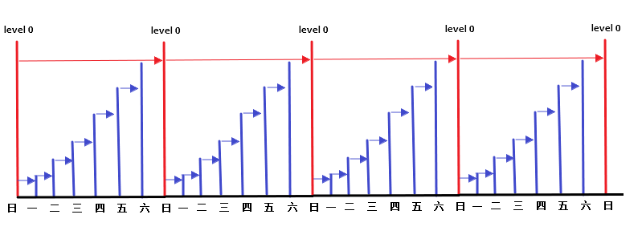
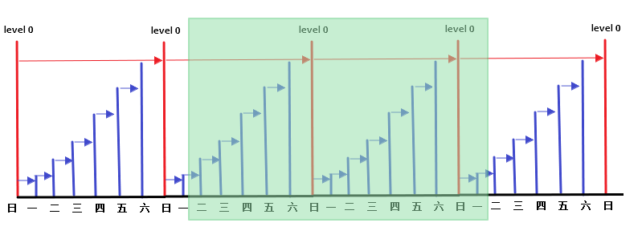

# 冷备计划的制定和实施

> 2019.12.15 BoobooWei

<!-- MDTOC maxdepth:6 firsth1:1 numbering:1 flatten:0 bullets:0 updateOnSave:1 -->

1. [冷备计划的制定和实施](#冷备计划的制定和实施)   
&emsp;1.1. [概念](#概念)   
&emsp;1.2. [冷备计划](#冷备计划)   
&emsp;&emsp;1.2.1. [RMAN备份周期](#rman备份周期)   
&emsp;&emsp;1.2.2. [RMAN备份保留策略](#rman备份保留策略)   
&emsp;&emsp;&emsp;1.2.2.1. [Linux计划任务`crontab`](#linux计划任务crontab)   
&emsp;&emsp;&emsp;1.2.2.2. [RMAN自带的`retention policy`](#rman自带的retention-policy)   
&emsp;&emsp;1.2.3. [RMAN备份脚本](#rman备份脚本)   
&emsp;&emsp;&emsp;1.2.3.1. [`/home/oracle/backup_scripts/rmanbk_inc0`](#homeoraclebackup_scriptsrmanbk_inc0)   
&emsp;&emsp;&emsp;1.2.3.2. [`/home/oracle/backup_scripts/rmanbk_inc1`](#homeoraclebackup_scriptsrmanbk_inc1)   
&emsp;&emsp;&emsp;1.2.3.3. [`/home/oracle/backup_scripts/rmanbk_crontab.sh `](#homeoraclebackup_scriptsrmanbk_crontabsh)   
&emsp;&emsp;&emsp;1.2.3.4. [Crontab配置`crontab -e -u oracle`](#crontab配置crontab-e-u-oracle)   
&emsp;&emsp;&emsp;1.2.3.5. [Linux删除14天的文件`rmanbk_del.sh`](#linux删除14天的文件rmanbk_delsh)   
&emsp;&emsp;&emsp;1.2.3.6. [冷备-RMAN在线热备-实施记录](#冷备-rman在线热备-实施记录)   

<!-- /MDTOC -->

## 概念

> 注意：增量备份（通用）=差异增量（Oracle） 差异备份（通用）=累计增量（Oracle）
> 增量备份（通用）:相对于上一次的备份
> 差异备份（通用）:相对于上一次的全备

- 包含从最近一次备份以来被修改或添加的数据块.可以分为**差异增量备份**和**累计增量备份**
- 差异增量备份：仅仅包含n级或n级以下被修改过的数据块。备份数据量小，恢复时间长。
- 累计增量备份：仅仅包含n-1级或n-1级以下被修改过的数据块。备份数据量大，恢复时间短。
- 0级增量备份相当于一个完整备份,该备份包含所有已用的数据块文件,与完整备份的差异是完整备份不能用作级增量备份的基础

## 冷备计划

* 备份周期：一周一全备，每天一增备
* 备份数据保留策略：保留近14天的备份

### RMAN备份周期

一周一全备，每天一增备



- 每周日晚做 0 级备份,就是备份所有使用过的数据块.
- 周一做 1 级增量,备份小于等于 1 以来备份后发生变化的块,前面有个 0 级备份.所以备份当天的变化.
- 周二做 1 级增量,备份小于等于 1 以来备份后发生变化的块,前面有个 1 级备份.所以备份当天的变化.
- 周三做 1 级增量,备份小于等于 1 以来备份后发生变化的块,前面有个 1 级备份.所以备份当天的变化.
- 周四做 1 级增量,备份小于等于 1 以来备份后发生变化的块,前面有个 1 级备份.所以备份当天的变化.
- 周五做 1 级增量,备份小于等于 1 以来备份后发生变化的块,前面有个 1 级备份.所以备份当天的变化.
- 周六做 1 级增量,备份小于等于 1 以来备份后发生变化的块,前面有个 1 级备份.所以备份当天的变化.
- 周日做 0 级增量, 备份所有使用过的数据块.

### RMAN备份保留策略

保留近14天的备份



实现方式：

1. Linux计划任务`crontab`
2. RMAN自带的`retention policy`

#### Linux计划任务`crontab`

保留14天的备份数据，当今天是周一时，会保留 近14天的数据，删除两周前的周一的数据。

| 周日 | 周一 | 周二 | 周三 | 周四 | 周五 | 周六 |
| ---- | ---- | ---- | ---- | ---- | ---- | ---- |
|      | 清除 | 保留 | 保留 | 保留 | 保留 | 保留 |
| 保留 | 保留 | 保留 | 保留 | 保留 | 保留 | 保留 |
| 保留 | Now  |      |      |      |      |      |

因此保留14天的备份数据，可以将数据恢复的时间范围为：`上周周日~本周当前`

#### RMAN自带的`retention policy`

保留14天的备份数据，即每份备份数据的冗余备份数量为14

```sql
configure retention policy to redundancy 14;
configure retention policy to recovery window of 14 days;
report obsolete;
delete obsolete;
```

### RMAN备份脚本

#### `/home/oracle/backup_scripts/rmanbk_inc0`

```sql
run {
configure retention policy to recovery window of 14 days;
configure controlfile autobackup on;
allocate channel ch1 type disk;
backup as compressed backupset  incremental level 0
format '/home/oracle/rmbk/incr0_%d_%U'
tag 'day_incr0'
database plus archivelog delete input;
crosscheck backup;
crosscheck archivelog all;
delete noprompt obsolete;
delete noprompt  expired backup;
delete noprompt  expired archivelog all;
release channel ch1;
}
```

#### `/home/oracle/backup_scripts/rmanbk_inc1`

```sql
run {
configure retention policy to recovery window of 14 days;
configure controlfile autobackup on;
allocate channel ch1 type disk;
backup as compressed backupset  incremental level 1
format '/home/oracle/rmbk/incr1_%d_%U'
tag 'day_incr1'
database plus archivelog delete input;
crosscheck backup;
crosscheck archivelog all;
delete noprompt obsolete;
delete noprompt  expired backup;
delete noprompt  expired archivelog all;
release channel ch1;
}
```

#### `/home/oracle/backup_scripts/rmanbk_crontab.sh `

```bash
#!/bin/bash
PATH=$PATH:$HOME/bin

export PATH
export ORACLE_BASE=/u01/app/oracle
export ORACLE_HOME=/u01/app/oracle/product/11.2.0.4
export ORACLE_SID=BOOBOO
export PATH=$PATH:$ORACLE_HOME/bin
export TNS_ADMIN=$ORACLE_HOME/network/admin
export LD_LIBRARY_PATH=$LD_LIBRARY_PATH:ORACLE_HOME/lib
export NLS_LANG=AMERICAN_AMERICA.ZHS16GBK
export ORA_NLS10=$ORACLE_HOME/nls/data
export SQLPATH="/home/oracle/.login.sql"

level=$1
/u01/app/oracle/product/11.2.0.4/bin/rman target / log=/home/oracle/rmbk_log/bak_inc${level}.log append cmdfile=/home/oracle/backup_scripts/rmanbk_inc${level}
#echo ${level}
```

#### Crontab配置`crontab -e -u oracle`

```bash
30 22 * * 0 /bin/bash /home/oracle/backup_scripts/rmanbk_crontab.sh 0
30 22 * * 1 /bin/bash /home/oracle/backup_scripts/rmanbk_crontab.sh 1
30 22 * * 2 /bin/bash /home/oracle/backup_scripts/rmanbk_crontab.sh 1
30 22 * * 3 /bin/bash /home/oracle/backup_scripts/rmanbk_crontab.sh 1
30 22 * * 4 /bin/bash /home/oracle/backup_scripts/rmanbk_crontab.sh 1
30 22 * * 5 /bin/bash /home/oracle/backup_scripts/rmanbk_crontab.sh 1
30 22 * * 6 /bin/bash /home/oracle/backup_scripts/rmanbk_crontab.sh 1
40 22 * * * /bin/bash /home/oracle/backup_scripts/rmanbk_del.sh
```

#### Linux删除14天的文件`rmanbk_del.sh`

```sql
#!/bin/bash
#del old folders
find /home/oracle/rmbk/ -mtime +13 -exec ls {} \;
find /home/oracle/rmbk/ -mtime +13 -exec rm -rf {} \;
```

#### 冷备-RMAN在线热备-实施记录

```bash
[root@oratest ~]# whoami
root
[root@oratest ~]# crontab -e -u oracle
crontab: installing new crontab
[root@oratest ~]# crontab -l -u oracle
30 22 * * 0 /bin/bash /home/oracle/backup_scripts/rmanbk_crontab.sh 0
30 22 * * 1 /bin/bash /home/oracle/backup_scripts/rmanbk_crontab.sh 1
30 22 * * 2 /bin/bash /home/oracle/backup_scripts/rmanbk_crontab.sh 1
30 22 * * 3 /bin/bash /home/oracle/backup_scripts/rmanbk_crontab.sh 1
30 22 * * 4 /bin/bash /home/oracle/backup_scripts/rmanbk_crontab.sh 1
30 22 * * 5 /bin/bash /home/oracle/backup_scripts/rmanbk_crontab.sh 1
30 22 * * 6 /bin/bash /home/oracle/backup_scripts/rmanbk_crontab.sh 1
[root@oratest ~]# service crond restart
Stopping crond:                                            [  OK  ]
Starting crond:                                            [  OK  ]

-- 模拟时间变化：
周日~周六
date -s "2020-01-05 22:29:55"
date -s "2020-01-06 22:29:55"
date -s "2020-01-07 22:29:55"
date -s "2020-01-08 22:29:55"
date -s "2020-01-09 22:29:55"
date -s "2020-01-10 22:29:55"
date -s "2020-01-11 22:29:55"
周日~周六
date -s "2020-01-12 22:29:55"
date -s "2020-01-13 22:29:55"
date -s "2020-01-14 22:29:55"
date -s "2020-01-15 22:29:55"
date -s "2020-01-16 22:29:55"
date -s "2020-01-17 22:29:55"
date -s "2020-01-18 22:29:55"
周日~周六
date -s "2020-01-19 22:29:55" 应该删除 "2020-01-05"的备份
date -s "2020-01-20 22:29:55" 应该删除 "2020-01-06"的备份
date -s "2020-01-21 22:29:55" 应该删除 "2020-01-07"的备份
date -s "2020-01-22 22:29:55" 应该删除 "2020-01-08"的备份
date -s "2020-01-23 22:29:55" 应该删除 "2020-01-09"的备份
date -s "2020-01-24 22:29:55" 应该删除 "2020-01-10"的备份
date -s "2020-01-25 22:29:55" 应该删除 "2020-01-11"的备份

date -s "2020-01-26 22:29:55" 应该删除 "2020-01-12"的备份
--观察结果

[root@oratest ~]# date -s "2020-01-20 22:29:59"
Mon Jan 20 22:29:59 CST 2020
[root@oratest ~]# date -s "2020-01-21 22:29:59"
Tue Jan 21 22:29:59 CST 2020
[root@oratest ~]# date -s "2020-01-22 22:29:59"
Wed Jan 22 22:29:59 CST 2020
```


参考命令文章
* https://www.cnblogs.com/feiyun126/p/3594281.html
* https://blog.csdn.net/qq_34556414/article/details/79447432
