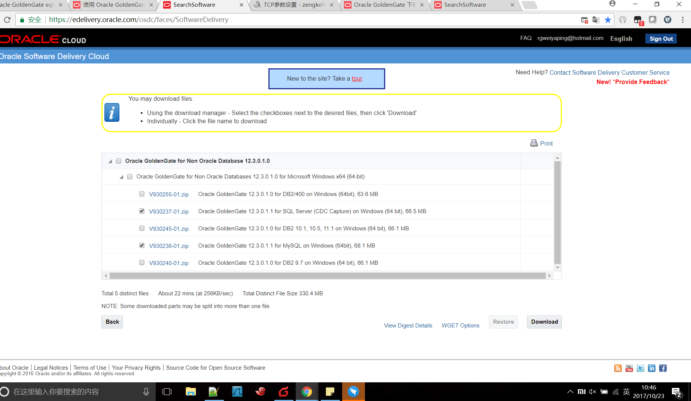
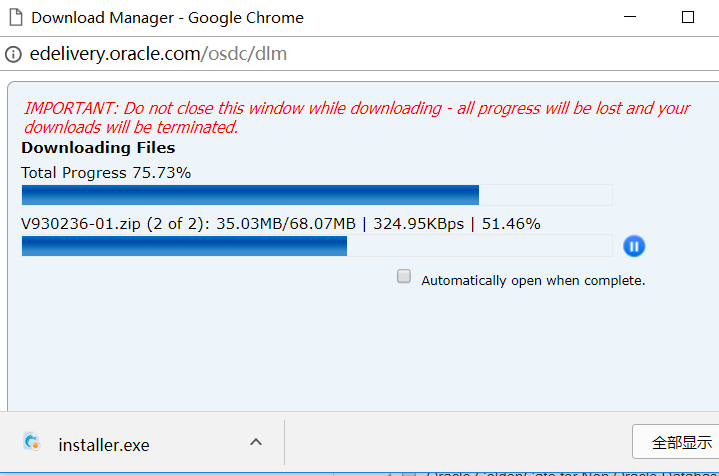

# Oracle ogg 使用学习

> 2017-10-23 booboowei

## 获取需求

自建数据库：
* SQLserver 2012 
* SQLserver 2008
* MySQL 5.7

需要实时互相同步

## ogg 软件获取

> SQLserver的版本比较难找到，很多人直接在oracle搜索ogg后得到的下载页面为http://www.oracle.com/technetwork/cn/middleware/goldengate/downloads/index.html
> 但是里面就是没有sqlserver的哈
> 到oracle软件库去寻找，且关键字为“Oracle GoldenGate for Non”才行哦!^.^

Oracle官方下载地址：https://edelivery.oracle.com/osdc/faces/SoftwareDelivery

登陆（*如果你没有账户可以直接注册一个*）
用户名：rgweiyaping@hotmail.com 
密码：你懂的

奇怪的下载方式哈，需要你将你需要的软件放入购物车，然后点击同意许可，然后我以为要花钱，其实不用花钱哈，下一步就能下载了，下载需要安装oracle的下载器。