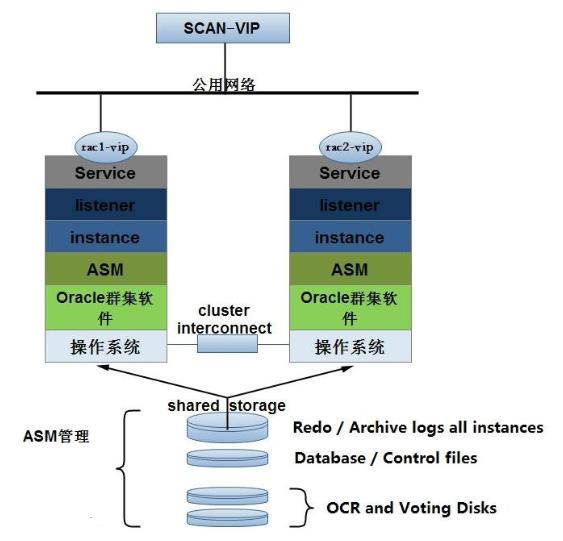

# 在阿里云ECS上搭建Oracle11g RAC实施方案

<!-- MDTOC maxdepth:6 firsth1:1 numbering:0 flatten:0 bullets:1 updateOnSave:1 -->

- [在阿里云ECS上搭建Oracle11g RAC实施方案](#在阿里云ecs上搭建oracle11g-rac实施方案)   
   - [Oracle11g RAC说明](#oracle11g-rac说明)   
      - [RAC 的概念](#rac-的概念)   
      - [ECS 上主机安装 RAC 的问题](#ecs-上主机安装-rac-的问题)   
   - [规划](#规划)   
      - [环境需求](#环境需求)   
      - [需要提供的信息](#需要提供的信息)   
      - [安装实施周期](#安装实施周期)   
      - [网络方案1-N2N](#网络方案1-n2n)   
      - [网络方案2-组播协议](#网络方案2-组播协议)   
   - [安装配置](#安装配置)   
      - [资源规划-全局参数配置](#资源规划-全局参数配置)   
      - [安装集群前的环境配置](#安装集群前的环境配置)   
         - [通用配置](#通用配置)   
         - [环境配置](#环境配置)   
         - [配置组播（生产中使用）](#配置组播（生产中使用）)   
         - [配置N2N（测试环境中使用）](#配置n2n（测试环境中使用）)   
         - [配置ISCSI（测试环境中使用）](#配置iscsi（测试环境中使用）)   
         - [依赖软件安装](#依赖软件安装)   
      - [RAC中间件和数据库安装](#rac中间件和数据库安装)   
         - [安装grid](#安装grid)   
         - [安装ASM实例](#安装asm实例)   
         - [安装oracle](#安装oracle)   
         - [创建数据库](#创建数据库)   
         - [配置监听](#配置监听)   
      - [其他优化](#其他优化)   

<!-- /MDTOC -->

## Oracle11g RAC说明

### RAC 的概念

[Real Application Clusters Administration and Deployment Guide ](https://docs.oracle.com/cd/E11882_01/rac.112/e41960/toc.htm)

Oracle RAC 是 Oracle Real Application Cluster  的简写，Oracle Real Application Clusters通过将单个数据库服务器作为单个故障点删除而为客户提供了最高的数据库可用性。在群集服务器环境中，数据库本身在服务器池之间共享，这意味着，如果服务器池中的任何服务器发生故障，数据库将继续在正常运行的服务器上运行。Oracle RAC不仅使客户能够在服务器发生故障时继续处理数据库工作负载，而且还可以通过减少数据库脱机进行计划内维护操作的时间来进一步降低停机成本。

Oracle Real Application Clusters使Oracle数据库跨集群服务器池的透明部署成为可能。这使客户可以轻松地将其单服务器Oracle数据库重新部署到数据库服务器集群上，从而充分利用集群数据库服务器提供的组合内存容量和处理能力。

Oracle Real Application Clusters提供了在服务器池中轻松部署Oracle数据库并充分利用群集提供的性能，可伸缩性和可用性所需的所有软件组件。Oracle RAC利用Oracle Grid Infrastructure作为Oracle RAC数据库系统的基础。Oracle Grid Infrastructure包括Oracle集群件和Oracle自动存储管理（ASM），它们可以在高度可用且可扩展的数据库云环境中高效共享服务器和存储资源。

Oracle RAC 根本的功能就在于多节点的负载均衡（Loadbalance）以及实例级的故障转移（Failover）。以下是 Oracle11g RAC 的原理图：

### ECS 上主机安装 RAC 的问题

在 ECS 主机上安装 Oracle RAC，一直以来有两个需要解决的问题，一是多网卡 IP 的配置， 一是共享存储。

- 多网卡 IP 的配置：阿里云HAVIP（生产推荐，较难申请）；使用 N2N（测试推荐，源码已不维护）
- 共享存储：阿里云共享块存储（生产推荐，较难申请）；使用 ISCSI（测试推荐，无高可用）

## 规划

本方案将在 ASM 上存储 OCR 和表决磁盘文件，具体是存储在一个名为 `+CRS` 的磁盘组中，该磁盘组使用*外部冗余* 配置，只有一个 OCR 位置和一个表决磁盘位置。ASM 磁盘组应在共享存储器上创建，大小至少为 2GB。

Oracle 物理数据库文件（数据、联机重做日志、控制文件、存档重做日志）将安装在 ASM 上一个名为 `+DATA` 的 ASM 磁盘组中，而快速恢复区将在一个名为 `+FRA` 的 ASM 磁盘组上创建。

### 环境需求

| 环境需求                                                     | 限制                                                       | 备注                                                         |
| :----------------------------------------------------------- | :--------------------------------------------------------- | :----------------------------------------------------------- |
| [ECS](https://www.aliyun.com/product/ecs?spm=5176.54360.h2v3icoap.13.eb406a81SuWmQw&aly_as=D0bby8Qs) | 最少2台，同地域同可用区                                    |                                                              |
| 系统配置                                                     | 最低4C8G                                                   | 根据实际业务量规划                                           |
| 操作系统                                                     | CentOS6.8 或以下版本                                       |                                                              |
| 系统盘                                                       | 最低 SSD 80G                                               |                                                              |
| 交换机                                                       | 与ECS相同可用区                                            |                                                              |
| 备份数据盘                                                   | 一块，最低 SSD 100G                                        | 根据实际备份需求规划，例如保留1周，则数据量的两倍 挂载在第一个节点上 |
| [共享块存储](https://promotion.aliyun.com/ntms/act/vsan.html?spm=5176.54360.1194325.6.416e6a81zMSksr&open_id=undefined&aly_as=scOFWE5E) | 三块 第一块：SSD 20G 第二块：SSD 待规划 第三块：SSD 待规划 | 根据实际规划，且必须与ECS相同地域可用区域 * 2019年8月 阿里云的共享存储块比较难申请。 * 替代方案：高速千兆以太网+iSCSI（openfiler） |

- 可用区：因共享块存储目前不支持跨可用区使用，故RAC的所有节点必须放置在同一可用区（比如都位于华东2可用区E）。

- 安全加固：在安装数据库之前，不要运行我们公司的安全加固脚本。安装完毕后再运行。

- 共享块存储：

  | No.    | 用途              | 大小                                                         |
  | :----- | :---------------- | :----------------------------------------------------------- |
  | 第一块 | OCR集群资源管理盘 | 20G SSD                                                      |
  | 第二块 | Data数据盘        | 根据数据量决定，不小于数据量的1.5倍（例如数据量为100G，则需要150G SSD） |
  | 第三块 | ARCH归档盘        | 根据系统繁忙程度，以及数据库恢复时的数据一致性要求，默认数据的0.5倍（例如数据量为100G，则需要50G SSD） |

### 需要提供的信息

| 需客户提供的信息 | 待填写 | 举例                               |
| :--------------- | :----- | :--------------------------------- |
| 数据库版本       |        | Oracle 11.2.0.4                    |
| 数据量           |        | 100GB                              |
| SID              |        | `orac`                             |
| 端口号           |        | 1521                               |
| 字符集           |        | ZHS16GBK                           |
| 备份恢复         |        | RMAN一周一全备每天一增备，保留14天 |
| 其他需求         |        |                                    |

### 安装实施周期

Oracle 11g RAC安装，需要在所有环境准备完毕后，一般需要1.5～3个工作日完成RAC环境安装配置。

两个 Oracle RAC 节点和网络存储服务器配置如下：

| 节点                |              |              |                               |                  |                                                              |
| :------------------ | :----------- | :----------- | :---------------------------- | :--------------- | :----------------------------------------------------------- |
| 节点名称            | 实例名称     | 数据库名称   | 处理器                        | RAM              | 操作系统                                                     |
| rac1                | rac1         | racdb        | 14个双核 Intel Xeon，3.00 GHz | 4GB              | CentOS 6.7- (x86_64)                                         |
| rac2                | rac2         |              | 4个双核 Intel Xeon，3.00 GHz  | 4GB              | CentOS 6.7- (x86_64)                                         |
| 网络配置            |              |              |                               |                  |                                                              |
| 节点名称            | 公共 IP 地址 | 专用 IP 地址 | 虚拟 IP 地址                  | SCAN 名称        | SCAN IP 地址                                                 |
| node1               | 172.16.10.19 | 172.16.9.75  | 172.16.10.29                  | rac-cluster-scan | 172.16.10.88                                                 |
| node2               | 172.16.10.20 | 172.16.9.76  | 172.16.10.30                  |                  |                                                              |
| Oracle 软件组件     |              |              |                               |                  |                                                              |
| 软件组件            | 操作系统用户 | 主组         | 辅助组                        | 主目录           | Oracle 基目录/Oracle 主目录                                  |
| Grid Infrastructure | grid         | oinstall     | asmadmin、asmdba、asmoper     | `/home/grid`     | `/alidata/app/grid` `/u01/app/11.2.0/grid`                   |
| Oracle RAC          | oracle       | oinstall     | dba、oper、asmdba             | `/home/oracle`   | `/alidata/app/oracle` `/alidata/app/oracle/product/11.2.0/dbhome_1` |
| 存储组件            |              |              |                               |                  |                                                              |
| 存储组件            | 文件系统     | 卷大小       | ASM 卷组名                    | ASM 冗余         | Openfiler 卷名                                               |
| OCR/表决磁盘        | ASM          | 2GB          | +CRS                          | External         | racdb-crs1                                                   |
| 数据库文件          | ASM          | 32GB         | +RACDB_DATA                   | External         | racdb-data1                                                  |
| 快速恢复区          | ASM          | 32GB         | +FRA                          | External         | racdb-fra1                                                   |

### 网络方案1-N2N

每个节点一个物理网卡即可。

| 网络配置 |              |              |              |                  |              |
| :------- | :----------- | :----------- | :----------- | :--------------- | :----------- |
| 节点名称 | 公共 IP 地址 | 专用 IP 地址 | 虚拟 IP 地址 | SCAN 名称        | SCAN IP 地址 |
|          | N2N虚拟      | N2N虚拟      |              |                  |              |
| node1    | 172.16.10.19 | 172.16.9.75  | 172.16.10.29 | rac-cluster-scan | 172.16.10.88 |
| node2    | 172.16.10.20 | 172.16.9.76  | 172.16.10.30 |                  |              |

### 网络方案2-组播协议

每个节点2个物理节点，申请3个HAVIP

保证内核kernel和kernel-devel的版本一致的情况下，安装阿里云内核组播工具。

| 网络配置 |              |              |              |                  |              |
| :------- | :----------- | :----------- | :----------- | :--------------- | :----------- |
| 节点名称 | 公共 IP 地址 | 专用 IP 地址 | 虚拟 IP 地址 | SCAN 名称        | SCAN IP 地址 |
|          | 物理网卡     | 物理网卡     | 绑定HAVIP    |                  | 绑定HAVIP    |
| node1    | 172.16.10.19 | 172.16.9.75  | 172.16.10.29 | rac-cluster-scan | 172.16.10.88 |
| node2    | 172.16.10.20 | 172.16.9.76  | 172.16.10.30 |                  |              |

## 安装配置

### 资源规划-全局参数配置

- [set_resource_plan.sh](https://github.com/BoobooWei/booboo_oracle/blob/master/scripts/oracle_11.2.0.4_rac_multi/set_resource_plan.sh)
- [get_resource_plan.sh](https://github.com/BoobooWei/booboo_oracle/blob/master/scripts/oracle_11.2.0.4_rac_multi/get_resource_plan.sh)

### 安装集群前的环境配置

- [AutoInstallRac01PreEnv.sh](https://github.com/BoobooWei/booboo_oracle/blob/master/scripts/oracle_11.2.0.4_rac_multi/AutoInstallRac01PreEnv.sh)

#### 通用配置

| No.  | 配置项                            | 自动化 |
| :--- | :-------------------------------- | :----- |
| 1    | 设置/etc/hosts文件                | Yes    |
| 2    | 配置/etc/sysctl.conf参数          | Yes    |
| 3    | 配置/etc/security/limits.conf参数 | Yes    |
| 4    | 配置/etc/pam.d/login参数          | Yes    |
| 5    | 关闭iptables & selinux            | Yes    |
| 6    | 配置 modprobe hangcheck-timer     | Yes    |
| 7    | 配置/etc/profile文件              | Yes    |
| 8    | 创建用户及组                      | Yes    |
| 9    | 创建目录                          | Yes    |
| 10   | 配置NTP                           | Yes    |

#### 环境配置

两个节点配置不同

| No.  | 配置项                 | 自动化 |
| :--- | :--------------------- | :----- |
| 1    | 修改主机名             | Yes    |
| 2    | 设置oracle用户环境变量 | Yes    |
| 3    | 设置grid用户环境变量   | Yes    |
| 4    | 配置节点间的ssh信任    | 半自动 |

#### 配置组播（生产中使用）

两个节点配置不同

| No.  | 配置项             | 自动化 |
| :--- | :----------------- | :----- |
| 1    | 下载组播代理工具   | Yes    |
| 2    | 检查Kernel版本     | Yes    |
| 3    | 运行命令生成安装包 | Yes    |
| 4    | 开始安装           | Yes    |
| 5    | 启动服务           | Yes    |
| 6    | 配置组播           | Yes    |

#### 配置N2N（测试环境中使用）

两个节点配置不同

| No.  | 配置项                 | 自动化 |
| :--- | :--------------------- | :----- |
| 1    | 修改主机名             | Yes    |
| 2    | 设置oracle用户环境变量 | Yes    |

#### 配置ISCSI（测试环境中使用）

两个节点配置不同

| No.  | 配置项       | 自动化 |
| :--- | :----------- | :----- |
| 1    | 配置target端 | Yes    |
| 2    | 配置iscsi    | Yes    |

####  依赖软件安装

| No.  | 配置项                       | 自动化 |
| :--- | :--------------------------- | :----- |
| 1    | 依赖软件包安装               | Yes    |
| 2    | 设置主机启动级别为5 图形界面 | Yes    |
| 3    | 获取RAC安装包                | Yes    |

### RAC中间件和数据库安装

#### 安装grid

| No.  | 配置项                   | 自动化 |
| :--- | :----------------------- | :----- |
| 1    | 静默安装grid应答文件准备 | Yes    |
| 2    | grid检查环境             | Yes    |
| 3    | grid静默安装             | Yes    |
| 4    | root执行脚本             | No     |

#### 安装ASM实例

| No.  | 配置项                  | 自动化 |
| :--- | :---------------------- | :----- |
| 1    | 静默安装asm应答文件准备 | No     |
| 2    | asm实例添加DATA磁盘组   | No     |

#### 安装oracle

待补充

#### 创建数据库

待补充

#### 配置监听

待补充

### 其他优化

待补充
