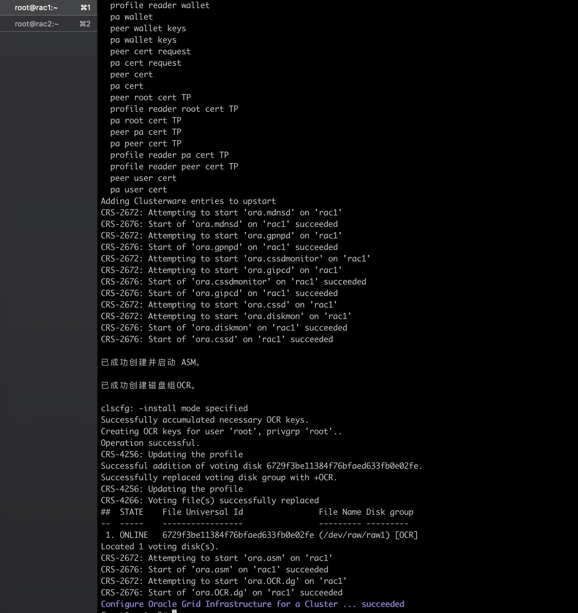
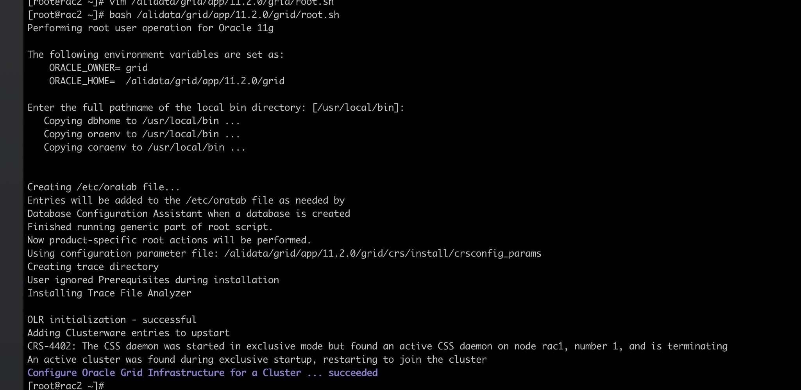

# 阿里云ECSCentos6.9自动化安装Oracle11.2.0.4.0Rac2Nodes.N2N

<!-- MDTOC maxdepth:6 firsth1:1 numbering:0 flatten:0 bullets:1 updateOnSave:1 -->

- [阿里云ECSCentos6.9自动化安装Oracle11.2.0.4.0Rac2Nodes.N2N](#阿里云ecscentos69自动化安装oracle112040rac2nodesn2n)   
- [脚本简介](#脚本简介)   
   - [RAC资源规划](#rac资源规划)   
- [脚本测试](#脚本测试)   
   - [自动化配置环境](#自动化配置环境)   
   - [N2N](#n2n)   
- [安装集群软件GRID](#安装集群软件grid)   

<!-- /MDTOC -->

> 每个ECS1个物理网卡
>
> 使用N2N
>
> 通过一块数据盘安装ISCSI服务，模拟共享存储
>
> CentOS 6.9Oracle11.2.0.4.0


# 脚本简介

```
$ tree oracle_11.2.0.4_rac_n2n
oracle_11.2.0.4_rac_ n2n

├── AutoInstallRac01PreEnv.sh 自动配置环境
├── AutoInstallRac02Grid.sh 自动安装grid
├── get_resource_plan.sh 打印环境配置
└── set_resource_plan.sh 规划资源配置
```

##  RAC资源规划

| 实例名称 | 地域            | 私有IP1     | 私有IP2     | 外网         | 规格                   |
| -------- | --------------- | ----------- | ----------- | ------------ | ---------------------- |
| rac01    | 华北 3 可用区 A | 172.16.1.19 | 172.16.2.75 | 47.92.237.14 | 2 vCPU 4 GiB (I/O优化) |
| rac02    | 华北 3 可用区 A | 172.16.1.20 | 172.16.2.76 | 无           | 2 vCPU 4 GiB (I/O优化) |


| 节点信息     |          |            |      |            |            |
| :----------- | -------- | ---------- | ---- | ---------- | ---------- |
| 节点主机名称 | 实例名称 | 数据库名称 | CPU  | Memory     | OS         |
| rac1         | rac01    | BOOBOO     | 2C   | 4G         | CentOS 6.9 |
| rac2         | rac02    | 2C         | 4G   | CentOS 6.9 |            |


| 网络配置 |                 |                                |               |                          |                     |              |             |
| :------- | --------------- | ------------------------------ | ------------- | ------------------------ | ------------------- | ------------ | ----------- |
| 节点名称 | Physical (eth0) | Private Interconnect(eth3-n2n) | EIP           | Public Network(eth2-n2n) | `Public Virtual IP` | Scan IP      | Scan IP名称 |
| rac1     | 172.16.1.19     | 172.16.9.75                    | 47.92.237.14  | 172.16.10.19             | 172.16.10.29        | 172.16.10.88 | rac-cluster |
| rac2     | 172.16.1.20     | 172.16.9.76                    | 39.98.186.105 | 172.16.10.20             | 172.16.10.30        |              |             |


| Oracle软件组件 |              |          |                                |              |                           |
| :------------- | ------------ | -------- | ------------------------------ | ------------ | ------------------------- |
| 软件组件       | 操作系统用户 | 主组     | 辅助组                         | 主目录       | Oracle基目录/Oracle主目录 |
| Grid Infra     | grid         | oinstall | asmadmin、asmdba、asmoper、dba | /home/grid   |                           |
| Oracle RAC     | oracle       | oinstall | dba、oper、asmdba              | /home/oracle |                           |


| 存储组件 |      |        |           |         |          |
| :------- | ---- | ------ | --------- | ------- | -------- |
| 存储组件 | 类型 | 卷大小 | ASM卷组名 | ASM冗余 | 设备名   |
| OCR      | ASM  | 20G    | OCR       | NORMAL  | /dev/vdd |
| DATA     | ASM  | 200G   | DATA      | NORMAL  | /dev/vdc |

# 脚本测试

## 自动化配置环境

脚本自动跑

## N2N

n2n 配置注意：

1. 虚拟edge节点的ip地址不能和实际的物理网卡地址相同。

2. super节点是相同的。

3. 需要虚拟出

   ```
   Public Network
   ```

   ```
   Private Interconnect
   ```

#  安装集群软件GRID




