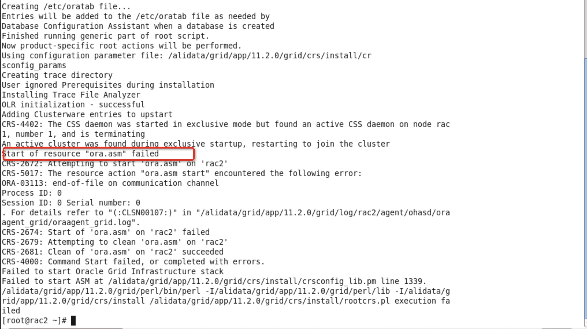

# 阿里云ECSCentos6.9自动化安装Oracle11.2.0.4.0Rac2Nodes.HAVIP

<!-- MDTOC maxdepth:6 firsth1:1 numbering:0 flatten:0 bullets:1 updateOnSave:1 -->

- [阿里云ECSCentos6.9自动化安装Oracle11.2.0.4.0Rac2Nodes.HAVIP](#阿里云ecscentos69自动化安装oracle112040rac2nodeshavip)   
- [运行步骤](#运行步骤)   
   - [手动升级内核](#手动升级内核)   
   - [根据服务器网卡地址规划资源，修改脚本set_resource_plan.sh](#根据服务器网卡地址规划资源，修改脚本set_resource_plansh)   
   - [安装集群前的环境配置](#安装集群前的环境配置)   
      - [RAC1上运行脚本 bash AutoInstallRac01PreEnv.sh 1](#rac1上运行脚本-bash-autoinstallrac01preenvsh-1)   
      - [RAC2上运行脚本 bash AutoInstallRac01PreEnv.sh 2](#rac2上运行脚本-bash-autoinstallrac01preenvsh-2)   
   - [安装阿里云内核组播工具install_multi.sh](#安装阿里云内核组播工具install_multish)   
      - [RAC1运行 bash install_multi.sh 1](#rac1运行-bash-install_multish-1)   
      - [RAC2运行 bash install_multi.sh 2](#rac2运行-bash-install_multish-2)   
- [图形化安装grid](#图形化安装grid)   
   - [rac1](#rac1)   
   - [rac2](#rac2)   
      - [节点2报错如下](#节点2报错如下)   
      - [解决方法：禁止HAIP](#解决方法：禁止haip)   

<!-- /MDTOC -->

> 使用阿里云组播方式
>
> ECS 两个物理网卡
>
> 难点：申请3个HAVIP资源（没有方法替代）
>
> 难点：申请共享存储块（非常难，替代方案：通过一块数据盘安装ISCSI服务，模拟共享存储）
>
> CentOS 6.9
>
> Oracle11.2.0.4.0

# 运行步骤

## 手动升级内核

```bash
yum upgrade kernel -y #升级内核
reboot #重启动
```

## 根据服务器网卡地址规划资源，修改脚本set_resource_plan.sh

修改变量，将脚本下发到rac1和rac2

```bash
ssh_port=22
grid_tmp=/home/grid/grid_tmp/ # grid 安装记录临时存放路径
grid_passwd=Zyadmin123 # grid 应答文件中SYSASMPassword 和 monitorPassword 的密码
database_name=racdb # 数据库名称

node1_hostname=rac1 # 节点1 名称，主机名，实例名
node1_physic_ip=eth0:172.16.1.31 # 节点1 真实的物理网卡和地址
node1_public_ip=eth0:172.16.1.31 # 节点1 公共IP 网卡和地址
node1_public_vip=172.16.1.100 # 节点1 虚拟IP 网卡和地址
node1_private_ip=eth1:172.16.2.82 # 节点1 专用IP 网卡和地址
node1_domain_pub=(rac1 rac1.example.com) # 节点1 公共IP 域名
node1_domain_pub_v=(rac1-vip rac1-vip.example.com) # 节点1 虚拟IP 域名
node1_domain_pri=(rac1-priv rac1-priv.example.com) # 节点1 专用IP 域名


node2_hostname=rac2 # 节点2 名称，主机名，实例名
node2_physic_ip=eth0:172.16.1.30 # 节点2 真实的物理网卡和地址
node2_public_ip=eth0:172.16.1.30 # 节点2 公共IP 网卡和地址
node2_public_vip=172.16.1.101 # 节点2 虚拟IP 网卡和地址
node2_private_ip=eth1:172.16.2.81 # 节点2 专用IP 网卡和地址
node2_domain_pub=(rac2 rac2.example.com) # 节点2 公共IP 域名
node2_domain_pub_v=(rac2-vip rac2-vip.example.com) # 节点2 虚拟IP 域名
node2_domain_pri=(rac2-priv rac2-priv.example.com) # 节点2 专用IP 域名

scan_ip=172.16.1.88 # SCAN IP 地址
scan_name=rac-cluster-scan # SCAN名称

rac_dir=/alidata/ # rac和oracle安装最顶级目录
shared_storage=("/dev/vdb1" "/dev/vdb2") # 共享存储块设备
```

## 安装集群前的环境配置

注意：rac1和rac2的脚本运行顺序-rac2延迟5分钟执行

### RAC1上运行脚本 bash AutoInstallRac01PreEnv.sh 1

```bash
[root@rac1 oracle_11.2.0.4_rac_multi]# bash AutoInstallRac01PreEnv.sh 1
开始时间：
20200110 10:24:13
当前用户为 root
执行用户与要求一致
Oracle RAM COMMON 环境配置 开始
设置/etc/hosts文件
# Public Network - (eth0)
172.16.1.31 rac1 rac1.example.com
172.16.1.30 rac2 rac2.example.com

# Private Interconnect - (eth1)
172.16.2.82 rac1-priv rac1-priv.example.com
172.16.2.81 rac2-priv rac2-priv.example.com

# Public Virtual IP
172.16.1.100 rac1-vip rac1-vip.example.com
172.16.1.101 rac2-vip rac2-vip.example.com

# scanIP
172.16.1.88 rac-cluster-scan
配置/etc/sysctl.conf参数
kernel.shmmax = 4001435648
kernel.shmmni = 4096
kernel.shmall = 976913
kernel.sem = 250 32000 100 128
fs.file-max = 6815744
fs.aio-max-nr = 1048576
net.ipv4.ip_local_port_range = 9000 65500
net.core.rmem_default = 262144
net.core.rmem_max = 4194304
net.core.wmem_default = 262144
net.core.wmem_max = 1048586
配置/etc/security/limits.conf参数
配置/etc/pam.d/login参数
关闭iptables & selinux
配置 modprobe hangcheck-timer
配置/etc/profile文件
创建用户及组
更改用户 oracle 的密码 。
passwd： 所有的身份验证令牌已经成功更新。
更改用户 grid 的密码 。
passwd： 所有的身份验证令牌已经成功更新。
创建目录
配置NTP
Shutting down ntpd:                                        [  OK  ]
swap分区150M
记录了154000+0 的读入
记录了154000+0 的写出
157696000字节(158 MB)已复制，0.34404 秒，458 MB/秒
mkswap: /home/swap: warning: don't erase bootbits sectors
        on whole disk. Use -f to force.
Setting up swapspace version 1, size = 153996 KiB
no label, UUID=7d9280cc-5bf1-4174-b195-c270580d549f
依赖软件包安装和Oracle RAC软件下载 开始
依赖软件包安装
设置主机启动级别为5，即图形界面
Oracle RAC软件下载
Oracle 集群软件 开始下载解压
Oracle 集群软件 下载解压完成
Oracle 数据库软件 开始下载解压
Oracle 数据库软件 下载解压完成
Oracle 其他软件 开始下载解压
Oracle 其他软件 下载解压完成
添加软连接/lib64/libcap.so.1
安装依赖包pdksh 和 cvuqdisk
依赖软件包安装和Oracle RAC软件下载 结束
rac1环境配置 开始
修改主机名
设置oracle用户环境变量
设置grid用户环境变量
配置节点间的ssh信任
cat: /tmp/ssh_oracle.sh: 没有那个文件或目录
rac1环境配置 开始
配置存储target-测试使用
服务端（rac1)
Starting SCSI target daemon:                               [  OK  ]
Target 1: iqn.2020-001.com.iscsi:oracle
    System information:
        Driver: iscsi
        State: ready
    I_T nexus information:
    LUN information:
        LUN: 0
            Type: controller
            SCSI ID: IET     00010000
            SCSI SN: beaf10
            Size: 0 MB, Block size: 1
            Online: Yes
            Removable media: No
            Prevent removal: No
            Readonly: No
            Backing store type: null
            Backing store path: None
            Backing store flags:
        LUN: 1
            Type: disk
            SCSI ID: IET     00010001
            SCSI SN: beaf11
            Size: 21475 MB, Block size: 512
            Online: Yes
            Removable media: No
            Prevent removal: No
            Readonly: No
            Backing store type: rdwr
            Backing store path: /dev/vdb1
            Backing store flags:
        LUN: 2
            Type: disk
            SCSI ID: IET     00010002
            SCSI SN: beaf12
            Size: 21474 MB, Block size: 512
            Online: Yes
            Removable media: No
            Prevent removal: No
            Readonly: No
            Backing store type: rdwr
            Backing store path: /dev/vdb2
            Backing store flags:
    Account information:
    ACL information:
        ALL
配置存储客户端-测试使用(rac1)
正在启动 iscsid：                                          [确定]
172.16.1.31:3260,1 iqn.2020-001.com.iscsi:oracle
Logging in to [iface: default, target: iqn.2020-001.com.iscsi:oracle, portal: 172.16.1.31,3260] (multiple)
Login to [iface: default, target: iqn.2020-001.com.iscsi:oracle, portal: 172.16.1.31,3260] successful.
正在启动 udev：                                            [确定]
[2:0:0:0]    storage IET      Controller       0001  -
[2:0:0:1]    disk    IET      VIRTUAL-DISK     0001  /dev/sda
[2:0:0:2]    disk    IET      VIRTUAL-DISK     0001  /dev/sdb
总用量 0
crw-rw---- 1 grid asmadmin 162, 1 1月  10 10:37 raw1
crw-rw---- 1 grid asmadmin 162, 2 1月  10 10:37 raw2
crw-rw---- 1 root disk     162, 0 1月  10 10:37 rawctl
/root/oracle_11.2.0.4_rac_multi/get_resource_plan.sh: line 52: set_resource_plan.sh: 没有那个文件或目录
Generating public/private rsa key pair.
Created directory '/root/.ssh'.
Your identification has been saved in /root/.ssh/id_rsa.
Your public key has been saved in /root/.ssh/id_rsa.pub.
The key fingerprint is:
06:21:6d:4a:4d:18:6d:fb:30:c0:de:58:d7:c8:a4:3e root@rac1
The key's randomart image is:
+--[ RSA 2048]----+
|   .oBoo.o       |
|    =.Bo+ .      |
|   o Ooo         |
|    +.=.         |
|      E+S        |
|       o.        |
|                 |
|                 |
|                 |
+-----------------+
The authenticity of host '172.16.1.31 (172.16.1.31)' can't be established.
RSA key fingerprint is 85:b9:7e:47:d2:d5:d8:d7:cf:de:8b:72:28:60:1d:7c.
Are you sure you want to continue connecting (yes/no)? yes
Warning: Permanently added '172.16.1.31' (RSA) to the list of known hosts.
root@172.16.1.31's password:
Now try logging into the machine, with "ssh '-p 22 root@172.16.1.31'", and check in:

  .ssh/authorized_keys

to make sure we haven't added extra keys that you weren't expecting.

The authenticity of host '172.16.1.30 (172.16.1.30)' can't be established.
RSA key fingerprint is 60:d6:5f:2b:5f:81:ae:93:57:90:4f:36:b2:16:ba:61.
Are you sure you want to continue connecting (yes/no)? yes
Warning: Permanently added '172.16.1.30' (RSA) to the list of known hosts.
root@172.16.1.30's password:
Now try logging into the machine, with "ssh '-p 22 root@172.16.1.30'", and check in:

  .ssh/authorized_keys

to make sure we haven't added extra keys that you weren't expecting.

节点信息
节点名称         数据库名称 处理器            内存               操作系统
rac1                 racdb      2          3907652kB  CentOS release 6.9 (Final)
rac2                 racdb      2          3907652kB  CentOS release 6.9 (Final)
资源规划-全局参数配置
节点名称              公共IP-网卡           虚拟IP-网卡           专用IP-网卡           SCAN-IP              SCAN名称
rac1                 172.16.1.31-eth0     172.16.1.100         172.16.2.82-eth1     172.16.1.88          rac-cluster-scan
rac2                 172.16.1.30-eth0     172.16.1.101         172.16.2.81-eth1
Oracle 软件组件
软件组件                   操作系统用户             主组                         辅助组                 主目录                      Oracle基目录/Oracle主目录
Grid Infrastructure            grid                 oinstall             asmadmin、asmdba、asmoper    /home/grid           /alidata/app/grid,/u01/app/11.2.0/grid
Oracle RAC                     oracle               oinstall             dba、oper、asmdba            /home/oracle         /alidata/app/oracle,/alidata/app/oracle/product/11.2.0/dbhome_1
Oracle Grid 密码
Zyadmin123
搭建GRID前还需要手动执行以下操作：
1.重启服务器完成主机名的变更。
2.切换到grid用户手动执行/tmp/ssh_grid_oracle.sh
3.切换到oracle用户手动执行/tmp/ssh_grid_oracle.sh
结束时间：
20200110 10:38:49
```


当看到结束时间时，代表已脚本已跑完毕，务必检查所有的返回结果，尤其是isscsi的存储服务情况。

按照提示执行，1可以不执行了已提前运行；直接跑2，3。

```bash
[oracle@rac1 ~]$ bash /tmp/ssh_grid_oracle.sh
[grid@rac1 ~]$ bash /tmp/ssh_grid_oracle.sh
```

### RAC2上运行脚本 bash AutoInstallRac01PreEnv.sh 2

```bash
[root@rac2 oracle_11.2.0.4_rac_multi]# bash AutoInstallRac01PreEnv.sh 2
开始时间：
20200110 10:27:08
当前用户为 root
执行用户与要求一致
Oracle RAM COMMON 环境配置 开始
设置/etc/hosts文件
# Public Network - (eth0)
172.16.1.31 rac1 rac1.example.com
172.16.1.30 rac2 rac2.example.com

# Private Interconnect - (eth1)
172.16.2.82 rac1-priv rac1-priv.example.com
172.16.2.81 rac2-priv rac2-priv.example.com

# Public Virtual IP
172.16.1.100 rac1-vip rac1-vip.example.com
172.16.1.101 rac2-vip rac2-vip.example.com

# scanIP
172.16.1.88 rac-cluster-scan
配置/etc/sysctl.conf参数
kernel.shmmax = 4001435648
kernel.shmmni = 4096
kernel.shmall = 976913
kernel.sem = 250 32000 100 128
fs.file-max = 6815744
fs.aio-max-nr = 1048576
net.ipv4.ip_local_port_range = 9000 65500
net.core.rmem_default = 262144
net.core.rmem_max = 4194304
net.core.wmem_default = 262144
net.core.wmem_max = 1048586
配置/etc/security/limits.conf参数
配置/etc/pam.d/login参数
关闭iptables & selinux
配置 modprobe hangcheck-timer
配置/etc/profile文件
创建用户及组
更改用户 oracle 的密码 。
passwd： 所有的身份验证令牌已经成功更新。
更改用户 grid 的密码 。
passwd： 所有的身份验证令牌已经成功更新。
创建目录
配置NTP
Shutting down ntpd:                                        [  OK  ]
swap分区150M
记录了154000+0 的读入
记录了154000+0 的写出
157696000字节(158 MB)已复制，0.342839 秒，460 MB/秒
mkswap: /home/swap: warning: don't erase bootbits sectors
        on whole disk. Use -f to force.
Setting up swapspace version 1, size = 153996 KiB
no label, UUID=29cdf3ff-cdd3-4fff-bb00-b6660aab27d4
依赖软件包安装和Oracle RAC软件下载 开始
依赖软件包安装
设置主机启动级别为5，即图形界面
Oracle RAC软件下载
Oracle 集群软件 开始下载解压
Oracle 集群软件 下载解压完成
Oracle 数据库软件 开始下载解压
Oracle 数据库软件 下载解压完成
Oracle 其他软件 开始下载解压
Oracle 其他软件 下载解压完成
添加软连接/lib64/libcap.so.1
安装依赖包pdksh 和 cvuqdisk
依赖软件包安装和Oracle RAC软件下载 结束
rac2环境配置 开始
修改主机名
设置oracle用户环境变量
设置grid用户环境变量
配置节点间的ssh信任
rac2环境配置 结束
配置存储客户端-测试使用(rac2)
正在启动 iscsid：                                          [确定]
172.16.1.31:3260,1 iqn.2020-001.com.iscsi:oracle
Logging in to [iface: default, target: iqn.2020-001.com.iscsi:oracle, portal: 172.16.1.31,3260] (multiple)
Login to [iface: default, target: iqn.2020-001.com.iscsi:oracle, portal: 172.16.1.31,3260] successful.
正在启动 udev：                                            [确定]
[2:0:0:0]    storage IET      Controller       0001  -
[2:0:0:1]    disk    IET      VIRTUAL-DISK     0001  /dev/sda
[2:0:0:2]    disk    IET      VIRTUAL-DISK     0001  /dev/sdb
总用量 0
crw-rw---- 1 grid asmadmin 162, 1 1月  10 10:40 raw1
crw-rw---- 1 grid asmadmin 162, 2 1月  10 10:40 raw2
crw-rw---- 1 root disk     162, 0 1月  10 10:40 rawctl
/root/oracle_11.2.0.4_rac_multi/get_resource_plan.sh: line 52: set_resource_plan.sh: 没有那个文件或目录
Generating public/private rsa key pair.
Your identification has been saved in /root/.ssh/id_rsa.
Your public key has been saved in /root/.ssh/id_rsa.pub.
The key fingerprint is:
a2:87:c0:34:14:6d:aa:ed:c0:50:70:9e:fc:e5:fd:c7 root@rac2
The key's randomart image is:
+--[ RSA 2048]----+
|..+o             |
| =..o            |
| .*o  .          |
|.o.o o .         |
|ooo . o S        |
|o... o . . .     |
| o  o .   . E    |
|  .  .     .     |
|                 |
+-----------------+
The authenticity of host '172.16.1.31 (172.16.1.31)' can't be established.
RSA key fingerprint is 85:b9:7e:47:d2:d5:d8:d7:cf:de:8b:72:28:60:1d:7c.
Are you sure you want to continue connecting (yes/no)? yes
Warning: Permanently added '172.16.1.31' (RSA) to the list of known hosts.
Connection closed by 172.16.1.31
The authenticity of host '172.16.1.30 (172.16.1.30)' can't be established.
RSA key fingerprint is 60:d6:5f:2b:5f:81:ae:93:57:90:4f:36:b2:16:ba:61.
Are you sure you want to continue connecting (yes/no)? yes
Warning: Permanently added '172.16.1.30' (RSA) to the list of known hosts.
root@172.16.1.30's password:
Now try logging into the machine, with "ssh '-p 22 root@172.16.1.30'", and check in:

  .ssh/authorized_keys

to make sure we haven't added extra keys that you weren't expecting.

节点信息
节点名称         数据库名称 处理器            内存               操作系统
rac1                 racdb      2          3907652kB  CentOS release 6.9 (Final)
rac2                 racdb      2          3907652kB  CentOS release 6.9 (Final)
资源规划-全局参数配置
节点名称              公共IP-网卡           虚拟IP-网卡           专用IP-网卡           SCAN-IP              SCAN名称
rac1                 172.16.1.31-eth0     172.16.1.100         172.16.2.82-eth1     172.16.1.88          rac-cluster-scan
rac2                 172.16.1.30-eth0     172.16.1.101         172.16.2.81-eth1
Oracle 软件组件
软件组件                   操作系统用户             主组                         辅助组                 主目录                      Oracle基目录/Oracle主目录
Grid Infrastructure            grid                 oinstall             asmadmin、asmdba、asmoper    /home/grid           /alidata/app/grid,/u01/app/11.2.0/grid
Oracle RAC                     oracle               oinstall             dba、oper、asmdba            /home/oracle         /alidata/app/oracle,/alidata/app/oracle/product/11.2.0/dbhome_1
Oracle Grid 密码
Zyadmin123
搭建GRID前还需要手动执行以下操作：
1.重启服务器完成主机名的变更。
2.切换到grid用户手动执行/tmp/ssh_grid_oracle.sh
3.切换到oracle用户手动执行/tmp/ssh_grid_oracle.sh
结束时间：
20200110 10:50:02
```


按照提示执行，1可以不执行了已提前运行；直接跑2，3。

```bash
[oracle@rac2 ~]$ bash /tmp/ssh_grid_oracle.sh
[grid@rac2 ~]$ bash /tmp/ssh_grid_oracle.sh
```

## 安装阿里云内核组播工具install_multi.sh

### RAC1运行 bash install_multi.sh 1

```bash
[root@rac1 oracle_11.2.0.4_rac_multi]# bash install_multi.sh 1
下载组播代理工具
运行以下命令检查Kernel版本
fix bug
运行命令生成安装包
已加载插件：fastestmirror, refresh-packagekit
设置安装进程
Loading mirror speeds from cached hostfile
包 rpm-build-4.8.0-59.el6.x86_64 已安装并且是最新版本
无须任何处理
已加载插件：fastestmirror, refresh-packagekit
设置安装进程
Loading mirror speeds from cached hostfile
包 kernel-devel-2.6.32-754.25.1.el6.x86_64 已安装并且是最新版本
无须任何处理
multi_client-1.1/
multi_client-1.1/kmod/
multi_client-1.1/kmod/multic_grp.c
multi_client-1.1/kmod/multic.c
multi_client-1.1/kmod/multic_nl.c
multi_client-1.1/kmod/Makefile
multi_client-1.1/kmod/multic_nf.c
multi_client-1.1/tools/
multi_client-1.1/tools/multi_client_control/
multi_client-1.1/tools/multi_client_control/comm_kernel.c
multi_client-1.1/tools/multi_client_control/json_config.c
multi_client-1.1/tools/multi_client_control/multic_json_config.h
multi_client-1.1/tools/multi_client_control/parse_arg.h
multi_client-1.1/tools/multi_client_control/Makefile
multi_client-1.1/tools/multi_client_control/base_config.c
multi_client-1.1/tools/multi_client_control/test.sh
multi_client-1.1/tools/multi_client_control/app_control.c
multi_client-1.1/tools/Makefile
multi_client-1.1/tools/multi_config_control/
multi_client-1.1/tools/multi_config_control/json_config.c
multi_client-1.1/tools/multi_config_control/multic_json_config.h
multi_client-1.1/tools/multi_config_control/parse_arg.h
multi_client-1.1/tools/multi_config_control/Makefile
multi_client-1.1/tools/multi_config_control/base_config.c
multi_client-1.1/tools/multi_config_control/test.sh
multi_client-1.1/tools/multi_config_control/app_control.c
multi_client-1.1/scripts/
multi_client-1.1/scripts/multic
multi_client-1.1/thirdpart/
multi_client-1.1/thirdpart/json-c/
multi_client-1.1/thirdpart/json-c/libjson-c.a
multi_client-1.1/thirdpart/json-c/json_inttypes.h
multi_client-1.1/thirdpart/json-c/debug.h
multi_client-1.1/thirdpart/json-c/linkhash.h
multi_client-1.1/thirdpart/json-c/printbuf.h
multi_client-1.1/thirdpart/json-c/arraylist.h
multi_client-1.1/thirdpart/json-c/json_config.h
multi_client-1.1/thirdpart/json-c/json_util.h
multi_client-1.1/thirdpart/json-c/bits.h
multi_client-1.1/thirdpart/json-c/libjson.a
multi_client-1.1/thirdpart/json-c/json_c_version.h
multi_client-1.1/thirdpart/json-c/json_object_private.h
multi_client-1.1/thirdpart/json-c/json_object.h
multi_client-1.1/thirdpart/json-c/json_object_iterator.h
multi_client-1.1/thirdpart/json-c/json.h
multi_client-1.1/thirdpart/json-c/json_tokener.h
multi_client-1.1/Makefile
multi_client-1.1/include/
multi_client-1.1/include/grp.h
multi_client-1.1/include/nl.h
multi_client-1.1/include/nf.h
multi_client-1.1/include/tmcc_nl.h
multi_client-1.1/include/base_control.h
Executing(%prep): /bin/sh -e /var/tmp/rpm-tmp.wgg8a5
+ umask 022
+ cd /software/patch/multicast_proxy-master/multicast_kernel/rpmbuild_multicast/BUILD
+ LANG=C
+ export LANG
+ unset DISPLAY
+ cd /software/patch/multicast_proxy-master/multicast_kernel/rpmbuild_multicast/BUILD
+ rm -rf multi_client-1.1
+ /usr/bin/bzip2 -dc /software/patch/multicast_proxy-master/multicast_kernel/rpmbuild_multicast/SOURCES/multi_client-1.1.tar.bz2
+ /bin/tar -xf -
+ STATUS=0
+ '[' 0 -ne 0 ']'
+ /usr/bin/bzip2 -dc /software/patch/multicast_proxy-master/multicast_kernel/rpmbuild_multicast/SOURCES/multi_client-1.1.tar.bz2
+ /bin/tar -xf -
+ STATUS=0
+ '[' 0 -ne 0 ']'
+ cd multi_client-1.1
+ /bin/chmod -Rf a+rX,u+w,g-w,o-w .
+ exit 0
Executing(%build): /bin/sh -e /var/tmp/rpm-tmp.1P8MQz
+ umask 022
+ cd /software/patch/multicast_proxy-master/multicast_kernel/rpmbuild_multicast/BUILD
+ cd multi_client-1.1
+ LANG=C
+ export LANG
+ unset DISPLAY
+ export MULTIC_VERSION=1.1
+ MULTIC_VERSION=1.1
+ echo /software/patch/multicast_proxy-master/multicast_kernel/rpmbuild_multicast/BUILDROOT/multi_client-1.1-1.x86_64
/software/patch/multicast_proxy-master/multicast_kernel/rpmbuild_multicast/BUILDROOT/multi_client-1.1-1.x86_64
+ make clean
make -C kmod clean
make[1]: Entering directory `/software/patch/multicast_proxy-master/multicast_kernel/rpmbuild_multicast/BUILD/multi_client-1.1/kmod'
rm -rf *.o *.ko* *.symvers *.mod.c .*.cmd *.order .rlqos.* .tmp_versions
make[1]: Leaving directory `/software/patch/multicast_proxy-master/multicast_kernel/rpmbuild_multicast/BUILD/multi_client-1.1/kmod'
make -C tools clean
make[1]: Entering directory `/software/patch/multicast_proxy-master/multicast_kernel/rpmbuild_multicast/BUILD/multi_client-1.1/tools'
make -C multi_client_control clean
make[2]: Entering directory `/software/patch/multicast_proxy-master/multicast_kernel/rpmbuild_multicast/BUILD/multi_client-1.1/tools/multi_client_control'
rm -fr *.o multic_admin
make[2]: Leaving directory `/software/patch/multicast_proxy-master/multicast_kernel/rpmbuild_multicast/BUILD/multi_client-1.1/tools/multi_client_control'
make -C multi_config_control clean
make[2]: Entering directory `/software/patch/multicast_proxy-master/multicast_kernel/rpmbuild_multicast/BUILD/multi_client-1.1/tools/multi_config_control'
rm -fr *.o multic_config_admin
make[2]: Leaving directory `/software/patch/multicast_proxy-master/multicast_kernel/rpmbuild_multicast/BUILD/multi_client-1.1/tools/multi_config_control'
rm -fr .tmp_versions
make[1]: Leaving directory `/software/patch/multicast_proxy-master/multicast_kernel/rpmbuild_multicast/BUILD/multi_client-1.1/tools'
rm -fr .tmp_versions
+ make
make -C kmod
make[1]: Entering directory `/software/patch/multicast_proxy-master/multicast_kernel/rpmbuild_multicast/BUILD/multi_client-1.1/kmod'
make -C /lib/modules/`uname -r`/build M=/software/patch/multicast_proxy-master/multicast_kernel/rpmbuild_multicast/BUILD/multi_client-1.1/kmod modules
make[2]: Entering directory `/usr/src/kernels/2.6.32-754.25.1.el6.x86_64'
  CC [M]  /software/patch/multicast_proxy-master/multicast_kernel/rpmbuild_multicast/BUILD/multi_client-1.1/kmod/multic.o
  CC [M]  /software/patch/multicast_proxy-master/multicast_kernel/rpmbuild_multicast/BUILD/multi_client-1.1/kmod/multic_nl.o
  CC [M]  /software/patch/multicast_proxy-master/multicast_kernel/rpmbuild_multicast/BUILD/multi_client-1.1/kmod/multic_nf.o
/software/patch/multicast_proxy-master/multicast_kernel/rpmbuild_multicast/BUILD/multi_client-1.1/kmod/multic_nf.c:42: warning: 'struct nf_hook_state' declared inside parameter list
/software/patch/multicast_proxy-master/multicast_kernel/rpmbuild_multicast/BUILD/multi_client-1.1/kmod/multic_nf.c:42: warning: its scope is only this definition or declaration, which is probably not what you want
/software/patch/multicast_proxy-master/multicast_kernel/rpmbuild_multicast/BUILD/multi_client-1.1/kmod/multic_nf.c:120: warning: initialization from incompatible pointer type
  CC [M]  /software/patch/multicast_proxy-master/multicast_kernel/rpmbuild_multicast/BUILD/multi_client-1.1/kmod/multic_grp.o
  LD [M]  /software/patch/multicast_proxy-master/multicast_kernel/rpmbuild_multicast/BUILD/multi_client-1.1/kmod/multi_client.o
  Building modules, stage 2.
  MODPOST 1 modules
  CC      /software/patch/multicast_proxy-master/multicast_kernel/rpmbuild_multicast/BUILD/multi_client-1.1/kmod/multi_client.mod.o
  LD [M]  /software/patch/multicast_proxy-master/multicast_kernel/rpmbuild_multicast/BUILD/multi_client-1.1/kmod/multi_client.ko.unsigned
  NO SIGN [M] /software/patch/multicast_proxy-master/multicast_kernel/rpmbuild_multicast/BUILD/multi_client-1.1/kmod/multi_client.ko
make[2]: Leaving directory `/usr/src/kernels/2.6.32-754.25.1.el6.x86_64'
make[1]: Leaving directory `/software/patch/multicast_proxy-master/multicast_kernel/rpmbuild_multicast/BUILD/multi_client-1.1/kmod'
make -C tools
make[1]: Entering directory `/software/patch/multicast_proxy-master/multicast_kernel/rpmbuild_multicast/BUILD/multi_client-1.1/tools'
make -C multi_client_control
make[2]: Entering directory `/software/patch/multicast_proxy-master/multicast_kernel/rpmbuild_multicast/BUILD/multi_client-1.1/tools/multi_client_control'
gcc -Wall -g -I../../include -I../../thirdpart/json-c/ -I../../thirdpart/libcurl/   -c -o app_control.o app_control.c
gcc -Wall -g -I../../include -I../../thirdpart/json-c/ -I../../thirdpart/libcurl/   -c -o comm_kernel.o comm_kernel.c
gcc -Wall -g -I../../include -I../../thirdpart/json-c/ -I../../thirdpart/libcurl/   -c -o json_config.o json_config.c
gcc -Wall -g -I../../include -I../../thirdpart/json-c/ -I../../thirdpart/libcurl/   -c -o base_config.o base_config.c
gcc -Wall -g -I../../include -I../../thirdpart/json-c/ -I../../thirdpart/libcurl/ app_control.o comm_kernel.o json_config.o base_config.o -L../../thirdpart/json-c -ljson-c -o multic_admin
make[2]: Leaving directory `/software/patch/multicast_proxy-master/multicast_kernel/rpmbuild_multicast/BUILD/multi_client-1.1/tools/multi_client_control'
make -C multi_config_control
make[2]: Entering directory `/software/patch/multicast_proxy-master/multicast_kernel/rpmbuild_multicast/BUILD/multi_client-1.1/tools/multi_config_control'
gcc -Wall -g -I../../include -I../../thirdpart/json-c/ -I../../thirdpart/libcurl/   -c -o app_control.o app_control.c
gcc -Wall -g -I../../include -I../../thirdpart/json-c/ -I../../thirdpart/libcurl/   -c -o json_config.o json_config.c
gcc -Wall -g -I../../include -I../../thirdpart/json-c/ -I../../thirdpart/libcurl/   -c -o base_config.o base_config.c
gcc -Wall -g -I../../include -I../../thirdpart/json-c/ -I../../thirdpart/libcurl/ app_control.o json_config.o base_config.o -L../../thirdpart/json-c -ljson-c -o multic_config_admin
make[2]: Leaving directory `/software/patch/multicast_proxy-master/multicast_kernel/rpmbuild_multicast/BUILD/multi_client-1.1/tools/multi_config_control'
make[1]: Leaving directory `/software/patch/multicast_proxy-master/multicast_kernel/rpmbuild_multicast/BUILD/multi_client-1.1/tools'
+ exit 0
Executing(%install): /bin/sh -e /var/tmp/rpm-tmp.2iYT28
+ umask 022
+ cd /software/patch/multicast_proxy-master/multicast_kernel/rpmbuild_multicast/BUILD
+ '[' /software/patch/multicast_proxy-master/multicast_kernel/rpmbuild_multicast/BUILDROOT/multi_client-1.1-1.x86_64 '!=' / ']'
+ rm -rf /software/patch/multicast_proxy-master/multicast_kernel/rpmbuild_multicast/BUILDROOT/multi_client-1.1-1.x86_64
++ dirname /software/patch/multicast_proxy-master/multicast_kernel/rpmbuild_multicast/BUILDROOT/multi_client-1.1-1.x86_64
+ mkdir -p /software/patch/multicast_proxy-master/multicast_kernel/rpmbuild_multicast/BUILDROOT
+ mkdir /software/patch/multicast_proxy-master/multicast_kernel/rpmbuild_multicast/BUILDROOT/multi_client-1.1-1.x86_64
+ cd multi_client-1.1
+ LANG=C
+ export LANG
+ unset DISPLAY
+ mkdir -p /software/patch/multicast_proxy-master/multicast_kernel/rpmbuild_multicast/BUILDROOT/multi_client-1.1-1.x86_64/usr/local/sbin
+ mkdir -p /software/patch/multicast_proxy-master/multicast_kernel/rpmbuild_multicast/BUILDROOT/multi_client-1.1-1.x86_64/usr/local/src/multic/kmod
+ mkdir -p /software/patch/multicast_proxy-master/multicast_kernel/rpmbuild_multicast/BUILDROOT/multi_client-1.1-1.x86_64/etc/init.d
+ cp -f ./tools/multi_client_control/multic_admin /software/patch/multicast_proxy-master/multicast_kernel/rpmbuild_multicast/BUILDROOT/multi_client-1.1-1.x86_64/usr/local/sbin/
+ cp -f ./tools/multi_config_control/multic_config_admin /software/patch/multicast_proxy-master/multicast_kernel/rpmbuild_multicast/BUILDROOT/multi_client-1.1-1.x86_64/usr/local/sbin/
+ cp -f ./kmod/multi_client.ko /software/patch/multicast_proxy-master/multicast_kernel/rpmbuild_multicast/BUILDROOT/multi_client-1.1-1.x86_64/usr/local/src/multic/kmod/
+ cp -f ./scripts/multic /software/patch/multicast_proxy-master/multicast_kernel/rpmbuild_multicast/BUILDROOT/multi_client-1.1-1.x86_64/etc/init.d/
+ /usr/lib/rpm/check-buildroot
+ /usr/lib/rpm/redhat/brp-compress
+ /usr/lib/rpm/redhat/brp-strip /usr/bin/strip
+ /usr/lib/rpm/redhat/brp-strip-static-archive /usr/bin/strip
+ /usr/lib/rpm/redhat/brp-strip-comment-note /usr/bin/strip /usr/bin/objdump
+ /usr/lib/rpm/brp-python-bytecompile /usr/bin/python
+ /usr/lib/rpm/redhat/brp-python-hardlink
+ /usr/lib/rpm/redhat/brp-java-repack-jars
Processing files: multi_client-1.1-1.x86_64
Requires(interp): /bin/sh
Requires(rpmlib): rpmlib(CompressedFileNames) <= 3.0.4-1 rpmlib(FileDigests) <= 4.6.0-1 rpmlib(PayloadFilesHavePrefix) <= 4.0-1
Requires(pre): /bin/sh
Requires: /bin/sh libc.so.6()(64bit) libc.so.6(GLIBC_2.2.5)(64bit) libc.so.6(GLIBC_2.3)(64bit) rtld(GNU_HASH)
Checking for unpackaged file(s): /usr/lib/rpm/check-files /software/patch/multicast_proxy-master/multicast_kernel/rpmbuild_multicast/BUILDROOT/multi_client-1.1-1.x86_64
Wrote: /software/patch/multicast_proxy-master/multicast_kernel/rpmbuild_multicast/RPMS/x86_64/multi_client-1.1-1.x86_64.rpm
Executing(%clean): /bin/sh -e /var/tmp/rpm-tmp.0WmB5h
+ umask 022
+ cd /software/patch/multicast_proxy-master/multicast_kernel/rpmbuild_multicast/BUILD
+ cd multi_client-1.1
+ rm -rf /software/patch/multicast_proxy-master/multicast_kernel/rpmbuild_multicast/BUILDROOT/multi_client-1.1-1.x86_64
+ exit 0
multi_server-1.1/
multi_server-1.1/kmod/
multi_server-1.1/kmod/multis.c
multi_server-1.1/kmod/multis_nl.c
multi_server-1.1/kmod/multis_nf.c
multi_server-1.1/kmod/multis_grp.c
multi_server-1.1/kmod/Makefile
multi_server-1.1/tools/
multi_server-1.1/tools/Makefile
multi_server-1.1/tools/multi_server_control/
multi_server-1.1/tools/multi_server_control/multis_json_config.h
multi_server-1.1/tools/multi_server_control/cscope.out
multi_server-1.1/tools/multi_server_control/comm_kernel.c
multi_server-1.1/tools/multi_server_control/json_config.c
multi_server-1.1/tools/multi_server_control/test_add.sh
multi_server-1.1/tools/multi_server_control/tags
multi_server-1.1/tools/multi_server_control/test_largevm.sh
multi_server-1.1/tools/multi_server_control/parse_arg.h
multi_server-1.1/tools/multi_server_control/Makefile
multi_server-1.1/tools/multi_server_control/base_config.c
multi_server-1.1/tools/multi_server_control/test_del.sh
multi_server-1.1/tools/multi_server_control/cscope.in.out
multi_server-1.1/tools/multi_server_control/app_control.c
multi_server-1.1/tools/multi_server_control/cscope.po.out
multi_server-1.1/tools/multi_config_control/
multi_server-1.1/tools/multi_config_control/json_config.c
multi_server-1.1/tools/multi_config_control/multic_json_config.h
multi_server-1.1/tools/multi_config_control/parse_arg.h
multi_server-1.1/tools/multi_config_control/Makefile
multi_server-1.1/tools/multi_config_control/base_config.c
multi_server-1.1/tools/multi_config_control/test.sh
multi_server-1.1/tools/multi_config_control/app_control.c
multi_server-1.1/scripts/
multi_server-1.1/scripts/multis
multi_server-1.1/thirdpart/
multi_server-1.1/thirdpart/json-c/
multi_server-1.1/thirdpart/json-c/libjson-c.a
multi_server-1.1/thirdpart/json-c/json_inttypes.h
multi_server-1.1/thirdpart/json-c/debug.h
multi_server-1.1/thirdpart/json-c/linkhash.h
multi_server-1.1/thirdpart/json-c/printbuf.h
multi_server-1.1/thirdpart/json-c/arraylist.h
multi_server-1.1/thirdpart/json-c/json_config.h
multi_server-1.1/thirdpart/json-c/json_util.h
multi_server-1.1/thirdpart/json-c/bits.h
multi_server-1.1/thirdpart/json-c/libjson.a
multi_server-1.1/thirdpart/json-c/json_c_version.h
multi_server-1.1/thirdpart/json-c/json_object_private.h
multi_server-1.1/thirdpart/json-c/json_object.h
multi_server-1.1/thirdpart/json-c/json_object_iterator.h
multi_server-1.1/thirdpart/json-c/json.h
multi_server-1.1/thirdpart/json-c/json_tokener.h
multi_server-1.1/Makefile
multi_server-1.1/include/
multi_server-1.1/include/grp.h
multi_server-1.1/include/nl.h
multi_server-1.1/include/nf.h
multi_server-1.1/include/tmcc_nl.h
multi_server-1.1/include/base_control.h
Executing(%prep): /bin/sh -e /var/tmp/rpm-tmp.JV4qoi
+ umask 022
+ cd /software/patch/multicast_proxy-master/multicast_kernel/rpmbuild_multicast/BUILD
+ LANG=C
+ export LANG
+ unset DISPLAY
+ cd /software/patch/multicast_proxy-master/multicast_kernel/rpmbuild_multicast/BUILD
+ rm -rf multi_server-1.1
+ /usr/bin/bzip2 -dc /software/patch/multicast_proxy-master/multicast_kernel/rpmbuild_multicast/SOURCES/multi_server-1.1.tar.bz2
+ /bin/tar -xf -
+ STATUS=0
+ '[' 0 -ne 0 ']'
+ /usr/bin/bzip2 -dc /software/patch/multicast_proxy-master/multicast_kernel/rpmbuild_multicast/SOURCES/multi_server-1.1.tar.bz2
+ /bin/tar -xf -
+ STATUS=0
+ '[' 0 -ne 0 ']'
+ cd multi_server-1.1
+ /bin/chmod -Rf a+rX,u+w,g-w,o-w .
+ exit 0
Executing(%build): /bin/sh -e /var/tmp/rpm-tmp.fBYiZS
+ umask 022
+ cd /software/patch/multicast_proxy-master/multicast_kernel/rpmbuild_multicast/BUILD
+ cd multi_server-1.1
+ LANG=C
+ export LANG
+ unset DISPLAY
+ export MULTIC_VERSION=1.1
+ MULTIC_VERSION=1.1
+ echo /software/patch/multicast_proxy-master/multicast_kernel/rpmbuild_multicast/BUILDROOT/multi_server-1.1-1.x86_64
/software/patch/multicast_proxy-master/multicast_kernel/rpmbuild_multicast/BUILDROOT/multi_server-1.1-1.x86_64
+ make clean
make -C kmod clean
make[1]: Entering directory `/software/patch/multicast_proxy-master/multicast_kernel/rpmbuild_multicast/BUILD/multi_server-1.1/kmod'
rm -rf *.o *.ko* *.symvers *.mod.c .*.cmd *.order .rlqos.* .tmp_versions
make[1]: Leaving directory `/software/patch/multicast_proxy-master/multicast_kernel/rpmbuild_multicast/BUILD/multi_server-1.1/kmod'
make -C tools clean
make[1]: Entering directory `/software/patch/multicast_proxy-master/multicast_kernel/rpmbuild_multicast/BUILD/multi_server-1.1/tools'
make -C multi_server_control clean
make[2]: Entering directory `/software/patch/multicast_proxy-master/multicast_kernel/rpmbuild_multicast/BUILD/multi_server-1.1/tools/multi_server_control'
rm -fr *.o multis_admin
make[2]: Leaving directory `/software/patch/multicast_proxy-master/multicast_kernel/rpmbuild_multicast/BUILD/multi_server-1.1/tools/multi_server_control'
make -C multi_config_control clean
make[2]: Entering directory `/software/patch/multicast_proxy-master/multicast_kernel/rpmbuild_multicast/BUILD/multi_server-1.1/tools/multi_config_control'
rm -fr *.o multis_config_admin
make[2]: Leaving directory `/software/patch/multicast_proxy-master/multicast_kernel/rpmbuild_multicast/BUILD/multi_server-1.1/tools/multi_config_control'
rm -fr .tmp_versions
make[1]: Leaving directory `/software/patch/multicast_proxy-master/multicast_kernel/rpmbuild_multicast/BUILD/multi_server-1.1/tools'
rm -fr .tmp_versions
+ make
make -C kmod
make[1]: Entering directory `/software/patch/multicast_proxy-master/multicast_kernel/rpmbuild_multicast/BUILD/multi_server-1.1/kmod'
make -C /lib/modules/`uname -r`/build M=/software/patch/multicast_proxy-master/multicast_kernel/rpmbuild_multicast/BUILD/multi_server-1.1/kmod modules
make[2]: Entering directory `/usr/src/kernels/2.6.32-754.25.1.el6.x86_64'
  CC [M]  /software/patch/multicast_proxy-master/multicast_kernel/rpmbuild_multicast/BUILD/multi_server-1.1/kmod/multis.o
  CC [M]  /software/patch/multicast_proxy-master/multicast_kernel/rpmbuild_multicast/BUILD/multi_server-1.1/kmod/multis_nl.o
  CC [M]  /software/patch/multicast_proxy-master/multicast_kernel/rpmbuild_multicast/BUILD/multi_server-1.1/kmod/multis_nf.o
/software/patch/multicast_proxy-master/multicast_kernel/rpmbuild_multicast/BUILD/multi_server-1.1/kmod/multis_nf.c:58: warning: 'struct nf_hook_state' declared inside parameter list
/software/patch/multicast_proxy-master/multicast_kernel/rpmbuild_multicast/BUILD/multi_server-1.1/kmod/multis_nf.c:58: warning: its scope is only this definition or declaration, which is probably not what you want
/software/patch/multicast_proxy-master/multicast_kernel/rpmbuild_multicast/BUILD/multi_server-1.1/kmod/multis_nf.c:179: warning: initialization from incompatible pointer type
  CC [M]  /software/patch/multicast_proxy-master/multicast_kernel/rpmbuild_multicast/BUILD/multi_server-1.1/kmod/multis_grp.o
  LD [M]  /software/patch/multicast_proxy-master/multicast_kernel/rpmbuild_multicast/BUILD/multi_server-1.1/kmod/multi_server.o
  Building modules, stage 2.
  MODPOST 1 modules
  CC      /software/patch/multicast_proxy-master/multicast_kernel/rpmbuild_multicast/BUILD/multi_server-1.1/kmod/multi_server.mod.o
  LD [M]  /software/patch/multicast_proxy-master/multicast_kernel/rpmbuild_multicast/BUILD/multi_server-1.1/kmod/multi_server.ko.unsigned
  NO SIGN [M] /software/patch/multicast_proxy-master/multicast_kernel/rpmbuild_multicast/BUILD/multi_server-1.1/kmod/multi_server.ko
make[2]: Leaving directory `/usr/src/kernels/2.6.32-754.25.1.el6.x86_64'
make[1]: Leaving directory `/software/patch/multicast_proxy-master/multicast_kernel/rpmbuild_multicast/BUILD/multi_server-1.1/kmod'
make -C tools
make[1]: Entering directory `/software/patch/multicast_proxy-master/multicast_kernel/rpmbuild_multicast/BUILD/multi_server-1.1/tools'
make -C multi_server_control
make[2]: Entering directory `/software/patch/multicast_proxy-master/multicast_kernel/rpmbuild_multicast/BUILD/multi_server-1.1/tools/multi_server_control'
gcc -Wall -g -I../../include -I../../thirdpart/json-c/   -c -o app_control.o app_control.c
gcc -Wall -g -I../../include -I../../thirdpart/json-c/   -c -o comm_kernel.o comm_kernel.c
gcc -Wall -g -I../../include -I../../thirdpart/json-c/   -c -o json_config.o json_config.c
gcc -Wall -g -I../../include -I../../thirdpart/json-c/   -c -o base_config.o base_config.c
gcc -Wall -g -I../../include -I../../thirdpart/json-c/ app_control.o comm_kernel.o json_config.o base_config.o -L../../thirdpart/json-c -ljson-c -o multis_admin
make[2]: Leaving directory `/software/patch/multicast_proxy-master/multicast_kernel/rpmbuild_multicast/BUILD/multi_server-1.1/tools/multi_server_control'
make -C multi_config_control
make[2]: Entering directory `/software/patch/multicast_proxy-master/multicast_kernel/rpmbuild_multicast/BUILD/multi_server-1.1/tools/multi_config_control'
gcc -Wall -g -I../../include -I../../thirdpart/json-c/ -I../../thirdpart/libcurl/   -c -o app_control.o app_control.c
gcc -Wall -g -I../../include -I../../thirdpart/json-c/ -I../../thirdpart/libcurl/   -c -o json_config.o json_config.c
gcc -Wall -g -I../../include -I../../thirdpart/json-c/ -I../../thirdpart/libcurl/   -c -o base_config.o base_config.c
gcc -Wall -g -I../../include -I../../thirdpart/json-c/ -I../../thirdpart/libcurl/ app_control.o json_config.o base_config.o -L../../thirdpart/json-c -ljson-c -o multis_config_admin
make[2]: Leaving directory `/software/patch/multicast_proxy-master/multicast_kernel/rpmbuild_multicast/BUILD/multi_server-1.1/tools/multi_config_control'
make[1]: Leaving directory `/software/patch/multicast_proxy-master/multicast_kernel/rpmbuild_multicast/BUILD/multi_server-1.1/tools'
+ exit 0
Executing(%install): /bin/sh -e /var/tmp/rpm-tmp.7mlsiy
+ umask 022
+ cd /software/patch/multicast_proxy-master/multicast_kernel/rpmbuild_multicast/BUILD
+ '[' /software/patch/multicast_proxy-master/multicast_kernel/rpmbuild_multicast/BUILDROOT/multi_server-1.1-1.x86_64 '!=' / ']'
+ rm -rf /software/patch/multicast_proxy-master/multicast_kernel/rpmbuild_multicast/BUILDROOT/multi_server-1.1-1.x86_64
++ dirname /software/patch/multicast_proxy-master/multicast_kernel/rpmbuild_multicast/BUILDROOT/multi_server-1.1-1.x86_64
+ mkdir -p /software/patch/multicast_proxy-master/multicast_kernel/rpmbuild_multicast/BUILDROOT
+ mkdir /software/patch/multicast_proxy-master/multicast_kernel/rpmbuild_multicast/BUILDROOT/multi_server-1.1-1.x86_64
+ cd multi_server-1.1
+ LANG=C
+ export LANG
+ unset DISPLAY
+ mkdir -p /software/patch/multicast_proxy-master/multicast_kernel/rpmbuild_multicast/BUILDROOT/multi_server-1.1-1.x86_64/usr/local/sbin
+ mkdir -p /software/patch/multicast_proxy-master/multicast_kernel/rpmbuild_multicast/BUILDROOT/multi_server-1.1-1.x86_64/usr/local/src/multis/kmod
+ mkdir -p /software/patch/multicast_proxy-master/multicast_kernel/rpmbuild_multicast/BUILDROOT/multi_server-1.1-1.x86_64/etc/init.d
+ cp -f ./tools/multi_server_control/multis_admin /software/patch/multicast_proxy-master/multicast_kernel/rpmbuild_multicast/BUILDROOT/multi_server-1.1-1.x86_64/usr/local/sbin/
+ cp -f ./tools/multi_config_control/multis_config_admin /software/patch/multicast_proxy-master/multicast_kernel/rpmbuild_multicast/BUILDROOT/multi_server-1.1-1.x86_64/usr/local/sbin/
+ cp -f ./kmod/multi_server.ko /software/patch/multicast_proxy-master/multicast_kernel/rpmbuild_multicast/BUILDROOT/multi_server-1.1-1.x86_64/usr/local/src/multis/kmod/
+ cp -f ./scripts/multis /software/patch/multicast_proxy-master/multicast_kernel/rpmbuild_multicast/BUILDROOT/multi_server-1.1-1.x86_64/etc/init.d/
+ /usr/lib/rpm/check-buildroot
+ /usr/lib/rpm/redhat/brp-compress
+ /usr/lib/rpm/redhat/brp-strip /usr/bin/strip
+ /usr/lib/rpm/redhat/brp-strip-static-archive /usr/bin/strip
+ /usr/lib/rpm/redhat/brp-strip-comment-note /usr/bin/strip /usr/bin/objdump
+ /usr/lib/rpm/brp-python-bytecompile /usr/bin/python
+ /usr/lib/rpm/redhat/brp-python-hardlink
+ /usr/lib/rpm/redhat/brp-java-repack-jars
Processing files: multi_server-1.1-1.x86_64
Requires(interp): /bin/sh
Requires(rpmlib): rpmlib(CompressedFileNames) <= 3.0.4-1 rpmlib(FileDigests) <= 4.6.0-1 rpmlib(PayloadFilesHavePrefix) <= 4.0-1
Requires(pre): /bin/sh
Requires: /bin/sh libc.so.6()(64bit) libc.so.6(GLIBC_2.2.5)(64bit) libc.so.6(GLIBC_2.3)(64bit) rtld(GNU_HASH)
Checking for unpackaged file(s): /usr/lib/rpm/check-files /software/patch/multicast_proxy-master/multicast_kernel/rpmbuild_multicast/BUILDROOT/multi_server-1.1-1.x86_64
Wrote: /software/patch/multicast_proxy-master/multicast_kernel/rpmbuild_multicast/RPMS/x86_64/multi_server-1.1-1.x86_64.rpm
Executing(%clean): /bin/sh -e /var/tmp/rpm-tmp.nT5jzT
+ umask 022
+ cd /software/patch/multicast_proxy-master/multicast_kernel/rpmbuild_multicast/BUILD
+ cd multi_server-1.1
+ rm -rf /software/patch/multicast_proxy-master/multicast_kernel/rpmbuild_multicast/BUILDROOT/multi_server-1.1-1.x86_64
+ exit 0
开始安装
Preparing...                ########################################### [100%]
	package multi_server-1.1-1.x86_64 is already installed
Preparing...                ########################################### [100%]
	package multi_client-1.1-1.x86_64 is already installed
启动服务
 multi_server is existed, please unload it...
 multi_client is existed, please unload it...
运行以下命令设置开机自动启动multis和multic服务
这里用224.0.0.251 作为组播组的地址，端口是42424，两个私有网络地址加入到这个组播组当中。
Multicast IP:  224.0.0.251
VM IP List:
    172.16.2.81
    172.16.1.30
Unloading  existing multi_server module
save configure
[OK]
Loading multi_server module
load configure
[OK]
Unloading  existing multi_client module
save configure
[OK]
Loading multi_client module
load configure
[OK]
{
  "multi_group_array":[
    {
      "group_ip":"224.0.0.251",
      "member_array":[
        "172.16.2.81",
        "172.16.1.30"
      ]
    }
  ]
}{
  "multi_group_array":[
    {
      "group_ip":"224.0.0.251",
      "member_array":[
        "172.16.2.81",
        "172.16.1.30"
      ]
    }
  ]
}{
  "multi_server_info_array":[
    {
      "server_ip":"172.16.2.81",
      "group_ip":"224.0.0.251",
      "client_port":42424
    },
    {
      "server_ip":"172.16.1.30",
      "group_ip":"224.0.0.251",
      "client_port":42424
    }
  ]
}{
  "multi_server_info_array":[
    {
      "server_ip":"172.16.2.81",
      "group_ip":"224.0.0.251",
      "client_port":42424
    },
    {
      "server_ip":"172.16.1.30",
      "group_ip":"224.0.0.251",
      "client_port":42424
    }
  ]
}
```

### RAC2运行 bash install_multi.sh 2

```bash
[root@rac2 oracle_11.2.0.4_rac_multi]# bash install_multi.sh 2
下载组播代理工具
运行以下命令检查Kernel版本
fix bug
运行命令生成安装包
已加载插件：fastestmirror, refresh-packagekit
设置安装进程
Loading mirror speeds from cached hostfile
包 rpm-build-4.8.0-59.el6.x86_64 已安装并且是最新版本
无须任何处理
已加载插件：fastestmirror, refresh-packagekit
设置安装进程
Loading mirror speeds from cached hostfile
包 kernel-devel-2.6.32-754.25.1.el6.x86_64 已安装并且是最新版本
无须任何处理
multi_client-1.1/
multi_client-1.1/kmod/
multi_client-1.1/kmod/multic_grp.c
multi_client-1.1/kmod/multic.c
multi_client-1.1/kmod/multic_nl.c
multi_client-1.1/kmod/Makefile
multi_client-1.1/kmod/multic_nf.c
multi_client-1.1/tools/
multi_client-1.1/tools/multi_client_control/
multi_client-1.1/tools/multi_client_control/comm_kernel.c
multi_client-1.1/tools/multi_client_control/json_config.c
multi_client-1.1/tools/multi_client_control/multic_json_config.h
multi_client-1.1/tools/multi_client_control/parse_arg.h
multi_client-1.1/tools/multi_client_control/Makefile
multi_client-1.1/tools/multi_client_control/base_config.c
multi_client-1.1/tools/multi_client_control/test.sh
multi_client-1.1/tools/multi_client_control/app_control.c
multi_client-1.1/tools/Makefile
multi_client-1.1/tools/multi_config_control/
multi_client-1.1/tools/multi_config_control/json_config.c
multi_client-1.1/tools/multi_config_control/multic_json_config.h
multi_client-1.1/tools/multi_config_control/parse_arg.h
multi_client-1.1/tools/multi_config_control/Makefile
multi_client-1.1/tools/multi_config_control/base_config.c
multi_client-1.1/tools/multi_config_control/test.sh
multi_client-1.1/tools/multi_config_control/app_control.c
multi_client-1.1/scripts/
multi_client-1.1/scripts/multic
multi_client-1.1/thirdpart/
multi_client-1.1/thirdpart/json-c/
multi_client-1.1/thirdpart/json-c/libjson-c.a
multi_client-1.1/thirdpart/json-c/json_inttypes.h
multi_client-1.1/thirdpart/json-c/debug.h
multi_client-1.1/thirdpart/json-c/linkhash.h
multi_client-1.1/thirdpart/json-c/printbuf.h
multi_client-1.1/thirdpart/json-c/arraylist.h
multi_client-1.1/thirdpart/json-c/json_config.h
multi_client-1.1/thirdpart/json-c/json_util.h
multi_client-1.1/thirdpart/json-c/bits.h
multi_client-1.1/thirdpart/json-c/libjson.a
multi_client-1.1/thirdpart/json-c/json_c_version.h
multi_client-1.1/thirdpart/json-c/json_object_private.h
multi_client-1.1/thirdpart/json-c/json_object.h
multi_client-1.1/thirdpart/json-c/json_object_iterator.h
multi_client-1.1/thirdpart/json-c/json.h
multi_client-1.1/thirdpart/json-c/json_tokener.h
multi_client-1.1/Makefile
multi_client-1.1/include/
multi_client-1.1/include/grp.h
multi_client-1.1/include/nl.h
multi_client-1.1/include/nf.h
multi_client-1.1/include/tmcc_nl.h
multi_client-1.1/include/base_control.h
Executing(%prep): /bin/sh -e /var/tmp/rpm-tmp.rBSPXY
+ umask 022
+ cd /software/patch/multicast_proxy-master/multicast_kernel/rpmbuild_multicast/BUILD
+ LANG=C
+ export LANG
+ unset DISPLAY
+ cd /software/patch/multicast_proxy-master/multicast_kernel/rpmbuild_multicast/BUILD
+ rm -rf multi_client-1.1
+ /bin/tar -xf -
+ /usr/bin/bzip2 -dc /software/patch/multicast_proxy-master/multicast_kernel/rpmbuild_multicast/SOURCES/multi_client-1.1.tar.bz2
+ STATUS=0
+ '[' 0 -ne 0 ']'
+ /usr/bin/bzip2 -dc /software/patch/multicast_proxy-master/multicast_kernel/rpmbuild_multicast/SOURCES/multi_client-1.1.tar.bz2
+ /bin/tar -xf -
+ STATUS=0
+ '[' 0 -ne 0 ']'
+ cd multi_client-1.1
+ /bin/chmod -Rf a+rX,u+w,g-w,o-w .
+ exit 0
Executing(%build): /bin/sh -e /var/tmp/rpm-tmp.FzT72w
+ umask 022
+ cd /software/patch/multicast_proxy-master/multicast_kernel/rpmbuild_multicast/BUILD
+ cd multi_client-1.1
+ LANG=C
+ export LANG
+ unset DISPLAY
+ export MULTIC_VERSION=1.1
+ MULTIC_VERSION=1.1
+ echo /software/patch/multicast_proxy-master/multicast_kernel/rpmbuild_multicast/BUILDROOT/multi_client-1.1-1.x86_64
/software/patch/multicast_proxy-master/multicast_kernel/rpmbuild_multicast/BUILDROOT/multi_client-1.1-1.x86_64
+ make clean
make -C kmod clean
make[1]: Entering directory `/software/patch/multicast_proxy-master/multicast_kernel/rpmbuild_multicast/BUILD/multi_client-1.1/kmod'
rm -rf *.o *.ko* *.symvers *.mod.c .*.cmd *.order .rlqos.* .tmp_versions
make[1]: Leaving directory `/software/patch/multicast_proxy-master/multicast_kernel/rpmbuild_multicast/BUILD/multi_client-1.1/kmod'
make -C tools clean
make[1]: Entering directory `/software/patch/multicast_proxy-master/multicast_kernel/rpmbuild_multicast/BUILD/multi_client-1.1/tools'
make -C multi_client_control clean
make[2]: Entering directory `/software/patch/multicast_proxy-master/multicast_kernel/rpmbuild_multicast/BUILD/multi_client-1.1/tools/multi_client_control'
rm -fr *.o multic_admin
make[2]: Leaving directory `/software/patch/multicast_proxy-master/multicast_kernel/rpmbuild_multicast/BUILD/multi_client-1.1/tools/multi_client_control'
make -C multi_config_control clean
make[2]: Entering directory `/software/patch/multicast_proxy-master/multicast_kernel/rpmbuild_multicast/BUILD/multi_client-1.1/tools/multi_config_control'
rm -fr *.o multic_config_admin
make[2]: Leaving directory `/software/patch/multicast_proxy-master/multicast_kernel/rpmbuild_multicast/BUILD/multi_client-1.1/tools/multi_config_control'
rm -fr .tmp_versions
make[1]: Leaving directory `/software/patch/multicast_proxy-master/multicast_kernel/rpmbuild_multicast/BUILD/multi_client-1.1/tools'
rm -fr .tmp_versions
+ make
make -C kmod
make[1]: Entering directory `/software/patch/multicast_proxy-master/multicast_kernel/rpmbuild_multicast/BUILD/multi_client-1.1/kmod'
make -C /lib/modules/`uname -r`/build M=/software/patch/multicast_proxy-master/multicast_kernel/rpmbuild_multicast/BUILD/multi_client-1.1/kmod modules
make[2]: Entering directory `/usr/src/kernels/2.6.32-754.25.1.el6.x86_64'
  CC [M]  /software/patch/multicast_proxy-master/multicast_kernel/rpmbuild_multicast/BUILD/multi_client-1.1/kmod/multic.o
  CC [M]  /software/patch/multicast_proxy-master/multicast_kernel/rpmbuild_multicast/BUILD/multi_client-1.1/kmod/multic_nl.o
  CC [M]  /software/patch/multicast_proxy-master/multicast_kernel/rpmbuild_multicast/BUILD/multi_client-1.1/kmod/multic_nf.o
/software/patch/multicast_proxy-master/multicast_kernel/rpmbuild_multicast/BUILD/multi_client-1.1/kmod/multic_nf.c:42: warning: 'struct nf_hook_state' declared inside parameter list
/software/patch/multicast_proxy-master/multicast_kernel/rpmbuild_multicast/BUILD/multi_client-1.1/kmod/multic_nf.c:42: warning: its scope is only this definition or declaration, which is probably not what you want
/software/patch/multicast_proxy-master/multicast_kernel/rpmbuild_multicast/BUILD/multi_client-1.1/kmod/multic_nf.c:120: warning: initialization from incompatible pointer type
  CC [M]  /software/patch/multicast_proxy-master/multicast_kernel/rpmbuild_multicast/BUILD/multi_client-1.1/kmod/multic_grp.o
  LD [M]  /software/patch/multicast_proxy-master/multicast_kernel/rpmbuild_multicast/BUILD/multi_client-1.1/kmod/multi_client.o
  Building modules, stage 2.
  MODPOST 1 modules
  CC      /software/patch/multicast_proxy-master/multicast_kernel/rpmbuild_multicast/BUILD/multi_client-1.1/kmod/multi_client.mod.o
  LD [M]  /software/patch/multicast_proxy-master/multicast_kernel/rpmbuild_multicast/BUILD/multi_client-1.1/kmod/multi_client.ko.unsigned
  NO SIGN [M] /software/patch/multicast_proxy-master/multicast_kernel/rpmbuild_multicast/BUILD/multi_client-1.1/kmod/multi_client.ko
make[2]: Leaving directory `/usr/src/kernels/2.6.32-754.25.1.el6.x86_64'
make[1]: Leaving directory `/software/patch/multicast_proxy-master/multicast_kernel/rpmbuild_multicast/BUILD/multi_client-1.1/kmod'
make -C tools
make[1]: Entering directory `/software/patch/multicast_proxy-master/multicast_kernel/rpmbuild_multicast/BUILD/multi_client-1.1/tools'
make -C multi_client_control
make[2]: Entering directory `/software/patch/multicast_proxy-master/multicast_kernel/rpmbuild_multicast/BUILD/multi_client-1.1/tools/multi_client_control'
gcc -Wall -g -I../../include -I../../thirdpart/json-c/ -I../../thirdpart/libcurl/   -c -o app_control.o app_control.c
gcc -Wall -g -I../../include -I../../thirdpart/json-c/ -I../../thirdpart/libcurl/   -c -o comm_kernel.o comm_kernel.c
gcc -Wall -g -I../../include -I../../thirdpart/json-c/ -I../../thirdpart/libcurl/   -c -o json_config.o json_config.c
gcc -Wall -g -I../../include -I../../thirdpart/json-c/ -I../../thirdpart/libcurl/   -c -o base_config.o base_config.c
gcc -Wall -g -I../../include -I../../thirdpart/json-c/ -I../../thirdpart/libcurl/ app_control.o comm_kernel.o json_config.o base_config.o -L../../thirdpart/json-c -ljson-c -o multic_admin
make[2]: Leaving directory `/software/patch/multicast_proxy-master/multicast_kernel/rpmbuild_multicast/BUILD/multi_client-1.1/tools/multi_client_control'
make -C multi_config_control
make[2]: Entering directory `/software/patch/multicast_proxy-master/multicast_kernel/rpmbuild_multicast/BUILD/multi_client-1.1/tools/multi_config_control'
gcc -Wall -g -I../../include -I../../thirdpart/json-c/ -I../../thirdpart/libcurl/   -c -o app_control.o app_control.c
gcc -Wall -g -I../../include -I../../thirdpart/json-c/ -I../../thirdpart/libcurl/   -c -o json_config.o json_config.c
gcc -Wall -g -I../../include -I../../thirdpart/json-c/ -I../../thirdpart/libcurl/   -c -o base_config.o base_config.c
gcc -Wall -g -I../../include -I../../thirdpart/json-c/ -I../../thirdpart/libcurl/ app_control.o json_config.o base_config.o -L../../thirdpart/json-c -ljson-c -o multic_config_admin
make[2]: Leaving directory `/software/patch/multicast_proxy-master/multicast_kernel/rpmbuild_multicast/BUILD/multi_client-1.1/tools/multi_config_control'
make[1]: Leaving directory `/software/patch/multicast_proxy-master/multicast_kernel/rpmbuild_multicast/BUILD/multi_client-1.1/tools'
+ exit 0
Executing(%install): /bin/sh -e /var/tmp/rpm-tmp.hQgLH9
+ umask 022
+ cd /software/patch/multicast_proxy-master/multicast_kernel/rpmbuild_multicast/BUILD
+ '[' /software/patch/multicast_proxy-master/multicast_kernel/rpmbuild_multicast/BUILDROOT/multi_client-1.1-1.x86_64 '!=' / ']'
+ rm -rf /software/patch/multicast_proxy-master/multicast_kernel/rpmbuild_multicast/BUILDROOT/multi_client-1.1-1.x86_64
++ dirname /software/patch/multicast_proxy-master/multicast_kernel/rpmbuild_multicast/BUILDROOT/multi_client-1.1-1.x86_64
+ mkdir -p /software/patch/multicast_proxy-master/multicast_kernel/rpmbuild_multicast/BUILDROOT
+ mkdir /software/patch/multicast_proxy-master/multicast_kernel/rpmbuild_multicast/BUILDROOT/multi_client-1.1-1.x86_64
+ cd multi_client-1.1
+ LANG=C
+ export LANG
+ unset DISPLAY
+ mkdir -p /software/patch/multicast_proxy-master/multicast_kernel/rpmbuild_multicast/BUILDROOT/multi_client-1.1-1.x86_64/usr/local/sbin
+ mkdir -p /software/patch/multicast_proxy-master/multicast_kernel/rpmbuild_multicast/BUILDROOT/multi_client-1.1-1.x86_64/usr/local/src/multic/kmod
+ mkdir -p /software/patch/multicast_proxy-master/multicast_kernel/rpmbuild_multicast/BUILDROOT/multi_client-1.1-1.x86_64/etc/init.d
+ cp -f ./tools/multi_client_control/multic_admin /software/patch/multicast_proxy-master/multicast_kernel/rpmbuild_multicast/BUILDROOT/multi_client-1.1-1.x86_64/usr/local/sbin/
+ cp -f ./tools/multi_config_control/multic_config_admin /software/patch/multicast_proxy-master/multicast_kernel/rpmbuild_multicast/BUILDROOT/multi_client-1.1-1.x86_64/usr/local/sbin/
+ cp -f ./kmod/multi_client.ko /software/patch/multicast_proxy-master/multicast_kernel/rpmbuild_multicast/BUILDROOT/multi_client-1.1-1.x86_64/usr/local/src/multic/kmod/
+ cp -f ./scripts/multic /software/patch/multicast_proxy-master/multicast_kernel/rpmbuild_multicast/BUILDROOT/multi_client-1.1-1.x86_64/etc/init.d/
+ /usr/lib/rpm/check-buildroot
+ /usr/lib/rpm/redhat/brp-compress
+ /usr/lib/rpm/redhat/brp-strip /usr/bin/strip
+ /usr/lib/rpm/redhat/brp-strip-static-archive /usr/bin/strip
+ /usr/lib/rpm/redhat/brp-strip-comment-note /usr/bin/strip /usr/bin/objdump
+ /usr/lib/rpm/brp-python-bytecompile /usr/bin/python
+ /usr/lib/rpm/redhat/brp-python-hardlink
+ /usr/lib/rpm/redhat/brp-java-repack-jars
Processing files: multi_client-1.1-1.x86_64
Requires(interp): /bin/sh
Requires(rpmlib): rpmlib(CompressedFileNames) <= 3.0.4-1 rpmlib(FileDigests) <= 4.6.0-1 rpmlib(PayloadFilesHavePrefix) <= 4.0-1
Requires(pre): /bin/sh
Requires: /bin/sh libc.so.6()(64bit) libc.so.6(GLIBC_2.2.5)(64bit) libc.so.6(GLIBC_2.3)(64bit) rtld(GNU_HASH)
Checking for unpackaged file(s): /usr/lib/rpm/check-files /software/patch/multicast_proxy-master/multicast_kernel/rpmbuild_multicast/BUILDROOT/multi_client-1.1-1.x86_64
Wrote: /software/patch/multicast_proxy-master/multicast_kernel/rpmbuild_multicast/RPMS/x86_64/multi_client-1.1-1.x86_64.rpm
Executing(%clean): /bin/sh -e /var/tmp/rpm-tmp.hAjpGp
+ umask 022
+ cd /software/patch/multicast_proxy-master/multicast_kernel/rpmbuild_multicast/BUILD
+ cd multi_client-1.1
+ rm -rf /software/patch/multicast_proxy-master/multicast_kernel/rpmbuild_multicast/BUILDROOT/multi_client-1.1-1.x86_64
+ exit 0
multi_server-1.1/
multi_server-1.1/kmod/
multi_server-1.1/kmod/multis.c
multi_server-1.1/kmod/multis_nl.c
multi_server-1.1/kmod/multis_nf.c
multi_server-1.1/kmod/multis_grp.c
multi_server-1.1/kmod/Makefile
multi_server-1.1/tools/
multi_server-1.1/tools/Makefile
multi_server-1.1/tools/multi_server_control/
multi_server-1.1/tools/multi_server_control/multis_json_config.h
multi_server-1.1/tools/multi_server_control/cscope.out
multi_server-1.1/tools/multi_server_control/comm_kernel.c
multi_server-1.1/tools/multi_server_control/json_config.c
multi_server-1.1/tools/multi_server_control/test_add.sh
multi_server-1.1/tools/multi_server_control/tags
multi_server-1.1/tools/multi_server_control/test_largevm.sh
multi_server-1.1/tools/multi_server_control/parse_arg.h
multi_server-1.1/tools/multi_server_control/Makefile
multi_server-1.1/tools/multi_server_control/base_config.c
multi_server-1.1/tools/multi_server_control/test_del.sh
multi_server-1.1/tools/multi_server_control/cscope.in.out
multi_server-1.1/tools/multi_server_control/app_control.c
multi_server-1.1/tools/multi_server_control/cscope.po.out
multi_server-1.1/tools/multi_config_control/
multi_server-1.1/tools/multi_config_control/json_config.c
multi_server-1.1/tools/multi_config_control/multic_json_config.h
multi_server-1.1/tools/multi_config_control/parse_arg.h
multi_server-1.1/tools/multi_config_control/Makefile
multi_server-1.1/tools/multi_config_control/base_config.c
multi_server-1.1/tools/multi_config_control/test.sh
multi_server-1.1/tools/multi_config_control/app_control.c
multi_server-1.1/scripts/
multi_server-1.1/scripts/multis
multi_server-1.1/thirdpart/
multi_server-1.1/thirdpart/json-c/
multi_server-1.1/thirdpart/json-c/libjson-c.a
multi_server-1.1/thirdpart/json-c/json_inttypes.h
multi_server-1.1/thirdpart/json-c/debug.h
multi_server-1.1/thirdpart/json-c/linkhash.h
multi_server-1.1/thirdpart/json-c/printbuf.h
multi_server-1.1/thirdpart/json-c/arraylist.h
multi_server-1.1/thirdpart/json-c/json_config.h
multi_server-1.1/thirdpart/json-c/json_util.h
multi_server-1.1/thirdpart/json-c/bits.h
multi_server-1.1/thirdpart/json-c/libjson.a
multi_server-1.1/thirdpart/json-c/json_c_version.h
multi_server-1.1/thirdpart/json-c/json_object_private.h
multi_server-1.1/thirdpart/json-c/json_object.h
multi_server-1.1/thirdpart/json-c/json_object_iterator.h
multi_server-1.1/thirdpart/json-c/json.h
multi_server-1.1/thirdpart/json-c/json_tokener.h
multi_server-1.1/Makefile
multi_server-1.1/include/
multi_server-1.1/include/grp.h
multi_server-1.1/include/nl.h
multi_server-1.1/include/nf.h
multi_server-1.1/include/tmcc_nl.h
multi_server-1.1/include/base_control.h
Executing(%prep): /bin/sh -e /var/tmp/rpm-tmp.oiMutf
+ umask 022
+ cd /software/patch/multicast_proxy-master/multicast_kernel/rpmbuild_multicast/BUILD
+ LANG=C
+ export LANG
+ unset DISPLAY
+ cd /software/patch/multicast_proxy-master/multicast_kernel/rpmbuild_multicast/BUILD
+ rm -rf multi_server-1.1
+ /usr/bin/bzip2 -dc /software/patch/multicast_proxy-master/multicast_kernel/rpmbuild_multicast/SOURCES/multi_server-1.1.tar.bz2
+ /bin/tar -xf -
+ STATUS=0
+ '[' 0 -ne 0 ']'
+ /usr/bin/bzip2 -dc /software/patch/multicast_proxy-master/multicast_kernel/rpmbuild_multicast/SOURCES/multi_server-1.1.tar.bz2
+ /bin/tar -xf -
+ STATUS=0
+ '[' 0 -ne 0 ']'
+ cd multi_server-1.1
+ /bin/chmod -Rf a+rX,u+w,g-w,o-w .
+ exit 0
Executing(%build): /bin/sh -e /var/tmp/rpm-tmp.NkD2wT
+ umask 022
+ cd /software/patch/multicast_proxy-master/multicast_kernel/rpmbuild_multicast/BUILD
+ cd multi_server-1.1
+ LANG=C
+ export LANG
+ unset DISPLAY
+ export MULTIC_VERSION=1.1
+ MULTIC_VERSION=1.1
+ echo /software/patch/multicast_proxy-master/multicast_kernel/rpmbuild_multicast/BUILDROOT/multi_server-1.1-1.x86_64
/software/patch/multicast_proxy-master/multicast_kernel/rpmbuild_multicast/BUILDROOT/multi_server-1.1-1.x86_64
+ make clean
make -C kmod clean
make[1]: Entering directory `/software/patch/multicast_proxy-master/multicast_kernel/rpmbuild_multicast/BUILD/multi_server-1.1/kmod'
rm -rf *.o *.ko* *.symvers *.mod.c .*.cmd *.order .rlqos.* .tmp_versions
make[1]: Leaving directory `/software/patch/multicast_proxy-master/multicast_kernel/rpmbuild_multicast/BUILD/multi_server-1.1/kmod'
make -C tools clean
make[1]: Entering directory `/software/patch/multicast_proxy-master/multicast_kernel/rpmbuild_multicast/BUILD/multi_server-1.1/tools'
make -C multi_server_control clean
make[2]: Entering directory `/software/patch/multicast_proxy-master/multicast_kernel/rpmbuild_multicast/BUILD/multi_server-1.1/tools/multi_server_control'
rm -fr *.o multis_admin
make[2]: Leaving directory `/software/patch/multicast_proxy-master/multicast_kernel/rpmbuild_multicast/BUILD/multi_server-1.1/tools/multi_server_control'
make -C multi_config_control clean
make[2]: Entering directory `/software/patch/multicast_proxy-master/multicast_kernel/rpmbuild_multicast/BUILD/multi_server-1.1/tools/multi_config_control'
rm -fr *.o multis_config_admin
make[2]: Leaving directory `/software/patch/multicast_proxy-master/multicast_kernel/rpmbuild_multicast/BUILD/multi_server-1.1/tools/multi_config_control'
rm -fr .tmp_versions
make[1]: Leaving directory `/software/patch/multicast_proxy-master/multicast_kernel/rpmbuild_multicast/BUILD/multi_server-1.1/tools'
rm -fr .tmp_versions
+ make
make -C kmod
make[1]: Entering directory `/software/patch/multicast_proxy-master/multicast_kernel/rpmbuild_multicast/BUILD/multi_server-1.1/kmod'
make -C /lib/modules/`uname -r`/build M=/software/patch/multicast_proxy-master/multicast_kernel/rpmbuild_multicast/BUILD/multi_server-1.1/kmod modules
make[2]: Entering directory `/usr/src/kernels/2.6.32-754.25.1.el6.x86_64'
  CC [M]  /software/patch/multicast_proxy-master/multicast_kernel/rpmbuild_multicast/BUILD/multi_server-1.1/kmod/multis.o
  CC [M]  /software/patch/multicast_proxy-master/multicast_kernel/rpmbuild_multicast/BUILD/multi_server-1.1/kmod/multis_nl.o
  CC [M]  /software/patch/multicast_proxy-master/multicast_kernel/rpmbuild_multicast/BUILD/multi_server-1.1/kmod/multis_nf.o
/software/patch/multicast_proxy-master/multicast_kernel/rpmbuild_multicast/BUILD/multi_server-1.1/kmod/multis_nf.c:58: warning: 'struct nf_hook_state' declared inside parameter list
/software/patch/multicast_proxy-master/multicast_kernel/rpmbuild_multicast/BUILD/multi_server-1.1/kmod/multis_nf.c:58: warning: its scope is only this definition or declaration, which is probably not what you want
/software/patch/multicast_proxy-master/multicast_kernel/rpmbuild_multicast/BUILD/multi_server-1.1/kmod/multis_nf.c:179: warning: initialization from incompatible pointer type
  CC [M]  /software/patch/multicast_proxy-master/multicast_kernel/rpmbuild_multicast/BUILD/multi_server-1.1/kmod/multis_grp.o
  LD [M]  /software/patch/multicast_proxy-master/multicast_kernel/rpmbuild_multicast/BUILD/multi_server-1.1/kmod/multi_server.o
  Building modules, stage 2.
  MODPOST 1 modules
  CC      /software/patch/multicast_proxy-master/multicast_kernel/rpmbuild_multicast/BUILD/multi_server-1.1/kmod/multi_server.mod.o
  LD [M]  /software/patch/multicast_proxy-master/multicast_kernel/rpmbuild_multicast/BUILD/multi_server-1.1/kmod/multi_server.ko.unsigned
  NO SIGN [M] /software/patch/multicast_proxy-master/multicast_kernel/rpmbuild_multicast/BUILD/multi_server-1.1/kmod/multi_server.ko
make[2]: Leaving directory `/usr/src/kernels/2.6.32-754.25.1.el6.x86_64'
make[1]: Leaving directory `/software/patch/multicast_proxy-master/multicast_kernel/rpmbuild_multicast/BUILD/multi_server-1.1/kmod'
make -C tools
make[1]: Entering directory `/software/patch/multicast_proxy-master/multicast_kernel/rpmbuild_multicast/BUILD/multi_server-1.1/tools'
make -C multi_server_control
make[2]: Entering directory `/software/patch/multicast_proxy-master/multicast_kernel/rpmbuild_multicast/BUILD/multi_server-1.1/tools/multi_server_control'
gcc -Wall -g -I../../include -I../../thirdpart/json-c/   -c -o app_control.o app_control.c
gcc -Wall -g -I../../include -I../../thirdpart/json-c/   -c -o comm_kernel.o comm_kernel.c
gcc -Wall -g -I../../include -I../../thirdpart/json-c/   -c -o json_config.o json_config.c
gcc -Wall -g -I../../include -I../../thirdpart/json-c/   -c -o base_config.o base_config.c
gcc -Wall -g -I../../include -I../../thirdpart/json-c/ app_control.o comm_kernel.o json_config.o base_config.o -L../../thirdpart/json-c -ljson-c -o multis_admin
make[2]: Leaving directory `/software/patch/multicast_proxy-master/multicast_kernel/rpmbuild_multicast/BUILD/multi_server-1.1/tools/multi_server_control'
make -C multi_config_control
make[2]: Entering directory `/software/patch/multicast_proxy-master/multicast_kernel/rpmbuild_multicast/BUILD/multi_server-1.1/tools/multi_config_control'
gcc -Wall -g -I../../include -I../../thirdpart/json-c/ -I../../thirdpart/libcurl/   -c -o app_control.o app_control.c
gcc -Wall -g -I../../include -I../../thirdpart/json-c/ -I../../thirdpart/libcurl/   -c -o json_config.o json_config.c
gcc -Wall -g -I../../include -I../../thirdpart/json-c/ -I../../thirdpart/libcurl/   -c -o base_config.o base_config.c
gcc -Wall -g -I../../include -I../../thirdpart/json-c/ -I../../thirdpart/libcurl/ app_control.o json_config.o base_config.o -L../../thirdpart/json-c -ljson-c -o multis_config_admin
make[2]: Leaving directory `/software/patch/multicast_proxy-master/multicast_kernel/rpmbuild_multicast/BUILD/multi_server-1.1/tools/multi_config_control'
make[1]: Leaving directory `/software/patch/multicast_proxy-master/multicast_kernel/rpmbuild_multicast/BUILD/multi_server-1.1/tools'
+ exit 0
Executing(%install): /bin/sh -e /var/tmp/rpm-tmp.KUOdlC
+ umask 022
+ cd /software/patch/multicast_proxy-master/multicast_kernel/rpmbuild_multicast/BUILD
+ '[' /software/patch/multicast_proxy-master/multicast_kernel/rpmbuild_multicast/BUILDROOT/multi_server-1.1-1.x86_64 '!=' / ']'
+ rm -rf /software/patch/multicast_proxy-master/multicast_kernel/rpmbuild_multicast/BUILDROOT/multi_server-1.1-1.x86_64
++ dirname /software/patch/multicast_proxy-master/multicast_kernel/rpmbuild_multicast/BUILDROOT/multi_server-1.1-1.x86_64
+ mkdir -p /software/patch/multicast_proxy-master/multicast_kernel/rpmbuild_multicast/BUILDROOT
+ mkdir /software/patch/multicast_proxy-master/multicast_kernel/rpmbuild_multicast/BUILDROOT/multi_server-1.1-1.x86_64
+ cd multi_server-1.1
+ LANG=C
+ export LANG
+ unset DISPLAY
+ mkdir -p /software/patch/multicast_proxy-master/multicast_kernel/rpmbuild_multicast/BUILDROOT/multi_server-1.1-1.x86_64/usr/local/sbin
+ mkdir -p /software/patch/multicast_proxy-master/multicast_kernel/rpmbuild_multicast/BUILDROOT/multi_server-1.1-1.x86_64/usr/local/src/multis/kmod
+ mkdir -p /software/patch/multicast_proxy-master/multicast_kernel/rpmbuild_multicast/BUILDROOT/multi_server-1.1-1.x86_64/etc/init.d
+ cp -f ./tools/multi_server_control/multis_admin /software/patch/multicast_proxy-master/multicast_kernel/rpmbuild_multicast/BUILDROOT/multi_server-1.1-1.x86_64/usr/local/sbin/
+ cp -f ./tools/multi_config_control/multis_config_admin /software/patch/multicast_proxy-master/multicast_kernel/rpmbuild_multicast/BUILDROOT/multi_server-1.1-1.x86_64/usr/local/sbin/
+ cp -f ./kmod/multi_server.ko /software/patch/multicast_proxy-master/multicast_kernel/rpmbuild_multicast/BUILDROOT/multi_server-1.1-1.x86_64/usr/local/src/multis/kmod/
+ cp -f ./scripts/multis /software/patch/multicast_proxy-master/multicast_kernel/rpmbuild_multicast/BUILDROOT/multi_server-1.1-1.x86_64/etc/init.d/
+ /usr/lib/rpm/check-buildroot
+ /usr/lib/rpm/redhat/brp-compress
+ /usr/lib/rpm/redhat/brp-strip /usr/bin/strip
+ /usr/lib/rpm/redhat/brp-strip-static-archive /usr/bin/strip
+ /usr/lib/rpm/redhat/brp-strip-comment-note /usr/bin/strip /usr/bin/objdump
+ /usr/lib/rpm/brp-python-bytecompile /usr/bin/python
+ /usr/lib/rpm/redhat/brp-python-hardlink
+ /usr/lib/rpm/redhat/brp-java-repack-jars
Processing files: multi_server-1.1-1.x86_64
Requires(interp): /bin/sh
Requires(rpmlib): rpmlib(CompressedFileNames) <= 3.0.4-1 rpmlib(FileDigests) <= 4.6.0-1 rpmlib(PayloadFilesHavePrefix) <= 4.0-1
Requires(pre): /bin/sh
Requires: /bin/sh libc.so.6()(64bit) libc.so.6(GLIBC_2.2.5)(64bit) libc.so.6(GLIBC_2.3)(64bit) rtld(GNU_HASH)
Checking for unpackaged file(s): /usr/lib/rpm/check-files /software/patch/multicast_proxy-master/multicast_kernel/rpmbuild_multicast/BUILDROOT/multi_server-1.1-1.x86_64
Wrote: /software/patch/multicast_proxy-master/multicast_kernel/rpmbuild_multicast/RPMS/x86_64/multi_server-1.1-1.x86_64.rpm
Executing(%clean): /bin/sh -e /var/tmp/rpm-tmp.4dzJC4
+ umask 022
+ cd /software/patch/multicast_proxy-master/multicast_kernel/rpmbuild_multicast/BUILD
+ cd multi_server-1.1
+ rm -rf /software/patch/multicast_proxy-master/multicast_kernel/rpmbuild_multicast/BUILDROOT/multi_server-1.1-1.x86_64
+ exit 0
开始安装
Preparing...                ########################################### [100%]
	package multi_server-1.1-1.x86_64 is already installed
Preparing...                ########################################### [100%]
	package multi_client-1.1-1.x86_64 is already installed
启动服务
 multi_server is existed, please unload it...
 multi_client is existed, please unload it...
运行以下命令设置开机自动启动multis和multic服务
这里用224.0.0.251 作为组播组的地址，端口是42424，两个私有网络地址加入到这个组播组当中。
Multicast IP:  224.0.0.251
VM IP List:
    172.16.2.82
    172.16.1.31
Unloading  existing multi_server module
save configure
[OK]
Loading multi_server module
load configure
[OK]
Unloading  existing multi_client module
save configure
[OK]
Loading multi_client module
load configure
[OK]
{
  "multi_group_array":[
    {
      "group_ip":"224.0.0.251",
      "member_array":[
        "172.16.2.82",
        "172.16.1.31"
      ]
    }
  ]
}{
  "multi_group_array":[
    {
      "group_ip":"224.0.0.251",
      "member_array":[
        "172.16.2.82",
        "172.16.1.31"
      ]
    }
  ]
}{
  "multi_server_info_array":[
    {
      "server_ip":"172.16.2.82",
      "group_ip":"224.0.0.251",
      "client_port":42424
    },
    {
      "server_ip":"172.16.1.31",
      "group_ip":"224.0.0.251",
      "client_port":42424
    }
  ]
}{
  "multi_server_info_array":[
    {
      "server_ip":"172.16.2.82",
      "group_ip":"224.0.0.251",
      "client_port":42424
    },
    {
      "server_ip":"172.16.1.31",
      "group_ip":"224.0.0.251",
      "client_port":42424
    }
  ]
}
```

# 图形化安装grid

## rac1


## rac2



### 节点2报错如下

```bash
Installing Trace File Analyzer
Start of resource "ora.asm" failed
CRS-2672: Attempting to start 'ora.asm' on 'rac2'
CRS-5017: The resource action "ora.asm start" encountered the following error:
ORA-03113: end-of-file on communication channel
Process ID: 0
Session ID: 0 Serial number: 0
. For details refer to "(:CLSN00107:)" in "/alidata/grid/app/11.2.0/grid/log/rac2/agent/ohasd/oraagent_grid/oraagent_grid.log".
CRS-2674: Start of 'ora.asm' on 'rac2' failed
CRS-2679: Attempting to clean 'ora.asm' on 'rac2'
CRS-2681: Clean of 'ora.asm' on 'rac2' succeeded
CRS-4000: Command Start failed, or completed with errors.
Failed to start Oracle Grid Infrastructure stack
Failed to start ASM at /alidata/grid/app/11.2.0/grid/crs/install/crsconfig_lib.pm line 1339.
/alidata/grid/app/11.2.0/grid/perl/bin/perl -I/alidata/grid/app/11.2.0/grid/perl/lib -I/alidata/grid/app/11.2.0/grid/crs/install /alidata/grid/app/11.2.0/grid/crs/install/rootcrs.pl execution failed
```

### 解决方法：禁止HAIP

因为HAIP的169网段地址在ECS间没有办法互通，导致ASM实例只能在一个节点启动，在只有一块私有网卡时，HAIP其实没有起到网卡冗余的作用，可以禁止掉。

1. 在所有节点执行停止集群中间件

   ```bash
   /alidata/grid/app/11.2.0/grid/bin/crsctl stop crs
   ```


2. 节点1执行

   ```bash
   /alidata/grid/app/11.2.0/grid/bin/crsctl start crs -excl -nocrs
   /alidata/grid/app/11.2.0/grid/bin/crsctl stop res ora.asm -init
   /alidata/grid/app/11.2.0/grid/bin/crsctl modify res ora.cluster_interconnect.haip -attr "ENABLED=0" -init
   /alidata/grid/app/11.2.0/grid/bin/crsctl modify res ora.asm -attr "START_DEPENDENCIES='hard(ora.cssd,ora.ctssd)pullup(ora.cssd,ora.ctssd)weak(ora.drivers.acfs)',STOP_DEPENDENCIES='hard(intermediate:ora.cssd)'" -init
   /alidata/grid/app/11.2.0/grid/bin/crsctl stop crs
   ```


3. 节点2执行

   ```bash
   /alidata/grid/app/11.2.0/grid/bin/crsctl start crs -excl -nocrs
   /alidata/grid/app/11.2.0/grid/bin/crsctl stop res ora.asm -init
   /alidata/grid/app/11.2.0/grid/bin/crsctl modify res ora.cluster_interconnect.haip -attr "ENABLED=0" -init
   /alidata/grid/app/11.2.0/grid/bin/crsctl modify res ora.asm -attr "START_DEPENDENCIES='hard(ora.cssd,ora.ctssd)pullup(ora.cssd,ora.ctssd)weak(ora.drivers.acfs)',STOP_DEPENDENCIES='hard(intermediate:ora.cssd)'" -init
   /alidata/grid/app/11.2.0/grid/bin/crsctl stop crs
   ```


4. 两个节点执行启动集群crs

   ```bash
   /alidata/grid/app/11.2.0/grid/bin/crsctl start crs
   ```

5. 两个节点查看集群crs状态

   ```bash
   /alidata/grid/app/11.2.0/grid/bin/crsctl status res -t
   ```


6. grid 用户 执行安装GI的 post检查，尤其确保节点连通性和组播通过检查

   ```bash
   cd /software/grid/grid/
   ./runcluvfy.sh stage -post hwos -n rac1,rac2 -verbose
   ```
