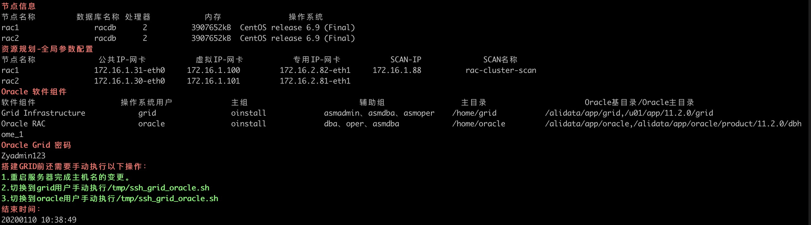

# VMWareCentos6.9自动化安装Oracle11.2.0.4.0Rac2Nodes.

<!-- MDTOC maxdepth:6 firsth1:1 numbering:0 flatten:0 bullets:1 updateOnSave:1 -->

- [VMWareCentos6.9自动化安装Oracle11.2.0.4.0Rac2Nodes.](#vmwarecentos69自动化安装oracle112040rac2nodes)   
- [运行步骤](#运行步骤)   
   - [根据服务器网卡地址规划资源，修改脚本set_resource_plan.sh](#根据服务器网卡地址规划资源，修改脚本set_resource_plansh)   
   - [安装集群前的环境配置](#安装集群前的环境配置)   
      - [RAC1上运行脚本 bash AutoInstallRac01PreEnv.sh 1](#rac1上运行脚本-bash-autoinstallrac01preenvsh-1)   
      - [RAC2上运行脚本 bash AutoInstallRac01PreEnv.sh 2](#rac2上运行脚本-bash-autoinstallrac01preenvsh-2)   
- [静默安装grid](#静默安装grid)   
   - [grid用户运行脚本AutoInstallRac02Grid.sh](#grid用户运行脚本autoinstallrac02gridsh)   
   - [rac1手动执行脚本](#rac1手动执行脚本)   
   - [rac2手动执行脚本](#rac2手动执行脚本)   
   - [grid用户继续运行脚本AutoInstallRac02Grid.sh](#grid用户继续运行脚本autoinstallrac02gridsh)   
- [静默安装oracle实例](#静默安装oracle实例)   
   - [oracle用户运行脚本AutoInstallRac03Oracle.sh](#oracle用户运行脚本autoinstallrac03oraclesh)   
   - [rac1手动执行脚本](#rac1手动执行脚本)   
   - [rac2手动执行脚本](#rac2手动执行脚本)   
- [静默创建数据库](#静默创建数据库)   
   - [oracle用户运行脚本](#oracle用户运行脚本)   
- [业务测试](#业务测试)   

<!-- /MDTOC -->

# 运行步骤

> 运行脚本前需要注意将网卡变更为静态ip模式后重启服务，并分配好iscsi要使用的磁盘

## 根据服务器网卡地址规划资源，修改脚本set_resource_plan.sh

修改变量，将脚本下发到rac1和rac2

```bash
ssh_port=22
grid_tmp=/home/grid/grid_tmp/ # grid 安装记录临时存放路径
grid_passwd=Zyadmin123 # grid 应答文件中SYSASMPassword 和 monitorPassword 的密码
database_name=rac # 数据库名称

node1_hostname=rac1 # 节点1 名称，主机名，实例名
node1_physic_ip=eth0:192.168.14.150 # 节点1 真实的物理网卡和地址
node1_public_ip=eth0:192.168.14.150 # 节点1 公共IP 网卡和地址
node1_public_vip=192.168.14.160 # 节点1 虚拟IP 网卡和地址
node1_private_ip=eth1:192.168.220.132 # 节点1 专用IP 网卡和地址
node1_domain_pub=(rac1 rac1.example.com) # 节点1 公共IP 域名
node1_domain_pub_v=(rac1-vip rac1-vip.example.com) # 节点1 虚拟IP 域名
node1_domain_pri=(rac1-priv rac1-priv.example.com) # 节点1 专用IP 域名


node2_hostname=rac2 # 节点2 名称，主机名，实例名
node2_physic_ip=eth1:192.168.14.151 # 节点2 真实的物理网卡和地址
node2_public_ip=eth1:192.168.14.151 # 节点2 公共IP 网卡和地址
node2_public_vip=192.168.14.161 # 节点2 虚拟IP 网卡和地址
node2_private_ip=eth2:192.168.220.133 # 节点2 专用IP 网卡和地址
node2_domain_pub=(rac2 rac2.example.com) # 节点2 公共IP 域名
node2_domain_pub_v=(rac2-vip rac2-vip.example.com) # 节点2 虚拟IP 域名
node2_domain_pri=(rac2-priv rac2-priv.example.com) # 节点2 专用IP 域名

scan_ip=192.168.14.180 # SCAN IP 地址
scan_name=rac-cluster-scan # SCAN名称

rac_dir=/alidata/ # rac和oracle安装最顶级目录
shared_storage=("/dev/sdb1" "/dev/sdb2") # 共享存储块设备
```

## 安装集群前的环境配置

注意：rac1和rac2的脚本运行顺序-rac2延迟5分钟执行

### RAC1上运行脚本 bash AutoInstallRac01PreEnv.sh 1

该脚本运行时间大概在15分钟

```bash
[root@rac1 oracle_11.2.0.4_rac_multi]# bash AutoInstallRac01PreEnv.sh 1
开始时间：
20200110 10:24:13
当前用户为 root
执行用户与要求一致
Oracle RAM COMMON 环境配置 开始
设置/etc/hosts文件
# Public Network - (eth0)
192.168.14.150 rac1 rac1.example.com
192.168.14.151 rac2 rac2.example.com

# Private Interconnect - (eth1)
192.168.220.132 rac1-priv rac1-priv.example.com
192.168.220.133 rac2-priv rac2-priv.example.com

# Public Virtual IP
192.168.14.160 rac1-vip rac1-vip.example.com
192.168.14.161 rac2-vip rac2-vip.example.com

# scanIP
192.168.14.180 rac-cluster-scan
配置/etc/sysctl.conf参数
kernel.shmmax = 4001435648
kernel.shmmni = 4096
kernel.shmall = 976913
kernel.sem = 250 32000 100 128
fs.file-max = 6815744
fs.aio-max-nr = 1048576
net.ipv4.ip_local_port_range = 9000 65500
net.core.rmem_default = 262144
net.core.rmem_max = 4194304
net.core.wmem_default = 262144
net.core.wmem_max = 1048586
配置/etc/security/limits.conf参数
配置/etc/pam.d/login参数
关闭iptables & selinux
配置 modprobe hangcheck-timer
配置/etc/profile文件
创建用户及组
更改用户 oracle 的密码 。
passwd： 所有的身份验证令牌已经成功更新。
更改用户 grid 的密码 。
passwd： 所有的身份验证令牌已经成功更新。
创建目录
配置NTP
Shutting down ntpd:                                        [  OK  ]
swap分区150M
记录了154000+0 的读入
记录了154000+0 的写出
157696000字节(158 MB)已复制，0.34404 秒，458 MB/秒
mkswap: /home/swap: warning: don't erase bootbits sectors
        on whole disk. Use -f to force.
Setting up swapspace version 1, size = 153996 KiB
no label, UUID=7d9280cc-5bf1-4174-b195-c270580d549f
依赖软件包安装和Oracle RAC软件下载 开始
依赖软件包安装
设置主机启动级别为5，即图形界面
Oracle RAC软件下载
Oracle 集群软件 开始下载解压
Oracle 集群软件 下载解压完成
Oracle 数据库软件 开始下载解压
Oracle 数据库软件 下载解压完成
Oracle 其他软件 开始下载解压
Oracle 其他软件 下载解压完成
添加软连接/lib64/libcap.so.1
安装依赖包pdksh 和 cvuqdisk
依赖软件包安装和Oracle RAC软件下载 结束
rac1环境配置 开始
修改主机名
设置oracle用户环境变量
设置grid用户环境变量
配置节点间的ssh信任
cat: /tmp/ssh_oracle.sh: 没有那个文件或目录
rac1环境配置 开始
配置存储target-测试使用
服务端（rac1)
Starting SCSI target daemon:                               [  OK  ]
Target 1: iqn.2020-001.com.iscsi:oracle
    System information:
        Driver: iscsi
        State: ready
    I_T nexus information:
    LUN information:
        LUN: 0
            Type: controller
            SCSI ID: IET     00010000
            SCSI SN: beaf10
            Size: 0 MB, Block size: 1
            Online: Yes
            Removable media: No
            Prevent removal: No
            Readonly: No
            Backing store type: null
            Backing store path: None
            Backing store flags:
        LUN: 1
            Type: disk
            SCSI ID: IET     00010001
            SCSI SN: beaf11
            Size: 21475 MB, Block size: 512
            Online: Yes
            Removable media: No
            Prevent removal: No
            Readonly: No
            Backing store type: rdwr
            Backing store path: /dev/sdb1
            Backing store flags:
        LUN: 2
            Type: disk
            SCSI ID: IET     00010002
            SCSI SN: beaf12
            Size: 21474 MB, Block size: 512
            Online: Yes
            Removable media: No
            Prevent removal: No
            Readonly: No
            Backing store type: rdwr
            Backing store path: /dev/sdb2
            Backing store flags:
    Account information:
    ACL information:
        ALL
配置存储客户端-测试使用(rac1)
节点信息
节点名称         数据库名称 处理器            内存               操作系统                              
rac1                 racdb      1          1906912kB  Red Hat Enterprise Linux Server release 6.7 (Santiago)                      
rac2                 racdb      1          1906912kB  Red Hat Enterprise Linux Server release 6.7 (Santiago)                      
资源规划-全局参数配置
节点名称              公共IP-网卡           虚拟IP-网卡           专用IP-网卡           SCAN-IP              SCAN名称           
rac1                 192.168.14.150-eth0  192.168.14.160       192.168.220.132-eth1 192.168.14.180       rac-cluster-scan     
rac2                 192.168.14.151-eth1  192.168.14.161       192.168.220.133-eth2                                           
Oracle 软件组件
软件组件                   操作系统用户             主组                         辅助组                 主目录                      Oracle基目录/Oracle主目录
Grid Infrastructure            grid                 oinstall             asmadmin、asmdba、asmoper    /home/grid           /alidata/app/grid,/u01/app/11.2.0/grid
Oracle RAC                     oracle               oinstall             dba、oper、asmdba            /home/oracle         /alidata/app/oracle,/alidata/app/oracle/product/11.2.0/dbhome_1
Oracle Grid 密码
Zyadmin123
搭建GRID前还需要手动执行以下操作：
1.重启服务器完成主机名的变更。
2.切换到grid用户手动执行/tmp/ssh_grid_oracle.sh
3.切换到oracle用户手动执行/tmp/ssh_grid_oracle.sh
结束时间：
20200110 10:38:49
```



当看到结束时间时，代表已脚本已跑完毕，务必检查所有的返回结果，尤其是isscsi的存储服务情况。

按照提示执行，1可以不执行了已提前运行；直接跑2，3。

```bash
[oracle@rac1 ~]$ bash /tmp/ssh_grid_oracle.sh
[grid@rac1 ~]$ bash /tmp/ssh_grid_oracle.sh
```

### RAC2上运行脚本 bash AutoInstallRac01PreEnv.sh 2

```bash
[root@rac2 oracle_11.2.0.4_rac_multi]# bash AutoInstallRac01PreEnv.sh 2
开始时间：
20200110 10:27:08
当前用户为 root
执行用户与要求一致
Oracle RAM COMMON 环境配置 开始
设置/etc/hosts文件
# Public Network - (eth0)
192.168.14.150 rac1 rac1.example.com
192.168.14.151 rac2 rac2.example.com

# Private Interconnect - (eth1)
192.168.220.132 rac1-priv rac1-priv.example.com
192.168.220.133 rac2-priv rac2-priv.example.com

# Public Virtual IP
192.168.14.160 rac1-vip rac1-vip.example.com
192.168.14.161 rac2-vip rac2-vip.example.com

# scanIP
192.168.14.180 rac-cluster-scan
配置/etc/sysctl.conf参数
kernel.shmmax = 4001435648
kernel.shmmni = 4096
kernel.shmall = 976913
kernel.sem = 250 32000 100 128
fs.file-max = 6815744
fs.aio-max-nr = 1048576
net.ipv4.ip_local_port_range = 9000 65500
net.core.rmem_default = 262144
net.core.rmem_max = 4194304
net.core.wmem_default = 262144
net.core.wmem_max = 1048586
配置/etc/security/limits.conf参数
配置/etc/pam.d/login参数
关闭iptables & selinux
配置 modprobe hangcheck-timer
配置/etc/profile文件
创建用户及组
更改用户 oracle 的密码 。
passwd： 所有的身份验证令牌已经成功更新。
更改用户 grid 的密码 。
passwd： 所有的身份验证令牌已经成功更新。
创建目录
配置NTP
Shutting down ntpd:                                        [  OK  ]
swap分区150M
记录了154000+0 的读入
记录了154000+0 的写出
157696000字节(158 MB)已复制，0.342839 秒，460 MB/秒
mkswap: /home/swap: warning: don't erase bootbits sectors
        on whole disk. Use -f to force.
Setting up swapspace version 1, size = 153996 KiB
no label, UUID=29cdf3ff-cdd3-4fff-bb00-b6660aab27d4
依赖软件包安装和Oracle RAC软件下载 开始
依赖软件包安装
设置主机启动级别为5，即图形界面
Oracle RAC软件下载
Oracle 集群软件 开始下载解压
Oracle 集群软件 下载解压完成
Oracle 数据库软件 开始下载解压
Oracle 数据库软件 下载解压完成
Oracle 其他软件 开始下载解压
Oracle 其他软件 下载解压完成
添加软连接/lib64/libcap.so.1
安装依赖包pdksh 和 cvuqdisk
依赖软件包安装和Oracle RAC软件下载 结束
rac2环境配置 开始
修改主机名
设置oracle用户环境变量
设置grid用户环境变量
配置节点间的ssh信任
rac2环境配置 结束
配置存储客户端-测试使用(rac2)
正在启动 iscsid：                                          [确定]
正在启动 udev：                                            [确定]
节点信息
节点名称         数据库名称 处理器            内存               操作系统                              
rac1                 racdb      1          1906912kB  Red Hat Enterprise Linux Server release 6.7 (Santiago)                      
rac2                 racdb      1          1906912kB  Red Hat Enterprise Linux Server release 6.7 (Santiago)                      
资源规划-全局参数配置
节点名称              公共IP-网卡           虚拟IP-网卡           专用IP-网卡           SCAN-IP              SCAN名称           
rac1                 192.168.14.150-eth0  192.168.14.160       192.168.220.132-eth1 192.168.14.180       rac-cluster-scan     
rac2                 192.168.14.151-eth1  192.168.14.161       192.168.220.133-eth2                                           
Oracle 软件组件
软件组件                   操作系统用户             主组                         辅助组                 主目录                      Oracle基目录/Oracle主目录
Grid Infrastructure            grid                 oinstall             asmadmin、asmdba、asmoper    /home/grid           /alidata/app/grid,/u01/app/11.2.0/grid
Oracle RAC                     oracle               oinstall             dba、oper、asmdba            /home/oracle         /alidata/app/oracle,/alidata/app/oracle/product/11.2.0/dbhome_1
Oracle Grid 密码
Zyadmin123
搭建GRID前还需要手动执行以下操作：
1.重启服务器完成主机名的变更。
2.切换到grid用户手动执行/tmp/ssh_grid_oracle.sh
3.切换到oracle用户手动执行/tmp/ssh_grid_oracle.sh
结束时间：
20200110 10:50:02
```


按照提示执行，1可以不执行了已提前运行；直接跑2，3。

```bash
[oracle@rac2 ~]$ bash /tmp/ssh_grid_oracle.sh
[grid@rac2 ~]$ bash /tmp/ssh_grid_oracle.sh
```

# 静默安装grid

## grid用户运行脚本AutoInstallRac02Grid.sh

拷贝脚本 set_resource_plan.sh 和 AutoInstallRac02Grid.sh 到 grid家目录下。

```bash
[grid@rac1 ~]$ bash AutoInstallRac02Grid.sh
开始时间：
20200111 23:13:27
当前用户为 grid
执行用户与要求一致
静默安装grid应答文件准备 开始
静默安装grid应答文件准备 结束
grid静默安装 开始
Starting Oracle Universal Installer...

Checking Temp space: must be greater than 120 MB.   Actual 22914 MB    Passed
Checking swap space: must be greater than 150 MB.   Actual 4150 MB    Passed
Preparing to launch Oracle Universal Installer from /tmp/OraInstall2020-01-11_11-13-27PM. Please wait ...grid静默安装 安装中
请查看日志，确认是否安装成功
You can find the log of this install session at:
 /alidata//grid/app/oraInventory/logs/installActions2020-01-11_11-13-27PM.log

Prepare in progress.
..................................................   9% Done.

Prepare successful.

Copy files in progress.
..................................................   15% Done.
..................................................   20% Done.
..................................................   25% Done.
..................................................   30% Done.
..................................................   35% Done.
..................................................   40% Done.
..................................................   45% Done.
........................................
Copy files successful.

Link binaries in progress.

Link binaries successful.
..................................................   62% Done.

Setup files in progress.

Setup files successful.
..................................................   76% Done.

Perform remote operations in progress.
..................................................   89% Done.

Perform remote operations successful.
The installation of Oracle Grid Infrastructure 11g was successful.
Please check '/alidata//grid/app/oraInventory/logs/silentInstall2020-01-11_11-13-27PM.log' for more details.
..................................................   94% Done.

Execute Root Scripts in progress.

As a root user, execute the following script(s):
	1. /alidata//grid/app/oraInventory/orainstRoot.sh
	2. /alidata/grid/app/11.2.0/grid/root.sh

Execute /alidata//grid/app/oraInventory/orainstRoot.sh on the following nodes:
[rac1, rac2]
Execute /alidata/grid/app/11.2.0/grid/root.sh on the following nodes:
[rac1, rac2]

..................................................   100% Done.

Execute Root Scripts successful.
As install user, execute the following script to complete the configuration.
	1. /alidata/grid/app/11.2.0/grid/cfgtoollogs/configToolAllCommands RESPONSE_FILE=<response_file>

 	Note:
	1. This script must be run on the same host from where installer was run.
	2. This script needs a small password properties file for configuration assistants that require passwords (refer to install guide documentation).


Successfully Setup Software.
```

按回车，让自动化脚本继续

```bash
成功输入1 失败输入0：
1
请打开新的终端执行脚本，执行完成后按回车继续
```

## rac1手动执行脚本

 ```bash
[root@rac1 ~]# bash /alidata/grid/app/oraInventory/orainstRoot.sh
Changing permissions of /alidata//grid/app/oraInventory.
Adding read,write permissions for group.
Removing read,write,execute permissions for world.

Changing groupname of /alidata//grid/app/oraInventory to oinstall.
The execution of the script is complete.
[root@rac1 ~]# bash /alidata/grid/app/11.2.0/grid/root.sh
Check /alidata/grid/app/11.2.0/grid/install/root_rac1_2020-01-11_22-00-10.log for the output of root script
[root@rac1 ~]# tailf /alidata/grid/app/11.2.0/grid/install/root_rac1_2020-01-11_22-00-10.log
Operation successful.
CRS-4256: Updating the profile
Successful addition of voting disk 9806babb40aa4f7dbff7e7e11953d3ec.
Successfully replaced voting disk group with +OCR.
CRS-4256: Updating the profile
CRS-4266: Voting file(s) successfully replaced
##  STATE    File Universal Id                File Name Disk group
--  -----    -----------------                --------- ---------
 1. ONLINE   9806babb40aa4f7dbff7e7e11953d3ec (/dev/raw/raw1) [OCR]
Located 1 voting disk(s).
CRS-2672: Attempting to start 'ora.asm' on 'rac1'
CRS-2676: Start of 'ora.asm' on 'rac1' succeeded
CRS-2672: Attempting to start 'ora.OCR.dg' on 'rac1'
CRS-2676: Start of 'ora.OCR.dg' on 'rac1' succeeded
Configure Oracle Grid Infrastructure for a Cluster ... succeeded
```

## rac2手动执行脚本

```bash
[root@rac2 ~]# bash /alidata//grid/app/oraInventory/orainstRoot.sh
Changing permissions of /alidata//grid/app/oraInventory.
Adding read,write permissions for group.
Removing read,write,execute permissions for world.

Changing groupname of /alidata//grid/app/oraInventory to oinstall.
The execution of the script is complete.
[root@rac2 ~]# bash /alidata/grid/app/11.2.0/grid/root.sh
Check /alidata/grid/app/11.2.0/grid/install/root_rac2_2020-01-11_22-09-23.log for the output of root script

[root@rac2 ~]# tailf /alidata/grid/app/11.2.0/grid/install/root_rac2_2020-01-11_22-09-23.log
Creating /etc/oratab file...
Entries will be added to the /etc/oratab file as needed by
Database Configuration Assistant when a database is created
Finished running generic part of root script.
Now product-specific root actions will be performed.
Using configuration parameter file: /alidata/grid/app/11.2.0/grid/crs/install/crsconfig_params
Creating trace directory
User ignored Prerequisites during installation
Installing Trace File Analyzer
OLR initialization - successful
Adding Clusterware entries to upstart
CRS-4402: The CSS daemon was started in exclusive mode but found an active CSS daemon on node rac1, number 1, and is terminating
An active cluster was found during exclusive startup, restarting to join the cluster
Configure Oracle Grid Infrastructure for a Cluster ... succeeded
```

## grid用户继续运行脚本AutoInstallRac02Grid.sh

按回车后

```bash
开始检查集群，按回车

grid集群检查 开始
**************************************************************
rac1:
CRS-4537: Cluster Ready Services is online
CRS-4529: Cluster Synchronization Services is online
CRS-4533: Event Manager is online
**************************************************************
rac2:
CRS-4537: Cluster Ready Services is online
CRS-4529: Cluster Synchronization Services is online
CRS-4533: Event Manager is online
**************************************************************
Name           Type           Target    State     Host        
------------------------------------------------------------
ora....N1.lsnr ora....er.type ONLINE    ONLINE    rac1        
ora.OCR.dg     ora....up.type ONLINE    ONLINE    rac1        
ora.asm        ora.asm.type   ONLINE    ONLINE    rac1        
ora.cvu        ora.cvu.type   ONLINE    ONLINE    rac1        
ora.gsd        ora.gsd.type   OFFLINE   OFFLINE               
ora....network ora....rk.type ONLINE    ONLINE    rac1        
ora.oc4j       ora.oc4j.type  ONLINE    ONLINE    rac1        
ora.ons        ora.ons.type   ONLINE    ONLINE    rac1        
ora....SM1.asm application    ONLINE    ONLINE    rac1        
ora.rac1.gsd   application    OFFLINE   OFFLINE               
ora.rac1.ons   application    ONLINE    ONLINE    rac1        
ora.rac1.vip   ora....t1.type ONLINE    ONLINE    rac1        
ora....SM2.asm application    ONLINE    ONLINE    rac2        
ora.rac2.gsd   application    OFFLINE   OFFLINE               
ora.rac2.ons   application    ONLINE    ONLINE    rac2        
ora.rac2.vip   ora....t1.type ONLINE    ONLINE    rac2        
ora....ry.acfs ora....fs.type ONLINE    ONLINE    rac1        
ora.scan1.vip  ora....ip.type ONLINE    ONLINE    rac1        
防止监听没有成功启动,可在两个节点执行以下命令保证监听都启动。
srvctl add listener
srvctl start listener
grid集群检查 结束
静默安装asm实例 开始

Diskgroup created.

   INST_ID NAME 			  STATE
---------- ------------------------------ -----------
	 1 OCR				  MOUNTED
	 1 DATA 			  MOUNTED
	 2 OCR				  MOUNTED
	 2 DATA 			  DISMOUNTED

orapw+ASM                                                                                                                                                    100% 2048     2.0KB/s   00:00    

User created.


Grant succeeded.


   INST_ID USERNAME			  SYSDB SYSOP SYSAS
---------- ------------------------------ ----- ----- -----
	 1 SYS				  TRUE	TRUE  FALSE
	 1 ASMSNMP			  TRUE	FALSE FALSE
	 2 SYS				  TRUE	TRUE  FALSE
	 2 ASMSNMP			  TRUE	FALSE FALSE

静默安装asm实例 结束
结束时间：
20200111 23:33:47
```

* 开始：23:13:27
* 结束：23:33:47

grid + asm 大概21分钟

# 静默安装oracle实例

## oracle用户运行脚本AutoInstallRac03Oracle.sh

```bash
[oracle@rac1 ~]$ bash AutoInstallRac03Oracle.sh
开始时间：
20200112 11:50:02
当前用户为 oracle
执行用户与要求一致
静默安装oracle应答文件准备 开始
静默安装oracle应答文件准备 结束
oracle实例静默安装 开始
Starting Oracle Universal Installer...

Checking Temp space: must be greater than 120 MB.   Actual 19212 MB    Passed
Checking swap space: must be greater than 150 MB.   Actual 3999 MB    Passed
Preparing to launch Oracle Universal Installer from /tmp/OraInstall2020-01-12_11-50-02AM. Please wait ...oracle实例静默安装 安装中
You can find the log of this install session at:
 /alidata//grid/app/oraInventory/logs/installActions2020-01-12_11-50-02AM.log
The installation of Oracle Database 11g was successful.
Please check '/alidata//grid/app/oraInventory/logs/silentInstall2020-01-12_11-50-02AM.log' for more details.

As a root user, execute the following script(s):
	1. /alidata/oracle/product/11.2.0/dbhome_1/root.sh

Execute /alidata/oracle/product/11.2.0/dbhome_1/root.sh on the following nodes:
[rac1, rac2]

Successfully Setup Software.
```

继续回车

```bash
请查看日志，确认是否安装成功

成功输入1 失败输入0：
1
请打开新的终端执行脚本，执行完成后按回车继续
```


## rac1手动执行脚本

```bash
[root@rac1 ~]# bash /alidata/oracle/product/11.2.0/dbhome_1/root.sh
Check /alidata/oracle/product/11.2.0/dbhome_1/install/root_rac1_2020-01-12_12-00-39.log for the output of root script
[root@rac1 ~]# tailf /alidata/oracle/product/11.2.0/dbhome_1/install/root_rac1_2020-01-12_12-00-39.log
   Copying dbhome to /usr/local/bin ...
   Copying oraenv to /usr/local/bin ...
   Copying coraenv to /usr/local/bin ...

Entries will be added to the /etc/oratab file as needed by
Database Configuration Assistant when a database is created
Finished running generic part of root script.
Now product-specific root actions will be performed.
Finished product-specific root actions.
Finished product-specific root actions.
```

## rac2手动执行脚本

```bash
[root@rac2 ~]# bash /alidata/oracle/product/11.2.0/dbhome_1/root.sh
Check /alidata/oracle/product/11.2.0/dbhome_1/install/root_rac2_2020-01-12_12-04-00.log for the output of root script
[root@rac2 ~]# tailf /alidata/oracle/product/11.2.0/dbhome_1/install/root_rac2_2020-01-12_12-04-00.log
   Copying dbhome to /usr/local/bin ...
   Copying oraenv to /usr/local/bin ...
   Copying coraenv to /usr/local/bin ...

Entries will be added to the /etc/oratab file as needed by
Database Configuration Assistant when a database is created
Finished running generic part of root script.
Now product-specific root actions will be performed.
Finished product-specific root actions.
Finished product-specific root actions.

## 安装结束

两个节点运行完成后按回车。

```bash
结束时间：
20200112 12:06:31
```
创建数据库实例耗时在10分钟。

# 静默创建数据库

## oracle用户运行脚本


# 业务测试
