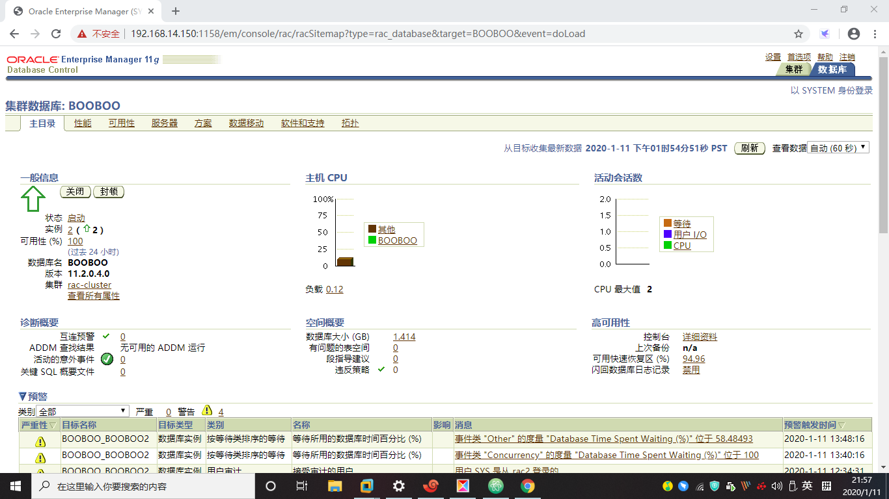
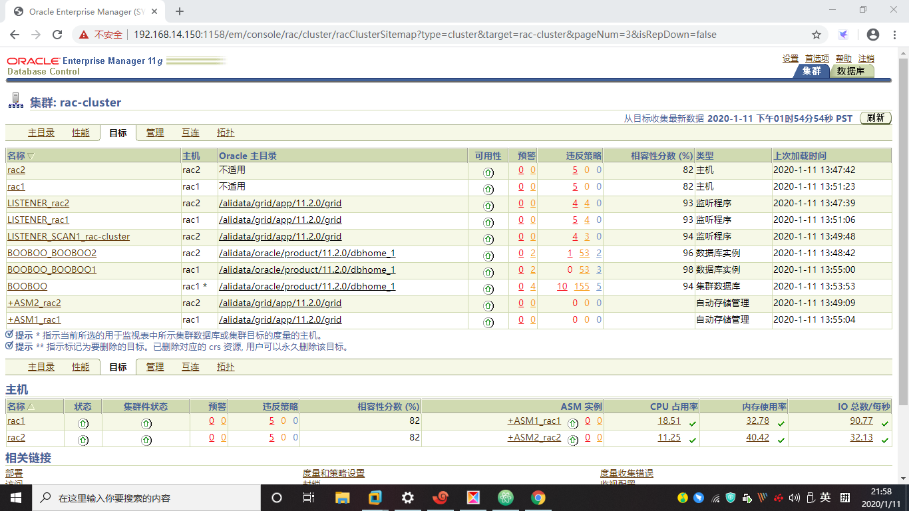

# 安装记录和问题处理

> 2020.01.11 BoobooWei

<!-- MDTOC maxdepth:6 firsth1:1 numbering:0 flatten:0 bullets:1 updateOnSave:1 -->

- [安装记录和问题处理](#安装记录和问题处理)   
   - [步骤概览](#步骤概览)   
      - [/etc/hosts的配置](#etchosts的配置)   
      - [RAC规划信息](#rac规划信息)   
   - [问题和解决](#问题和解决)   
      - [问题1:安装oracle软件时，无法识别节点](#问题1安装oracle软件时，无法识别节点)   
      - [问题2：dbca建库的过程中监听问题](#问题2：dbca建库的过程中监听问题)   
      - [问题3：创建数据库时提示不能验证ASMSNMP密码问题的解决(ORA-01017)](#问题3：创建数据库时提示不能验证asmsnmp密码问题的解决ora-01017)   
   - [集群和数据库实例检查](#集群和数据库实例检查)   
   - [查看数据库实例](#查看数据库实例)   
   - [em地址](#em地址)   

<!-- /MDTOC -->
## 步骤概览

1. 安装前的环境部署（脚本）
2. grid安装
3. asmca
4. oracle安装
5. dbca
6. 检查

### /etc/hosts的配置

```bash
# Public Network - (eth0)
192.168.14.150 rac1 rac1.example.com
192.168.14.151 rac2 rac2.example.com

# Private Interconnect - (eth1)
192.168.220.132 rac1-priv rac1-priv.example.com
192.168.220.133 rac2-priv rac2-priv.example.com

# Public Virtual IP
192.168.14.160 rac1-vip rac1-vip.example.com
192.168.14.161 rac2-vip rac2-vip.example.com

# scanIP
192.168.14.180 rac-cluster-scan
```

### RAC规划信息

```
节点信息
节点名称         数据库名称 处理器            内存               操作系统                              
rac1                 racdb      1          1906912kB  Red Hat Enterprise Linux Server release 6.7 (Santiago)                      
rac2                 racdb      1          1906912kB  Red Hat Enterprise Linux Server release 6.7 (Santiago)                      
资源规划-全局参数配置
节点名称              公共IP-网卡           虚拟IP-网卡           专用IP-网卡           SCAN-IP              SCAN名称           
rac1                 192.168.14.150-eth0  192.168.14.160       192.168.220.132-eth1 192.168.14.180       rac-cluster-scan     
rac2                 192.168.14.151-eth1  192.168.14.161       192.168.220.133-eth2                                           
Oracle 软件组件
软件组件                   操作系统用户             主组                         辅助组                 主目录                      Oracle基目录/Oracle主目录
Grid Infrastructure            grid                 oinstall             asmadmin、asmdba、asmoper    /home/grid           /alidata/app/grid,/u01/app/11.2.0/grid
Oracle RAC                     oracle               oinstall             dba、oper、asmdba            /home/oracle         /alidata/app/oracle,/alidata/app/oracle/product/11.2.0/dbhome_1
Oracle Grid 密码
Zyadmin123
```


## 问题和解决

### 问题1:安装oracle软件时，无法识别节点

解决方法：在文件中添加配置CRS="true"

```xml
vim /alidata/grid/app/oraInventory/ContentsXML/inventory.xml
cat: vim: No such file or directory
<?xml version="1.0" standalone="yes" ?>
<!-- Copyright (c) 1999, 2013, Oracle and/or its affiliates.
All rights reserved. -->
<!-- Do not modify the contents of this file by hand. -->
<INVENTORY>
<VERSION_INFO>
   <SAVED_WITH>11.2.0.4.0</SAVED_WITH>
   <MINIMUM_VER>2.1.0.6.0</MINIMUM_VER>
</VERSION_INFO>
<HOME_LIST>
<HOME NAME="Ora11g_gridinfrahome1" LOC="/alidata/grid/app/11.2.0/grid" TYPE="O" IDX="1" CRS="true">
   <NODE_LIST>
      <NODE NAME="rac1"/>
      <NODE NAME="rac2"/>
   </NODE_LIST>
</HOME>
<HOME NAME="OraDb11g_home1" LOC="/alidata/oracle/product/11.2.0/dbhome_1" TYPE="O" IDX="2">
   <NODE_LIST>
      <NODE NAME="rac1"/>
      <NODE NAME="rac2"/>
   </NODE_LIST>
</HOME>
</HOME_LIST>
<COMPOSITEHOME_LIST>
</COMPOSITEHOME_LIST>
</INVENTORY>
```

### 问题2：dbca建库的过程中监听问题

在安装oracle 11gR2 rac时，使用dbca建库的过程中提示需要创建监听，报错明细：
Default Listener "LISTENER" is not configured in Grid Infrantructure home.Use NetCA to configure Default Listener and return DBCA

解决方法：grid用户在没有监听的节点执行

```bash
srvctl add listener
srvctl start listener
```

解决明细：

因为oracle 11g rac在安装过程中会自动创建监听，无需手动创建，首先使用grid用户登录查看监听状态：

```bash
[grid@rac1 ~]$ crs_stat -t
Name           Type           Target    State     Host        
------------------------------------------------------------
ora.DATA.dg    ora....up.type ONLINE    ONLINE    rac1        
ora....N1.lsnr ora....er.type ONLINE    ONLINE    rac2        
ora.OCR.dg     ora....up.type ONLINE    ONLINE    rac1        
ora.asm        ora.asm.type   ONLINE    ONLINE    rac1        
ora.cvu        ora.cvu.type   ONLINE    ONLINE    rac2        
ora.gsd        ora.gsd.type   OFFLINE   OFFLINE               
ora....network ora....rk.type ONLINE    ONLINE    rac1        
ora.oc4j       ora.oc4j.type  ONLINE    ONLINE    rac2        
ora.ons        ora.ons.type   ONLINE    ONLINE    rac1        
ora....SM1.asm application    ONLINE    ONLINE    rac1        
ora.rac1.gsd   application    OFFLINE   OFFLINE               
ora.rac1.ons   application    ONLINE    ONLINE    rac1        
ora.rac1.vip   ora....t1.type ONLINE    ONLINE    rac1        
ora....SM2.asm application    ONLINE    ONLINE    rac2        
ora.rac2.gsd   application    OFFLINE   OFFLINE               
ora.rac2.ons   application    ONLINE    ONLINE    rac2        
ora.rac2.vip   ora....t1.type ONLINE    ONLINE    rac2        
ora....ry.acfs ora....fs.type ONLINE    ONLINE    rac1        
ora.scan1.vip  ora....ip.type ONLINE    ONLINE    rac2
```

rac1无监听，rac2有监听

```bash
[root@rac1 ~]# ps -ef|grep tns
root         13      2  0 07:45 ?        00:00:00 [netns]

[root@rac2 ~]# ps -ef|grep tns
root         13      2  0 04:29 ?        00:00:00 [netns]
grid      85795      1  0 07:49 ?        00:00:00 /alidata/grid/app/11.2.0/grid/bin/tnslsnr LISTENER_SCAN1 -inherit
```

rac1手动添加监听资源：
```bash
[grid@rac1 ~]$ srvctl status listener
PRCN-2044 : No listener exists
[grid@rac1 ~]$ srvctl add listener
[grid@rac1 ~]$ srvctl status listener
Listener LISTENER is enabled
Listener LISTENER is not running
[grid@rac1 ~]$ srvctl start listener
[grid@rac1 ~]$ srvctl status listener
Listener LISTENER is enabled
Listener LISTENER is running on node(s): rac2,rac1
```

再次查看
```bash
[grid@rac1 ~]$ crs_stat -t
Name           Type           Target    State     Host        
------------------------------------------------------------
ora.DATA.dg    ora....up.type ONLINE    ONLINE    rac1        
ora....ER.lsnr ora....er.type ONLINE    ONLINE    rac1        
ora....N1.lsnr ora....er.type ONLINE    ONLINE    rac2        
ora.OCR.dg     ora....up.type ONLINE    ONLINE    rac1        
ora.asm        ora.asm.type   ONLINE    ONLINE    rac1        
ora.cvu        ora.cvu.type   ONLINE    ONLINE    rac2        
ora.gsd        ora.gsd.type   OFFLINE   OFFLINE               
ora....network ora....rk.type ONLINE    ONLINE    rac1        
ora.oc4j       ora.oc4j.type  ONLINE    ONLINE    rac2        
ora.ons        ora.ons.type   ONLINE    ONLINE    rac1        
ora....SM1.asm application    ONLINE    ONLINE    rac1        
ora....C1.lsnr application    ONLINE    ONLINE    rac1        
ora.rac1.gsd   application    OFFLINE   OFFLINE               
ora.rac1.ons   application    ONLINE    ONLINE    rac1        
ora.rac1.vip   ora....t1.type ONLINE    ONLINE    rac1        
ora....SM2.asm application    ONLINE    ONLINE    rac2        
ora....C2.lsnr application    ONLINE    ONLINE    rac2        
ora.rac2.gsd   application    OFFLINE   OFFLINE               
ora.rac2.ons   application    ONLINE    ONLINE    rac2        
ora.rac2.vip   ora....t1.type ONLINE    ONLINE    rac2        
ora....ry.acfs ora....fs.type ONLINE    ONLINE    rac1        
ora.scan1.vip  ora....ip.type ONLINE    ONLINE    rac2
```

### 问题3：创建数据库时提示不能验证ASMSNMP密码问题的解决(ORA-01017)

解决方法：

```bash
cd /alidata/grid/app/11.2.0/grid/dbs
orapwd file='orapw+ASM' entries=5 password=Zyadmin123 force=y
scp /alidata/grid/app/11.2.0/grid/dbs/orapw+ASM rac2:/alidata/grid/app/11.2.0/grid/dbs/orapw+ASM
sqlplus / as sysasm
SQL> create user asmsnmp identified by Zyadmin123;
SQL> grant sysdba to asmsnmp;
SQL> select * from v$pwfile_users;
```


1. 在各个节点的$ORACLE_HOME/dbs下删除orapw+ASM.ba口令文件

```bash
[grid@rac1 ~]$ cd /alidata/grid/app/11.2.0/grid/dbs
[grid@rac1 dbs]$ ll
total 12
-rw-rw----  1 grid oinstall 1143 Jan 11 07:49 ab_+ASM1.dat
-rw-rw----. 1 grid oinstall 1544 Jan 11 07:49 hc_+ASM1.dat
-rw-r--r--. 1 grid oinstall 2851 May 15  2009 init.ora

[grid@rac1 dbs]$ orapwd file='orapw+ASM' entries=5 password=Zyadmin123
[grid@rac1 dbs]$ ll
total 16
-rw-rw----  1 grid oinstall 1143 Jan 11 07:49 ab_+ASM1.dat
-rw-rw----. 1 grid oinstall 1544 Jan 11 07:49 hc_+ASM1.dat
-rw-r--r--. 1 grid oinstall 2851 May 15  2009 init.ora
-rw-r-----  1 grid oinstall 1536 Jan 11 11:54 orapw+ASM
```

2. 拷贝生成的口令到各个节点的当前实例中
```bash
[grid@rac1 dbs]$ scp /alidata/grid/app/11.2.0/grid/dbs/orapw+ASM rac2:/alidata/grid/app/11.2.0/grid/dbs/orapw+ASM
orapw+ASM
```

3. 增加asmsnmp用户到asm实例中并授予sysdba的权限
```bash
[grid@rac1 dbs]$ sqlplus / as sysasm

SQL*Plus: Release 11.2.0.4.0 Production on Sat Jan 11 12:01:42 2020

Copyright (c) 1982, 2013, Oracle.  All rights reserved.


Connected to:
Oracle Database 11g Enterprise Edition Release 11.2.0.4.0 - 64bit Production
With the Real Application Clusters and Automatic Storage Management options

SQL> create user asmsnmp identified by Zyadmin123;

User created.

SQL> grant dba to asmsnmp;
grant dba to asmsnmp
      *
ERROR at line 1:
ORA-00990: missing or invalid privilege


SQL> grant sysdba to asmsnmp;

Grant succeeded.

SQL> select * from v$pwfile_users;

USERNAME		       SYSDB SYSOP SYSAS
------------------------------ ----- ----- -----
SYS			       TRUE  TRUE  FALSE
ASMSNMP 		       TRUE  FALSE FALSE
```

## 集群和数据库实例检查

1. 检查集群情况 `crsctl check cluster`
2. 检查数据库状态 `srvctl status database -d <dbname>`
3. 节点应用程序状态 `srvctl status nodeapps`
4. 列出所有的配置数据库 `srvctl config database`
5. 数据库配置`config database -d <dbname> -a`
6. ASM状态以及ASM配置 `srvctl status asm`
7. TNS监听器状态以及配置 `srvctl status listener;srvctl config listener -a`
8. SCAN状态以及配置 `srvctl status scan;srvctl config scan`
9. VIP各个节点的状态以及配置 `srvctl status vip -n rac1;srvctl config vip -n rac1;srvctl status vip -n rac2;srvctl config vip -n rac2`
10. 节点应用程序配置（VIP、GSD、ONS、监听器）`srvctl config nodeapps -a -g -s -l`


```bash
[grid@rac1 ~]$ crsctl check cluster
CRS-4537: Cluster Ready Services is online
CRS-4529: Cluster Synchronization Services is online
CRS-4533: Event Manager is online

[grid@rac1 ~]$ srvctl status database -d booboo
Instance BOOBOO1 is running on node rac1
Instance BOOBOO2 is running on node rac2

[grid@rac1 ~]$ srvctl status nodeapps
VIP rac1-vip is enabled
VIP rac1-vip is running on node: rac1
VIP rac2-vip is enabled
VIP rac2-vip is running on node: rac2
Network is enabled
Network is running on node: rac1
Network is running on node: rac2
GSD is disabled
GSD is not running on node: rac1
GSD is not running on node: rac2
ONS is enabled
ONS daemon is running on node: rac1
ONS daemon is running on node: rac2

[grid@rac1 ~]$ srvctl config database
BOOBOO

[grid@rac1 ~]$ srvctl config database -d booboo -a
Database unique name: BOOBOO
Database name: BOOBOO
Oracle home: /alidata/oracle/product/11.2.0/dbhome_1
Oracle user: oracle
Spfile: +DATA/BOOBOO/spfileBOOBOO.ora
Domain:
Start options: open
Stop options: immediate
Database role: PRIMARY
Management policy: AUTOMATIC
Server pools: BOOBOO
Database instances: BOOBOO1,BOOBOO2
Disk Groups: DATA
Mount point paths:
Services:
Type: RAC
Database is enabled
Database is administrator managed


[grid@rac1 ~]$ srvctl status asm
ASM is running on rac2,rac1

[grid@rac1 ~]$ srvctl status listener
Listener LISTENER is enabled
Listener LISTENER is running on node(s): rac2,rac1
[grid@rac1 ~]$ srvctl config listener -a
Name: LISTENER
Network: 1, Owner: grid
Home: <CRS home>
  /alidata/grid/app/11.2.0/grid on node(s) rac1,rac2
End points: TCP:1521

[grid@rac1 ~]$  srvctl status vip -n rac1;srvctl config vip -n rac1
VIP rac1-vip is enabled
VIP rac1-vip is running on node: rac1
VIP exists: /rac1-vip/192.168.14.160/192.168.14.0/255.255.255.0/, hosting node rac1
[grid@rac1 ~]$  srvctl status vip -n rac2;srvctl config vip -n rac2
VIP rac2-vip is enabled
VIP rac2-vip is running on node: rac2
VIP exists: /rac2-vip/192.168.14.161/192.168.14.0/255.255.255.0/, hosting node rac2

srvctl config nodeapps -a -g -s -l
Warning:-l option has been deprecated and will be ignored.
Network exists: 1/192.168.14.0/255.255.255.0/, type static
VIP exists: /rac1-vip/192.168.14.160/192.168.14.0/255.255.255.0/, hosting node rac1
VIP exists: /rac2-vip/192.168.14.161/192.168.14.0/255.255.255.0/, hosting node rac2
GSD exists
ONS exists: Local port 6100, remote port 6200, EM port 2016
Name: LISTENER
Network: 1, Owner: grid
Home: <CRS home>
  /alidata/grid/app/11.2.0/grid on node(s) rac1,rac2
End points: TCP:1521

```

## 查看数据库实例

```sql
SQL> select * from v$instance;

INSTANCE_NUMBER INSTANCE_NAME	HOST_NAME	     VERSION	       STARTUP_TIME	    STATUS     PAR    THREAD# ARCHIVE LOG_SWITCH_WAIT LOGINS	 SHU DATABASE_STATUS	  INSTANCE_ROLE      ACTIVE_ST BLO
--------------- --------------- -------------------- ----------------- -------------------- ---------- --- ---------- ------- --------------- ---------- --- -------------------- ------------------ --------- ---
	      1 BOOBOO1 	rac1		     11.2.0.4.0        11-JAN-20	    OPEN       YES	    1 STARTED		      ALLOWED	 NO  ACTIVE     PRIMARY_INSTANCE   NORMAL    NO

SQL> archive log list;
Database log mode	       Archive Mode
Automatic archival	       Enabled
Archive destination	       +DATA/booboo/archivelog
Oldest online log sequence     4
Next log sequence to archive   5
Current log sequence	       5
SQL> show parameter log_archive_dest_1;

NAME				     TYPE	 VALUE
------------------------------------ ----------- ------------------------------
log_archive_dest_1		     string	 LOCATION=+DATA/BOOBOO/ARCHIVEL
						 OG
log_archive_dest_10		     string
log_archive_dest_11		     string
log_archive_dest_12		     string
log_archive_dest_13		     string
log_archive_dest_14		     string
log_archive_dest_15		     string
log_archive_dest_16		     string
log_archive_dest_17		     string
log_archive_dest_18		     string

NAME				     TYPE	 VALUE
------------------------------------ ----------- ------------------------------
log_archive_dest_19		     string
SQL> select name from v$datafile;

NAME
----------------------------------------------------------------------
+DATA/booboo/datafile/system.256.1029413625
+DATA/booboo/datafile/sysaux.257.1029413625
+DATA/booboo/datafile/undotbs1.258.1029413625
+DATA/booboo/datafile/users.259.1029413627
+DATA/booboo/datafile/undotbs2.267.1029413773

SQL> select name from v$controlfile;

NAME
----------------------------------------------------------------------
+DATA/booboo/controlfile/current.261.1029413709
+DATA/booboo/controlfile/current.260.1029413709

SQL> desc redologs;
ERROR:
ORA-04043: object redologs does not exist


select a.tablespace_name "tablespace_name",round(total/1024/1024)
"total(MB)",round(free/1024/1024) "free(MB)",
round((total-free)/total,4)*100 "use%"
from (select tablespace_name,sum(bytes) free from dba_free_space group by
tablespace_name) a,
(select tablespace_name,sum(bytes) total from dba_data_files group by
tablespace_name) b
where a.tablespace_name=b.tablespace_name;

tablespace_name 		total(MB)   free(MB)	   use%
------------------------------ ---------- ---------- ----------
SYSAUX				      550	  34	  93.89
UNDOTBS1			       80	   4	  94.53
USERS					5	   4	  26.25
SYSTEM				      740	   2	  99.74
UNDOTBS2			       50	  19	  62.75

show parameter control_files;

NAME				     TYPE	 VALUE
------------------------------------ ----------- ------------------------------
control_files			     string	 +DATA/booboo/controlfile/curre
						 nt.261.1029413709, +DATA/boobo
						 o/controlfile/current.260.1029
						 413709
SQL> select * from gv$log order by thread#;

   INST_ID     GROUP#	 THREAD#  SEQUENCE#	 BYTES	BLOCKSIZE    MEMBERS ARC STATUS     FIRST_CHANGE# FIRST_TIM NEXT_CHANGE# NEXT_TIME
---------- ---------- ---------- ---------- ---------- ---------- ---------- --- ---------- ------------- --------- ------------ ---------
	 1	    1	       1	  5   52428800	      512	   2 NO  CURRENT	   966854 11-JAN-20   2.8147E+14
	 2	    2	       1	  4   52428800	      512	   2 YES INACTIVE	   957187 11-JAN-20	  966854 11-JAN-20
	 2	    1	       1	  5   52428800	      512	   2 NO  CURRENT	   966854 11-JAN-20   2.8147E+14
	 1	    2	       1	  4   52428800	      512	   2 YES INACTIVE	   957187 11-JAN-20	  966854 11-JAN-20
	 2	    3	       2	  3   52428800	      512	   2 NO  CURRENT	   989372 11-JAN-20   2.8147E+14
	 2	    4	       2	  2   52428800	      512	   2 YES INACTIVE	   967947 11-JAN-20	  989372 11-JAN-20
	 1	    3	       2	  3   52428800	      512	   2 NO  CURRENT	   989372 11-JAN-20   2.8147E+14
	 1	    4	       2	  2   52428800	      512	   2 YES INACTIVE	   967947 11-JAN-20	  989372 11-JAN-20
```

## em地址

https://192.168.14.150:1158/em




